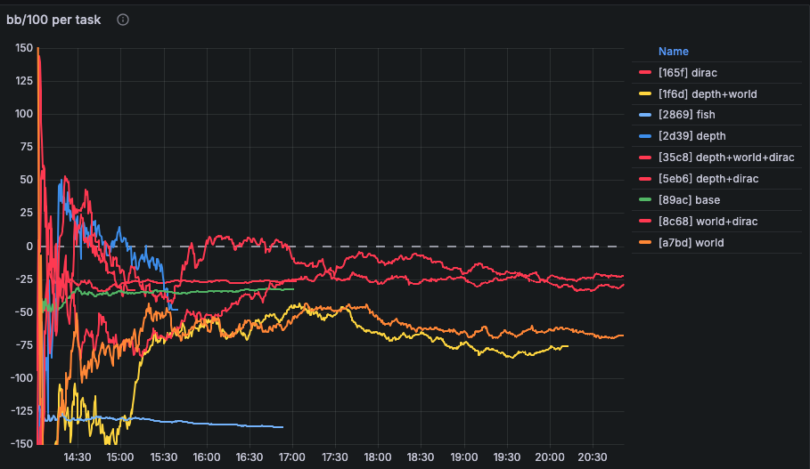
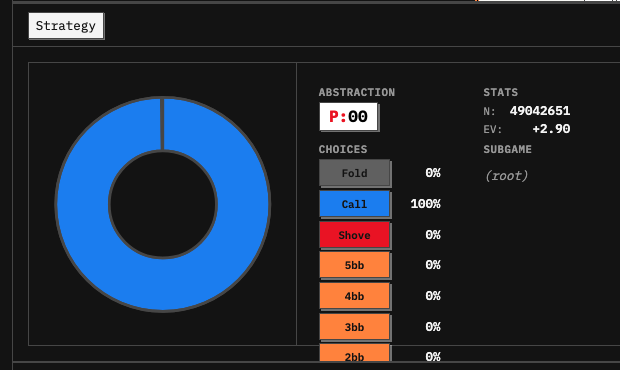
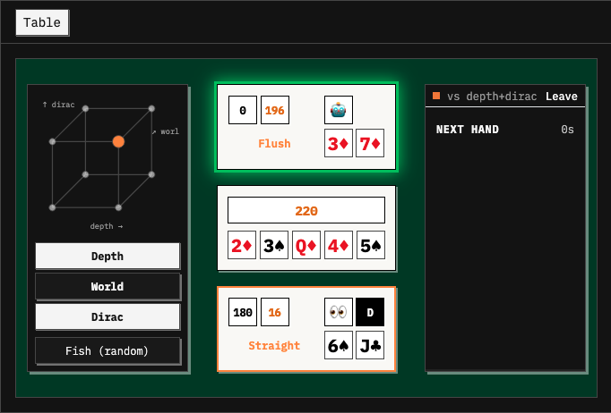
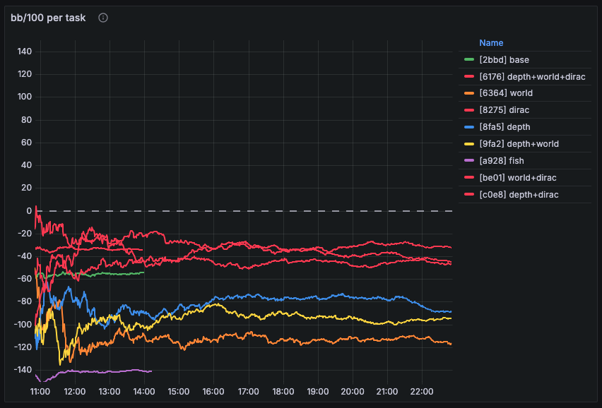
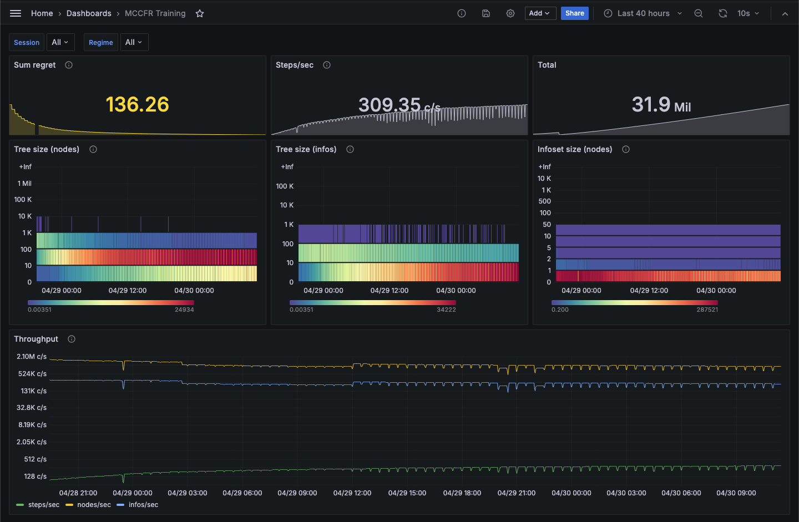

# robopoker

[](LICENSE)
[](https://github.com/krukah/robopoker/actions/workflows/ci.yml)
[](https://crates.io/crates/rbp)
[](https://docs.rs/rbp)

A Rust toolkit for game-theoretically optimal poker strategies, implementing state-of-the-art algorithms for No-Limit Texas Hold'em. Seeking functional parity to Pluribus¹.

## Visual Tour

|  |  |
| :---------------------------------------------------------------------------------------------------------: | :------------------------------------------------------------------------------------------------------: |
|                                          _Monte Carlo Tree Search_                                          |                                          _Equity Distributions_                                          |

## Results



Each colored series is a different combination of real-time-search techniques layered on the MCCFR blueprint — `depth` (depth-limited subgame solving¹⁰), `world` (world-partitioned belief¹²), and `dirac` (a zero-temperature picker that argmaxes the post-search policy). `fish` plays uniformly at random and `base` is the blueprint with no real-time search. All variants play against [Slumbot](https://www.slumbot.com).

<br clear="all"/>

| variant             |  hands |    bb/100 | 95% CI | H/hr |
| :------------------ | -----: | --------: | -----: | ---: |
| `world+dirac`       | 23.1 K | **−22.8** | ± 25.8 |  4 K |
| `dirac`             |  480 K |     −26.6 |  ± 5.7 |    — |
| `depth+dirac`       | 23.0 K |     −28.6 | ± 25.9 |  3 K |
| `base`              |  480 K |     −32.8 |  ± 5.7 |    — |
| `depth+world+dirac` | 3.76 K |     −33.7 | ± 64.0 |    — |
| `depth`             | 5.93 K |     −48.2 | ± 50.9 |    — |
| `world`             | 24.2 K |     −68.1 | ± 25.2 |  1 K |
| `depth+world`       | 21.8 K |     −76.1 | ± 26.6 |    — |

**Every variant with `dirac` is at or above `base`; every variant without `dirac` (except `base` itself) is well below it.** The leader is `world+dirac` at −22.8 bb/100 — ten bb/100 ahead of `base` and ~50 bb/100 ahead of `depth+world`. The dashboard's running marginal-effect estimator agrees: turning `dirac` on improves bb/100 by an order of magnitude more than turning `depth` or `world` on. Sampling temperature, not tree depth or belief partitioning, is currently the dominant loss source in the unaugmented blueprint — a useful direction for further work.

CIs on the ablation variants are wide (±25 bb/100 on ~23 K-hand tasks, ±64 on the 3.76 K-hand `depth+world+dirac` task), so the ordering within the `*+dirac` cluster isn't yet statistically separated. The three reference tasks — `base`, `dirac`, and `fish` — have run an order of magnitude longer (480 K hands each), so their estimates are tight (± 5.7).

## Features

- **Fastest open-source hand evaluator** — nanosecond evaluation outperforming Cactus Kev
- **Strategic abstraction** — hierarchical k-means clustering of 3.1T poker situations
- **Optimal transport** — Earth Mover's Distance via Sinkhorn algorithm
- **MCCFR solver** — external sampling with dynamic tree construction, pluggable regret/policy/sampling schemes
- **Depth-limited subgame solving¹⁰** — frontier-augmented games with biased continuation strategies
- **Safe subgame solving¹²** — world-partitioned belief preserves blueprint equilibrium
- **Action translation⁷,⁸** — pseudo-harmonic mapping over finite lattices
- **AIVAT variance reduction** — for hand-history evaluation of trained strategies
- **PostgreSQL persistence** — binary format serialization for efficiency
- **Short-deck support** — 36-card variant with adjusted rankings

## Crate Overview

### Core

| Crate                                   | Description                                                         |
| --------------------------------------- | ------------------------------------------------------------------- |
| [`rbp`](crates/rbp)                     | Facade re-exporting all public crates                               |
| [`rbp-core`](crates/util)               | Type aliases, constants, regime/version metadata, shared traits     |
| [`rbp-cards`](crates/cards)             | Card primitives, hand evaluation, equity                            |
| [`rbp-transport`](crates/transport)     | Optimal transport (Sinkhorn, EMD) over arbitrary measures           |
| [`rbp-mccfr`](crates/mccfr)             | Game-agnostic CFR framework                                         |
| [`rbp-gameplay`](crates/gameplay)       | Poker game engine: state, edges, settlement, witness/perfect recall |
| [`rbp-clustering`](crates/clustering)   | Hierarchical k-means abstraction with Elkan acceleration            |
| [`rbp-hyperparams`](crates/hyperparams) | Proc-macro deriving a `OnceLock`-backed global config pattern       |

### Search & abstraction

| Crate                               | Description                                               |
| ----------------------------------- | --------------------------------------------------------- |
| [`rbp-translate`](crates/translate) | Generic action translation over finite lattices           |
| [`rbp-world`](crates/world)         | World-partitioned belief layer for safe subgame solving   |
| [`rbp-depth`](crates/depth)         | Depth-limited solving with biased continuation strategies |
| [`rbp-subgame`](crates/subgame)     | Safe + depth-limited subgame composition                  |

### Games

| Crate                       | Description                                      |
| --------------------------- | ------------------------------------------------ |
| [`rbp-nlhe`](crates/nlhe)   | No-Limit Hold'em solver and abstraction          |
| [`rbp-leduc`](crates/leduc) | Leduc Hold'em — MCCFR framework validation       |
| [`rbp-kuhn`](crates/kuhn)   | Kuhn poker — MCCFR framework validation          |
| [`rbp-rps`](crates/rps)     | Rock-Paper-Scissors — MCCFR framework validation |

### Infrastructure

| Crate                               | Description                                                       |
| ----------------------------------- | ----------------------------------------------------------------- |
| [`rbp-database`](crates/database)   | PostgreSQL bulk I/O via `Schema` / `Row` / `Streamable` traits    |
| [`rbp-auth`](crates/auth)           | JWT + Argon2 authentication, session management                   |
| [`rbp-telemetry`](crates/telemetry) | OpenTelemetry init and a centrally-registered metric handle table |

### Applications

| Crate                                   | Description                                                            |
| --------------------------------------- | ---------------------------------------------------------------------- |
| [`rbp-gameroom`](crates/gameroom)       | Async game coordinator with pluggable players and hand-history records |
| [`rbp-server`](crates/server)           | Unified HTTP/WebSocket backend (analysis API + game hosting)           |
| [`rbp-autotrain`](crates/autotrain)     | Training pipeline orchestration with distributed workers               |
| [`rbp-slumbot`](crates/slumbot)         | Slumbot API benchmark client for blueprint evaluation                  |
| [`rbp-competition`](crates/competition) | Hand-history analysis with AIVAT variance reduction                    |
| [`rbp-litmus`](crates/litmus)           | Strategic litmus tests for blueprint validation                        |

## Architecture

### Core layer

**`rbp-cards`** — Card representation and hand evaluation:

- Bijective `u8` / `u16` / `u32` / `u64` representations for efficient bit-twiddling
- Nanosecond-scale hand strength evaluation
- Equity calculation via enumeration and Monte Carlo
- Exhaustive iteration over cards, hands, decks, and observations
- Short-deck (36-card) variant support

**`rbp-transport`** — Optimal transport:

- Sinkhorn iteration for near-linear Wasserstein approximation⁵
- Greenkhorn / greedy variants for sparse distributions
- Generic `Density` / `Support` traits over arbitrary metric spaces

**`rbp-mccfr`** — Game-agnostic CFR framework:

- State primitives: `CfrTurn`, `CfrEdge`, `CfrGame`, `CfrInfo`, `CfrPublic`, `CfrSecret`, plus the concrete `Tree<T, E, G, I>`
- Strategy layer: `CfrEncoder` (state → infoset), `RefProf` (read profile), `MutProf` (write storage), `InfoSet`, `Posterior`
- Composed traits: `CfrFlow` (regret matching, reach, EV — blanket from `RefProf` + `CfrSampling`) and `CfrSolution` (full supertrait for `Solver`)
- Solver layer: `Solver`, `TreeBuilder`, `Decisions`, `Harvest`
- Pluggable schemes: `RegretSchedule` (linear, discounted, asymmetric, floored, summed), `WeightSchedule`, `SamplingScheme` (external, vanilla, targeted, pluribus, pruning⁹,¹¹)

### Search & abstraction layer

**`rbp-translate`** — Action translation:

- Generic `Lattice` over a totally-ordered axis
- Pseudo-harmonic translation between abstract and concrete actions⁷,⁸
- Composable scalar and bracket primitives

**`rbp-world` + `rbp-depth` + `rbp-subgame`** — Real-time search:

- `WorldProfile` partitions belief into discrete worlds for safe re-solving¹²
- `DepthEdge<E, D>` augments base edges with `D` continuation choices at the frontier
- `Subgame` composes the two: depth-limited tree of world-tagged states

### Domain layer

**`rbp-gameplay`** — Complete poker game engine:

- Full No-Limit Texas Hold'em rules
- Side-pot, all-in, and tie handling
- Bet-sizing abstraction via `Size::SPR(n, d)` and `Size::BBs(n)`
- `Witness` (one player's view) vs `Perfect` (god's view) recall types

**`rbp-clustering`** — Hand abstraction via clustering:

- Hierarchical k-means with Elkan triangle-inequality acceleration
- Earth Mover's Distance over child-street distributions
- Isomorphic exhaustion of 3.1T situations⁴
- PostgreSQL binary persistence

**`rbp-nlhe`** — Concrete NLHE solver:

- `Nlhe<R, W, S>` parameterised over regret, weight, and sampling schemes
- `NlheEncoder` for state → infoset mapping
- `NlheProfile` for regret/strategy storage
- `Flagship` type alias for the production Pluribus-inspired config

### Infrastructure layer

**`rbp-database`** — PostgreSQL persistence:

- Binary format serialization for efficient storage
- `Schema`, `Row`, `Streamable` traits with `COPY IN` for bulk inserts
- `(Regime × Version)` table-naming macros (`table!`, `versioned!`, `regime!`)
- Regime fingerprint check guards against silent constant drift

**`rbp-gameroom`** — Async game coordination:

- Room-based session management with `Engine` / `Actor` / `Channel` model
- Pluggable player implementations: `agent`, `blueprint`, `brain`, `depth`, `dirac`, `fish`, `human`, `mount`, `solved`, `variant`, `world`, `zoo`
- Hand-history recording and replay

**`rbp-server`** — Unified backend:

- Analysis API for querying training results, strategies, and topology
- Game hosting with WebSocket support
- Authentication integration

**`rbp-autotrain`** — Training orchestration:

- `Fast` (single-machine in-memory) and `Slow` (distributed workers) modes
- Pre-training: cluster generation + persistence
- Graceful interrupts and resumable state

## Training pipeline

1. **Hierarchical abstraction** (per street: river → turn → flop → preflop):
   - Generate isomorphic hand clusters
   - Initialize k-means centroids via k-means++²
   - Run clustering to group strategically similar hands
   - Calculate EMD metrics via optimal transport⁵
   - Save abstractions and metrics to PostgreSQL

2. **MCCFR training**³:
   - Sample game trajectories via external sampling
   - Update regret values and compute counterfactual values
   - Accumulate strategy with linear weighting⁶
   - Checkpoint blueprint strategy to database

3. **Real-time search**:
   - Load blueprint as prior
   - Build depth-limited subgame tree from current state¹⁰
   - Re-solve using world-partitioned belief to preserve equilibrium¹²
   - Translate abstract action back to a concrete chip amount⁷,⁸



The `rbp-telemetry` crate emits OpenTelemetry metrics consumed by any OTLP-compatible backend. Shown: forty hours of MCCFR training — sum regret collapsing to 136, throughput holding at ~309 decisions/sec, 31.9 M decisions accumulated, plus heatmaps of tree-size and infoset-size distributions over time. Add a new metric in `crates/telemetry/src/metrics.rs` and it's visible immediately.

<br clear="all"/>

## System Requirements

| Street  | Abstraction Size | Metric Size |
| ------- | ---------------- | ----------- |
| Preflop | 4 KB             | 301 KB      |
| Flop    | 32 MB            | 175 KB      |
| Turn    | 347 MB           | 175 KB      |
| River   | 3.02 GB          | -           |

**Recommended:**

- Training: 16 vCPU, 120 GB RAM
- Database: PostgreSQL 14+ with 8 vCPU, 64 GB RAM
- Analysis: 1 vCPU, 4 GB RAM

## Feature Flags

| Feature     | Description                                          |
| ----------- | ---------------------------------------------------- |
| `database`  | PostgreSQL integration                               |
| `server`    | Server dependencies (Actix, Tokio, Rayon, telemetry) |
| `async`     | Async MCCFR sampling/regret variants                 |
| `shortdeck` | 36-card short-deck variant                           |

## Binaries

```bash
# Train a blueprint (fast = single-machine in-memory)
cargo run --bin trainer --features database -- --fast

# Run the unified backend (analysis API + game hosting)
BIND_ADDR=0.0.0.0:8888 cargo run --bin backend --features database

# Interactive CLI for type conversions and database queries
cargo run --bin convert

# Run the litmus catalog against a trained blueprint, emit a markdown report
cargo run --bin litmus -- --scenarios bin/litmus/scenarios.json --out report.md

# Benchmark a blueprint against the Slumbot API
cargo run --bin slumbot -- --variants base,dirac,depth+world+dirac --hands 1000

# Measure Sinkhorn's entropic-bias on the trained Turn metric (diagnostic)
cargo run --bin sinkhorn-bias
```

`trainer` modes: `--status`, `--fast`, `--slow`, `--cluster`, `--reset`, `--forget`.

## Built on this stack

A closed-source analysis frontend consumes the public APIs in this repo — `rbp-server`'s WebSocket and HTTP endpoints, the `rbp-clustering` abstraction tables, the blueprint format from `rbp-nlhe`. The crates here are sufficient to build a similar product.

### Live gameplay



*Showdown view — the abstraction cube picks the opponent's `depth × world × dirac` configuration. Backed by `rbp-server`'s WebSocket hosting API.*

### Per-decision strategy



*Strategy lookup at flop bucket `F:95` — action distribution, visit count, EV, and subgame history. Reads `rbp-server`'s `/api/strategy`.*

### Opponent range grid



*169-cell preflop range grid; cell intensity = opponent's posterior given observed action. Validated by [`rbp-litmus`](crates/litmus).*

## References

1. (2019). Superhuman AI for multiplayer poker. [(Science)](https://science.sciencemag.org/content/early/2019/07/10/science.aay2400)
2. (2014). Potential-Aware Imperfect-Recall Abstraction with Earth Mover's Distance in Imperfect-Information Games. [(AAAI)](http://www.cs.cmu.edu/~sandholm/potential-aware_imperfect-recall.aaai14.pdf)
3. (2007). Regret Minimization in Games with Incomplete Information. [(NIPS)](https://papers.nips.cc/paper/3306-regret-minimization-in-games-with-incomplete-information)
4. (2013). A Fast and Optimal Hand Isomorphism Algorithm. [(AAAI)](https://www.cs.cmu.edu/~waugh/publications/isomorphism13.pdf)
5. (2018). Near-linear time approximation algorithms for optimal transport via Sinkhorn iteration. [(NIPS)](https://arxiv.org/abs/1705.09634)
6. (2019). Solving Imperfect-Information Games via Discounted Regret Minimization. [(AAAI)](https://arxiv.org/pdf/1809.04040.pdf)
7. (2013). Action Translation in Extensive-Form Games with Large Action Spaces. [(IJCAI)](http://www.cs.cmu.edu/~sandholm/reverse%20mapping.ijcai13.pdf)
8. (2015). Discretization of Continuous Action Spaces in Extensive-Form Games. [(AAMAS)](http://www.cs.cmu.edu/~sandholm/discretization.aamas15.fromACM.pdf)
9. (2015). Regret-Based Pruning in Extensive-Form Games. [(NIPS)](http://www.cs.cmu.edu/~sandholm/regret-basedPruning.nips15.withAppendix.pdf)
10. (2018). Depth-Limited Solving for Imperfect-Information Games. [(NeurIPS)](https://arxiv.org/pdf/1805.08195.pdf)
11. (2017). Reduced Space and Faster Convergence in Imperfect-Information Games via Pruning. [(ICML)](http://www.cs.cmu.edu/~sandholm/reducedSpace.icml17.pdf)
12. (2017). Safe and Nested Subgame Solving for Imperfect-Information Games. [(NIPS)](https://www.cs.cmu.edu/~noamb/papers/17-NIPS-Safe.pdf)

## License

MIT License — see [LICENSE](LICENSE) for details.
