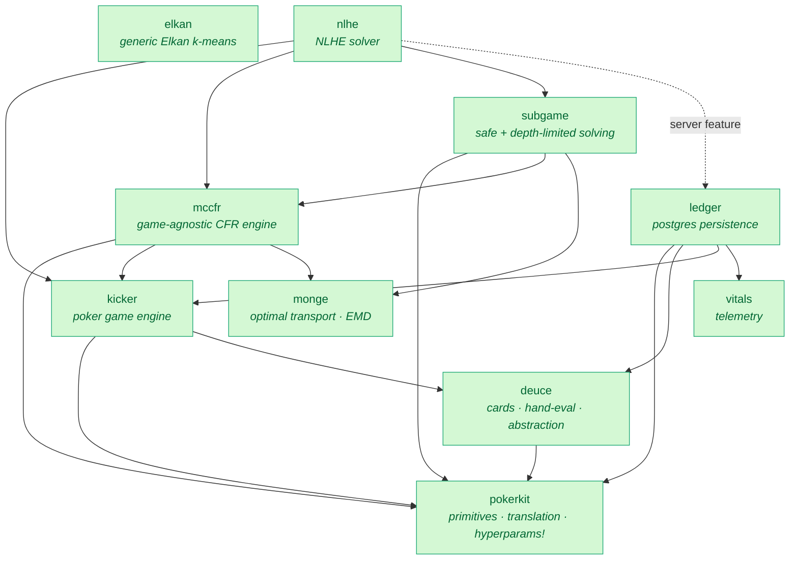
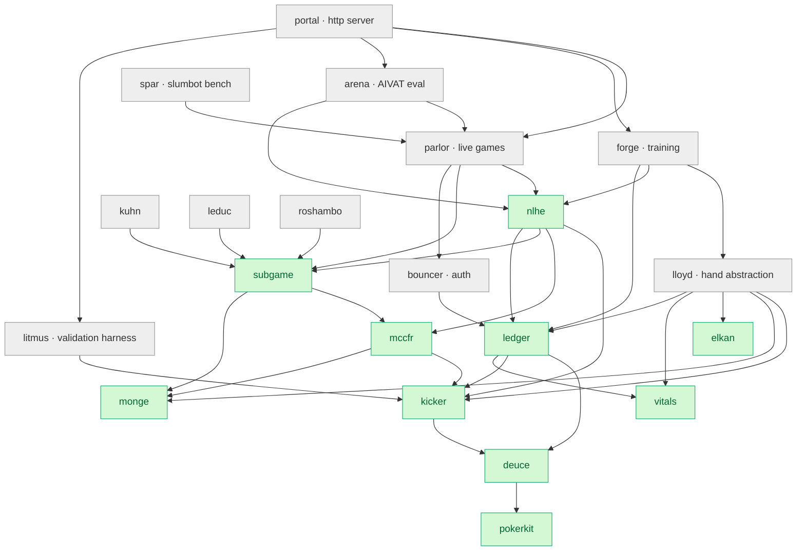

# robopoker

A Rust toolkit for game-theoretically optimal poker strategies, implementing state-of-the-art algorithms for No-Limit Texas Hold'em. Seeking functional parity to Pluribus¹.

## Visual Tour

|  |  |
| :---------------------------------------------------------------------------------------------------------: | :------------------------------------------------------------------------------------------------------: |
|                                          _Monte Carlo Tree Search_                                          |                                          _Equity Distributions_                                          |

A closed-source analysis frontend is built entirely on this repo's public APIs — `portal`'s WebSocket and HTTP endpoints, the `lloyd` abstraction tables, and the blueprint format from `nlhe`. The crates here are sufficient to build a comparable product.

### Live gameplay

*Showdown view — the abstraction cube picks the opponent's `depth × world × dirac` configuration. Backed by `portal`'s WebSocket hosting API.*

### Per-decision strategy

*Strategy lookup at flop bucket `F:95` — action distribution, visit count, EV, and subgame history. Reads `portal`'s `/api/strategy`.*

### Opponent range grid

*169-cell preflop range grid; cell intensity = opponent's posterior given observed action. Validated by [`litmus`](crates/litmus).*

## Features

- **Fastest open-source hand evaluator** — nanosecond evaluation outperforming Cactus Kev
- **Strategic abstraction** — hierarchical k-means clustering of 3.1T poker situations
- **Optimal transport** — Earth Mover's Distance via Sinkhorn algorithm
- **MCCFR solver** — external sampling with dynamic tree construction, pluggable regret/policy/sampling schemes
- **Real-time search** — depth-limited¹⁰ and safe, world-partitioned¹² subgame solving that preserves the blueprint equilibrium
- **Action translation⁷,⁸** — pseudo-harmonic mapping over finite lattices
- **AIVAT variance reduction** — for hand-history evaluation of trained strategies
- **PostgreSQL persistence** — binary format serialization for efficiency
- **Short-deck support** — 36-card variant with adjusted rankings

## Architecture

The project is a workspace of small, single-purpose crates. 🟢 = published to [crates.io](https://crates.io), ⚪ = internal (`publish = false`). The published crates are the reusable libraries; the internal crates are the product built on top of them plus its test scaffolding.

### Dependency graph

Eleven crates make up the public surface — ten libraries plus the `robopoker` facade (not shown below) that re-exports them. Most funnel down toward `pokerkit`; `elkan`, `monge`, and `vitals` stand alone (external dependencies only). Edges point from a crate to its dependencies.

Adding the internal crates — hand abstraction (`lloyd`), validation games (`kuhn` / `leduc` / `roshambo`), authentication (`bouncer`), and the applications and tooling layer. `pokerkit` is omitted from the arrows (almost everything depends on it) and the `robopoker` facade is omitted (it re-exports the published crates).

### Crates

**Core** — the published libraries.

| Crate                             |     | Description                                                                                 |
| --------------------------------- | --- | ------------------------------------------------------------------------------------------- |
| [`pokerkit`](crates/pokerkit)     | 🟢  | Type aliases, constants, regime/version metadata, action translation, `hyperparams!` macro  |
| [`deuce`](crates/deuce)           | 🟢  | Card primitives, hand evaluation, equity, strategic abstraction                             |
| [`monge`](crates/monge)           | 🟢  | Optimal transport (Sinkhorn, EMD) over arbitrary measures                                   |
| [`elkan`](crates/elkan)           | 🟢  | Generic, triangle-inequality-accelerated (Elkan 2003) k-means                               |
| [`kicker`](crates/kicker)         | 🟢  | Poker game engine: state, edges, settlement, witness/perfect recall                         |
| [`mccfr`](crates/mccfr)           | 🟢  | Game-agnostic MCCFR framework with pluggable regret/policy/sampling                         |
| [`subgame`](crates/subgame)       | 🟢  | Safe (world-partitioned) + depth-limited subgame solving                                    |
| [`robopoker`](crates/robopoker)   | 🟢  | Facade re-exporting the published crates                                                    |

**Games & abstraction**

| Crate                         |     | Description                                          |
| ----------------------------- | --- | ---------------------------------------------------- |
| [`nlhe`](crates/nlhe)         | 🟢  | No-Limit Hold'em solver and abstraction              |
| [`lloyd`](crates/lloyd)       | ⚪  | Hierarchical k-means hand abstraction with EMD       |
| [`leduc`](crates/leduc)       | ⚪  | Leduc Hold'em — MCCFR framework validation           |
| [`kuhn`](crates/kuhn)         | ⚪  | Kuhn poker — MCCFR framework validation              |
| [`roshambo`](crates/roshambo) | ⚪  | Rock-Paper-Scissors — MCCFR framework validation     |

**Infrastructure**

| Crate                       |     | Description                                                       |
| --------------------------- | --- | ----------------------------------------------------------------- |
| [`ledger`](crates/ledger)   | 🟢  | PostgreSQL bulk I/O via `Schema` / `Row` / `Streamable` traits    |
| [`vitals`](crates/vitals)   | 🟢  | OpenTelemetry init and a centrally-registered metric handle table |
| [`bouncer`](crates/bouncer) | ⚪  | JWT + Argon2 authentication, session management                   |

**Applications** — the product and its tooling.

| Crate                     |     | Description                                                            |
| ------------------------- | --- | ---------------------------------------------------------------------- |
| [`parlor`](crates/parlor) | ⚪  | Async game coordinator with pluggable players and hand-history records |
| [`portal`](crates/portal) | ⚪  | Unified HTTP/WebSocket backend (analysis API + game hosting)           |
| [`forge`](crates/forge)   | ⚪  | Training pipeline orchestration with distributed workers               |
| [`spar`](crates/spar)     | ⚪  | Slumbot API benchmark client for blueprint evaluation                  |
| [`arena`](crates/arena)   | ⚪  | Hand-history analysis with AIVAT variance reduction                    |
| [`litmus`](crates/litmus) | ⚪  | Strategic litmus tests for blueprint validation                        |

### How it works

The pipeline runs in three stages — static abstraction, blueprint training, then real-time search — with the crate names and key types shown inline.

**1. Hierarchical abstraction** (per street: river → turn → flop → preflop). `deuce` exhaustively iterates the isomorphic⁴ hand space (3.1T situations) with nanosecond hand evaluation over bijective `u8` / `u16` / `u32` / `u64` card encodings. `lloyd` groups strategically similar hands with hierarchical k-means — k-means++² seeding, `elkan` triangle-inequality acceleration — measuring distance as the Earth Mover's Distance between child-street distributions, computed by `monge`'s Sinkhorn / Greenkhorn iteration⁵ over generic `Density` / `Support` measures. Abstractions and metrics persist to PostgreSQL through `ledger` (`Schema` / `Row` / `Streamable` with `COPY IN`, plus `(Regime × Version)` table-naming macros and a fingerprint check against silent constant drift).

**2. MCCFR training³.** `mccfr` samples game trajectories through `kicker`'s No-Limit Hold'em engine — full side-pot / all-in / tie settlement, `Size::SPR(n, d)` / `Size::BBs(n)` bet-sizing, and `Witness` (one player's view) vs `Perfect` (god's view) recall. Its `CfrEncoder` → `Solver` → `Tree` machinery is game-agnostic; `nlhe` (`Nlhe<R, W, S>`, its `NlheEncoder`, and the production `Flagship` config) plugs in concrete schemes: external sampling, discounted / linear regret weighting⁶, and regret-based pruning⁹,¹¹. `forge` orchestrates this in `Fast` (single-machine, in-memory) or `Slow` (distributed workers) mode, checkpointing the blueprint to the database.

**3. Real-time search.** At play time, `subgame` loads the blueprint as a prior and re-solves the current spot: `DepthEdge<E, D>` builds a depth-limited¹⁰ frontier with biased continuation strategies, `WorldProfile` partitions belief into discrete worlds for safe re-solving¹² that preserves the blueprint equilibrium, and `SubGameSolver` composes both. `pokerkit`'s `Lattice` then translates the abstract action back to a concrete chip amount via pseudo-harmonic mapping⁷,⁸.

The `vitals` crate emits OpenTelemetry metrics consumed by any OTLP-compatible backend. Shown: forty hours of MCCFR training — sum regret collapsing to 136, throughput holding at ~309 decisions/sec, 31.9 M decisions accumulated, plus heatmaps of tree-size and infoset-size distributions over time. Add a new metric in `crates/vitals/src/metrics.rs` and it's visible immediately.

 

## Benchmarks

Each colored series is a different combination of real-time-search techniques layered on the MCCFR blueprint — `depth` (depth-limited subgame solving¹⁰), `world` (world-partitioned belief¹²), and `dirac` (a zero-temperature picker that argmaxes the post-search policy). `fish` plays uniformly at random and `base` is the blueprint with no real-time search. All variants play against [Slumbot](https://www.slumbot.com).

 

| variant             |  hands |    bb/100 | 95% CI | H/hr |
| :------------------ | -----: | --------: | -----: | ---: |
| `world+dirac`       | 23.1 K | **−22.8** | ± 25.8 |  4 K |
| `dirac`             |  480 K |     −26.6 |  ± 5.7 |    — |
| `depth+dirac`       | 23.0 K |     −28.6 | ± 25.9 |  3 K |
| `base`              |  480 K |     −32.8 |  ± 5.7 |    — |
| `depth+world+dirac` | 3.76 K |     −33.7 | ± 64.0 |    — |
| `depth`             | 5.93 K |     −48.2 | ± 50.9 |    — |
| `world`             | 24.2 K |     −68.1 | ± 25.2 |  1 K |
| `depth+world`       | 21.8 K |     −76.1 | ± 26.6 |    — |

**Every variant with `dirac` is at or above `base`; every variant without `dirac` (except `base` itself) is well below it.** The leader is `world+dirac` at −22.8 bb/100 — ten bb/100 ahead of `base` and ~50 bb/100 ahead of `depth+world`. The dashboard's running marginal-effect estimator agrees: turning `dirac` on improves bb/100 by an order of magnitude more than turning `depth` or `world` on. Sampling temperature, not tree depth or belief partitioning, is currently the dominant loss source in the unaugmented blueprint — a useful direction for further work.

CIs on the ablation variants are wide (±25 bb/100 on ~23 K-hand tasks, ±64 on the 3.76 K-hand `depth+world+dirac` task), so the ordering within the `*+dirac` cluster isn't yet statistically separated. The three reference tasks — `base`, `dirac`, and `fish` — have run an order of magnitude longer (480 K hands each), so their estimates are tight (± 5.7).

## References

1. (2019). Superhuman AI for multiplayer poker. [(Science)](https://science.sciencemag.org/content/early/2019/07/10/science.aay2400)
2. (2014). Potential-Aware Imperfect-Recall Abstraction with Earth Mover's Distance in Imperfect-Information Games. [(AAAI)](http://www.cs.cmu.edu/~sandholm/potential-aware_imperfect-recall.aaai14.pdf)
3. (2007). Regret Minimization in Games with Incomplete Information. [(NIPS)](https://papers.nips.cc/paper/3306-regret-minimization-in-games-with-incomplete-information)
4. (2013). A Fast and Optimal Hand Isomorphism Algorithm. [(AAAI)](https://www.cs.cmu.edu/~waugh/publications/isomorphism13.pdf)
5. (2018). Near-linear time approximation algorithms for optimal transport via Sinkhorn iteration. [(NIPS)](https://arxiv.org/abs/1705.09634)
6. (2019). Solving Imperfect-Information Games via Discounted Regret Minimization. [(AAAI)](https://arxiv.org/pdf/1809.04040.pdf)
7. (2013). Action Translation in Extensive-Form Games with Large Action Spaces. [(IJCAI)](http://www.cs.cmu.edu/~sandholm/reverse%20mapping.ijcai13.pdf)
8. (2015). Discretization of Continuous Action Spaces in Extensive-Form Games. [(AAMAS)](http://www.cs.cmu.edu/~sandholm/discretization.aamas15.fromACM.pdf)
9. (2015). Regret-Based Pruning in Extensive-Form Games. [(NIPS)](http://www.cs.cmu.edu/~sandholm/regret-basedPruning.nips15.withAppendix.pdf)
10. (2018). Depth-Limited Solving for Imperfect-Information Games. [(NeurIPS)](https://arxiv.org/pdf/1805.08195.pdf)
11. (2017). Reduced Space and Faster Convergence in Imperfect-Information Games via Pruning. [(ICML)](http://www.cs.cmu.edu/~sandholm/reducedSpace.icml17.pdf)
12. (2017). Safe and Nested Subgame Solving for Imperfect-Information Games. [(NIPS)](https://www.cs.cmu.edu/~noamb/papers/17-NIPS-Safe.pdf)

## License

MIT License — see [LICENSE](LICENSE) for details.
