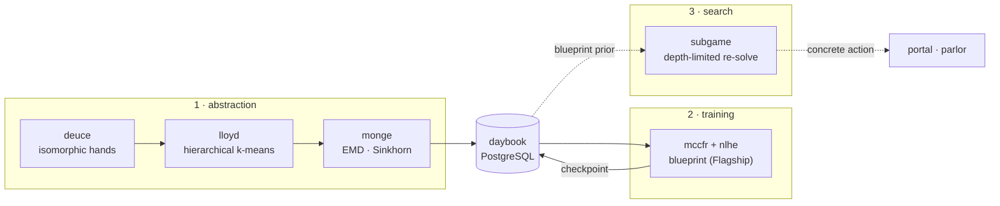
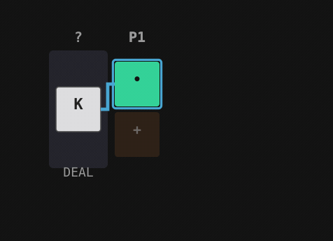
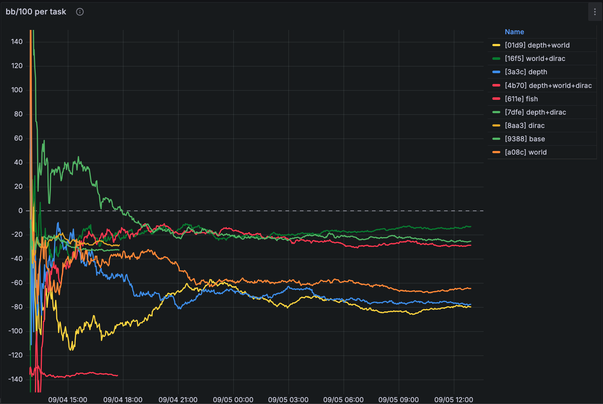
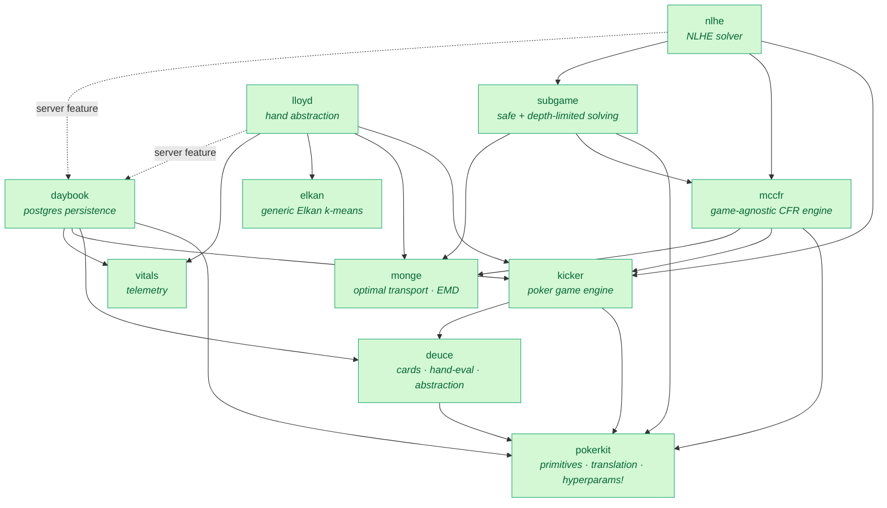

# robopoker

A Rust implementation of superhuman-scale poker AI, seeking functional parity with Pluribus¹. It reduces the 3.1 trillion situations of No-Limit Texas Hold'em to a tractable abstraction, trains a blueprint strategy by Monte Carlo counterfactual regret minimization, and refines that blueprint at play time with depth-limited and safe subgame solving. Every component — hand evaluation, optimal transport, clustering, the CFR framework, the game engine, persistence, telemetry — is written from scratch as a single-purpose crate.

Against [Slumbot](https://www.slumbot.com), the strongest publicly available benchmark, the best configuration measures **−22.8 bb/100** over 23.1 K hands (§ [Results](#results)). It is not yet winning — but the ablation identifies precisely which component is responsible.

  

  <b>Figure 1.</b> One hand, preflop → river, on nested clocks: the game tree flickers as MCCFR samples it,
  hero's range tightens street by street, the equity curves morph, the policy resolves, and the board deals out.
  Animated SVG emitted by the solver — no video, no scripts.

## Contributions

- **Fastest open-source hand evaluator** — nanosecond evaluation, outperforming Cactus Kev
- **Strategic abstraction** — hierarchical k-means clustering of 3.1 T poker situations
- **Optimal transport** — Earth Mover's Distance via Sinkhorn iteration over generic measures
- **MCCFR solver** — external sampling, dynamic tree construction, pluggable regret/policy/sampling schemes
- **Real-time search** — depth-limited¹⁰ and safe, world-partitioned¹² subgame solving that preserves the blueprint equilibrium
- **Action translation⁷,⁸** — pseudo-harmonic mapping over finite lattices
- **AIVAT variance reduction** — low-variance evaluation over hand histories
- **Measured against a live opponent** — 480 K-hand reference tasks with confidence intervals, not self-play claims

## Method

Three stages: a static abstraction computed once, a blueprint trained against it, and a real-time re-solve at play time.

```mermaid
flowchart LR
  subgraph S1["1 · abstraction"]
    direction LR
    A["deuce<br/>isomorphic hands"] --> B["lloyd<br/>hierarchical k-means"]
    B --> C["monge<br/>EMD · Sinkhorn"]
  end
  subgraph S2["2 · training"]
    D["mccfr + nlhe<br/>blueprint (Flagship)"]
  end
  subgraph S3["3 · search"]
    F["subgame<br/>depth-limited re-solve"]
  end
  C --> DB[("daybook<br/>PostgreSQL")]
  DB --> D
  D -->|checkpoint| DB
  DB -.->|blueprint prior| F
  F -.->|concrete action| G["portal · parlor"]
```

### 1 · Hierarchical abstraction

Per street, river → turn → flop → preflop. `deuce` exhaustively iterates the isomorphic⁴ hand space with nanosecond hand evaluation over bijective `u8`/`u16`/`u32`/`u64` card encodings. `lloyd` groups strategically similar hands by hierarchical k-means — k-means++² seeding, `elkan` triangle-inequality acceleration — measuring distance as the Earth Mover's Distance between child-street distributions, computed by `monge`'s Sinkhorn/Greenkhorn iteration⁵. Abstractions persist through `daybook` (`Schema`/`Row`/`Streamable` over `COPY IN`, `(Regime × Version)` table naming, and a fingerprint check against silent constant drift).

  
   
  <b>Figure 2.</b> The clustering feature. Each curve is one hand's distribution over next-street outcomes;
  hands whose curves lie close in EMD share an abstraction bucket. This is what makes 3.1 T situations tractable.

### 2 · MCCFR training³

`mccfr` samples trajectories through `kicker`'s engine — full side-pot/all-in/tie settlement, `Size::SPR(n, d)` and `Size::BBs(n)` bet-sizing, and `Witness` (one player's view) versus `Perfect` (god's view) recall. Its `CfrEncoder` → `Solver` → `Tree` machinery is game-agnostic; `nlhe` supplies the concrete schemes through `Nlhe<R, W, S>` and the production `Flagship` configuration: external sampling, discounted/linear regret weighting⁶, regret-based pruning⁹,¹¹. `forge` orchestrates `Fast` (single-machine, in-memory) or `Slow` (distributed workers) mode, checkpointing to the database. `kuhn`, `leduc`, and `roshambo` hold the framework to closed-form equilibria on toy games.

  
  
   
  <b>Figure 3.</b> External sampling walks one trajectory per iteration — chance nodes fan into revealed cards,
  decision nodes into the bet-sizing lattice, and the highlighted path is the branch being updated. Streets are the
  vertical bands; the acting seat labels each column. <i>Right:</i> Kuhn poker, whose entire tree fits on screen, is
  where convergence is checked against the analytic Nash equilibrium.

### 3 · Real-time search

At play time `subgame` loads the blueprint as a prior and re-solves the current spot: `DepthEdge<E, D>` builds a depth-limited¹⁰ frontier with biased continuation strategies, `WorldProfile` partitions belief into discrete worlds for safe re-solving¹² that preserves the blueprint equilibrium, and `SubGameSolver` composes both. `pokerkit`'s `Lattice` maps the abstract action back to a concrete chip amount by pseudo-harmonic translation⁷,⁸.

  
   
  <b>Figure 4.</b> The 169-cell grid is the canonical lens on strategy quality: hero's representing range, the
  action distribution at the node, villain's defending range. Structural pathologies — non-monotonic hand-strength
  ordering, suited/offsuit asymmetry, collapsed action support — are visible at a glance, and are asserted
  mechanically by <a href="crates/litmus"><code>litmus</code></a>.

## Results

Each series layers a different real-time-search technique onto the MCCFR blueprint: `depth` (depth-limited solving¹⁰), `world` (world-partitioned belief¹²), and `dirac` (a zero-temperature picker that argmaxes the post-search policy). `base` is the blueprint with no search; `fish` plays uniformly at random. All variants play live against Slumbot.

 

| variant             |  hands |    bb/100 | 95% CI | H/hr |
| :------------------ | -----: | --------: | -----: | ---: |
| `world+dirac`       | 23.1 K | **−22.8** | ± 25.8 |  4 K |
| `dirac`             |  480 K |     −26.6 |  ± 5.7 |    — |
| `depth+dirac`       | 23.0 K |     −28.6 | ± 25.9 |  3 K |
| `base`              |  480 K |     −32.8 |  ± 5.7 |    — |
| `depth+world+dirac` | 3.76 K |     −33.7 | ± 64.0 |    — |
| `depth`             | 5.93 K |     −48.2 | ± 50.9 |    — |
| `world`             | 24.2 K |     −68.1 | ± 25.2 |  1 K |
| `depth+world`       | 21.8 K |     −76.1 | ± 26.6 |    — |

<b>Table 1.</b> Slumbot results by search configuration.

**Every variant with `dirac` is at or above `base`; every variant without it — except `base` itself — is well below.** The leader, `world+dirac`, is ten bb/100 ahead of `base` and roughly fifty ahead of `depth+world`. Enabling `dirac` improves bb/100 by an order of magnitude more than enabling `depth` or `world`. The interpretation: **sampling temperature, not tree depth or belief partitioning, is the dominant loss source in the unaugmented blueprint** — the clearest available direction for further work.

Confidence intervals on the ablation variants are wide (± 25 bb/100 at ~23 K hands; ± 64 on the 3.76 K-hand `depth+world+dirac` task), so ordering *within* the `*+dirac` cluster is not yet statistically separated. The three reference tasks — `base`, `dirac`, `fish` — have each run an order of magnitude longer at 480 K hands, so those estimates are tight (± 5.7).

## Implementation

A workspace of small, single-purpose crates. 🟢 = published to [crates.io](https://crates.io); ⚪ = internal (`publish = false`). Twelve crates form the public surface — eleven libraries plus the `robopoker` facade that re-exports them. Most funnel toward `pokerkit`; `elkan`, `monge`, and `vitals` stand alone. Edges point to dependencies.

```mermaid
graph TD
  classDef pub fill:#d4f8d4,stroke:#2a7,color:#063
  pokerkit["pokerkit<br/><i>primitives · translation · hyperparams!</i>"]
  deuce["deuce<br/><i>cards · hand-eval · abstraction</i>"]
  monge["monge<br/><i>optimal transport · EMD</i>"]
  kicker["kicker<br/><i>poker game engine</i>"]
  mccfr["mccfr<br/><i>game-agnostic CFR engine</i>"]
  subgame["subgame<br/><i>safe + depth-limited solving</i>"]
  elkan["elkan<br/><i>generic Elkan k-means</i>"]
  vitals["vitals<br/><i>telemetry</i>"]
  daybook["daybook<br/><i>postgres persistence</i>"]
  lloyd["lloyd<br/><i>hand abstraction</i>"]
  nlhe["nlhe<br/><i>NLHE solver</i>"]

  deuce --> pokerkit
  kicker --> pokerkit
  kicker --> deuce
  mccfr --> pokerkit
  mccfr --> kicker
  mccfr --> monge
  subgame --> pokerkit
  subgame --> mccfr
  subgame --> monge
  daybook --> pokerkit
  daybook --> deuce
  daybook --> kicker
  daybook --> vitals
  lloyd --> kicker
  lloyd --> monge
  lloyd --> elkan
  lloyd --> vitals
  nlhe --> kicker
  nlhe --> mccfr
  nlhe --> subgame
  nlhe -.->|"server feature"| daybook
  lloyd -.->|"server feature"| daybook

  class pokerkit,deuce,monge,kicker,mccfr,subgame,elkan,vitals,daybook,nlhe,lloyd pub
```

| Crate                           |     | Description                                                                                |
| ------------------------------- | --- | ------------------------------------------------------------------------------------------ |
| [`pokerkit`](crates/pokerkit)   | 🟢  | Type aliases, constants, regime/version metadata, action translation, `hyperparams!` macro |
| [`deuce`](crates/deuce)         | 🟢  | Card primitives, hand evaluation, equity, strategic abstraction                            |
| [`monge`](crates/monge)         | 🟢  | Optimal transport (Sinkhorn, EMD) over arbitrary measures                                  |
| [`elkan`](crates/elkan)         | 🟢  | Generic, triangle-inequality-accelerated (Elkan 2003) k-means                              |
| [`lloyd`](crates/lloyd)         | 🟢  | Hierarchical k-means hand abstraction with EMD                                             |
| [`kicker`](crates/kicker)       | 🟢  | Poker game engine: state, edges, settlement, witness/perfect recall                        |
| [`mccfr`](crates/mccfr)         | 🟢  | Game-agnostic MCCFR framework with pluggable regret/policy/sampling                        |
| [`subgame`](crates/subgame)     | 🟢  | Safe (world-partitioned) and depth-limited subgame solving                                 |
| [`nlhe`](crates/nlhe)           | 🟢  | No-Limit Hold'em solver and abstraction                                                    |
| [`daybook`](crates/daybook)     | 🟢  | PostgreSQL bulk I/O via `Schema`/`Row`/`Streamable`                                        |
| [`vitals`](crates/vitals)       | 🟢  | OpenTelemetry init and a centrally-registered metric table                                 |
| [`robopoker`](crates/robopoker) | 🟢  | Facade re-exporting the published crates                                                   |

<b>Internal crates</b> — the product built on top, and its scaffolding

| Crate                         |     | Description                                                            |
| ----------------------------- | --- | ---------------------------------------------------------------------- |
| [`parlor`](crates/parlor)     | ⚪  | Async game coordinator with pluggable players and hand-history records |
| [`portal`](crates/portal)     | ⚪  | Unified HTTP/WebSocket backend (analysis API and game hosting)         |
| [`forge`](crates/forge)       | ⚪  | Training pipeline orchestration with distributed workers               |
| [`arena`](crates/arena)       | ⚪  | Hand-history analysis with AIVAT variance reduction                    |
| [`spar`](crates/spar)         | ⚪  | Slumbot API benchmark client                                           |
| [`litmus`](crates/litmus)     | ⚪  | Strategic litmus tests for blueprint validation                        |
| [`phh`](crates/phh)           | ⚪  | Poker-hand-history parsing and chip-exact replay                       |
| [`bouncer`](crates/bouncer)   | ⚪  | JWT and Argon2 authentication, session management                      |
| [`kuhn`](crates/kuhn)         | ⚪  | Kuhn poker — MCCFR framework validation                                |
| [`leduc`](crates/leduc)       | ⚪  | Leduc Hold'em — MCCFR framework validation                             |
| [`roshambo`](crates/roshambo) | ⚪  | Rock-Paper-Scissors — MCCFR framework validation                       |

<b>Feature flags, resource requirements, telemetry</b>

| Feature     | Description                                          |
| ----------- | ---------------------------------------------------- |
| `database`  | PostgreSQL integration                               |
| `server`    | Server dependencies (Actix, Tokio, Rayon, telemetry) |
| `async`     | Async MCCFR sampling/regret variants                 |
| `shortdeck` | 36-card short-deck variant                           |
| `sixmax`    | Six-handed build (`N = 6`)                           |

| Street  | Abstraction size | Metric size |
| ------- | ---------------- | ----------- |
| Preflop | 4 KB             | 301 KB      |
| Flop    | 32 MB            | 175 KB      |
| Turn    | 347 MB           | 175 KB      |
| River   | 3.02 GB          | —           |

Recommended: training on 16 vCPU / 120 GB RAM; PostgreSQL 14+ on 8 vCPU / 64 GB RAM; analysis on 1 vCPU / 4 GB RAM.

`vitals` emits OpenTelemetry metrics to any OTLP-compatible backend — sum regret, throughput, and heatmaps of tree- and infoset-size distributions over time. A metric added in `crates/vitals/src/metrics.rs` is visible immediately.

## Frontend

A closed-source analysis frontend is built entirely on this repository's public APIs — `portal`'s WebSocket and HTTP endpoints, the `lloyd` abstraction tables, and the blueprint format from `nlhe`. The crates here are sufficient to build a comparable product.

|                      |       |
| :----------------------------------------------------------------------------------------------: | :-------------------------------------------------------------------------------------------: |
| Showdown view; the cube selects the opponent's `depth × world × dirac` configuration. | Strategy at flop bucket `F:95` — action distribution, visits, EV, subgame history. |

## References

1. (2019). Superhuman AI for multiplayer poker. [(Science)](https://science.sciencemag.org/content/early/2019/07/10/science.aay2400)
2. (2014). Potential-Aware Imperfect-Recall Abstraction with Earth Mover's Distance in Imperfect-Information Games. [(AAAI)](http://www.cs.cmu.edu/~sandholm/potential-aware_imperfect-recall.aaai14.pdf)
3. (2007). Regret Minimization in Games with Incomplete Information. [(NIPS)](https://papers.nips.cc/paper/3306-regret-minimization-in-games-with-incomplete-information)
4. (2013). A Fast and Optimal Hand Isomorphism Algorithm. [(AAAI)](https://www.cs.cmu.edu/~waugh/publications/isomorphism13.pdf)
5. (2018). Near-linear time approximation algorithms for optimal transport via Sinkhorn iteration. [(NIPS)](https://arxiv.org/abs/1705.09634)
6. (2019). Solving Imperfect-Information Games via Discounted Regret Minimization. [(AAAI)](https://arxiv.org/pdf/1809.04040.pdf)
7. (2013). Action Translation in Extensive-Form Games with Large Action Spaces. [(IJCAI)](http://www.cs.cmu.edu/~sandholm/reverse%20mapping.ijcai13.pdf)
8. (2015). Discretization of Continuous Action Spaces in Extensive-Form Games. [(AAMAS)](http://www.cs.cmu.edu/~sandholm/discretization.aamas15.fromACM.pdf)
9. (2015). Regret-Based Pruning in Extensive-Form Games. [(NIPS)](http://www.cs.cmu.edu/~sandholm/regret-basedPruning.nips15.withAppendix.pdf)
10. (2018). Depth-Limited Solving for Imperfect-Information Games. [(NeurIPS)](https://arxiv.org/pdf/1805.08195.pdf)
11. (2017). Reduced Space and Faster Convergence in Imperfect-Information Games via Pruning. [(ICML)](http://www.cs.cmu.edu/~sandholm/reducedSpace.icml17.pdf)
12. (2017). Safe and Nested Subgame Solving for Imperfect-Information Games. [(NIPS)](https://www.cs.cmu.edu/~noamb/papers/17-NIPS-Safe.pdf)

## License

MIT License — see [LICENSE](LICENSE).
