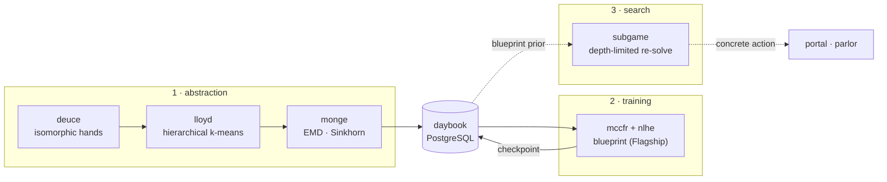
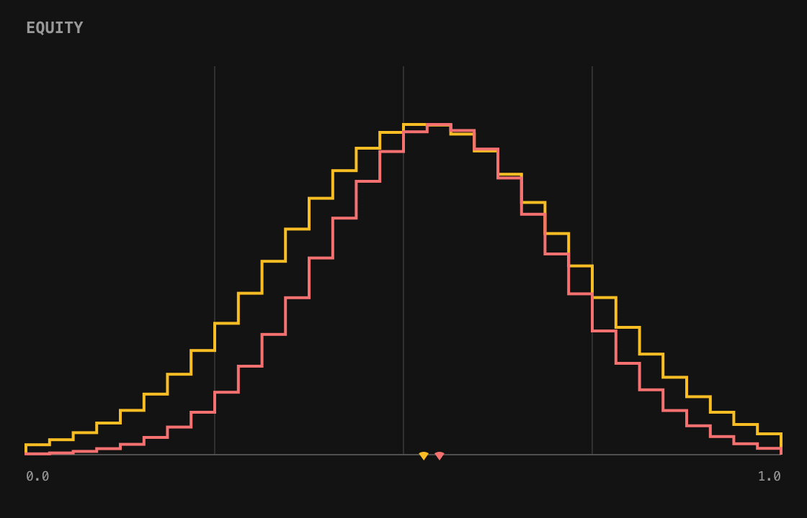
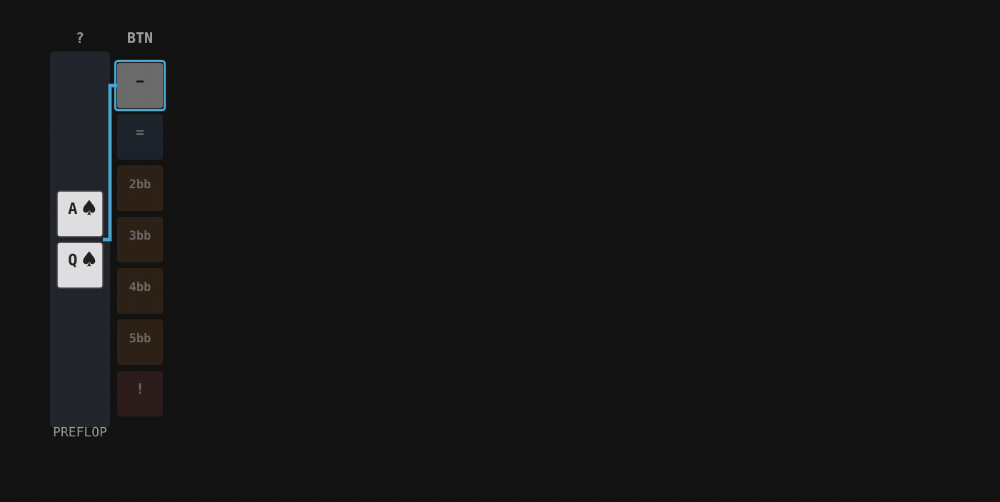
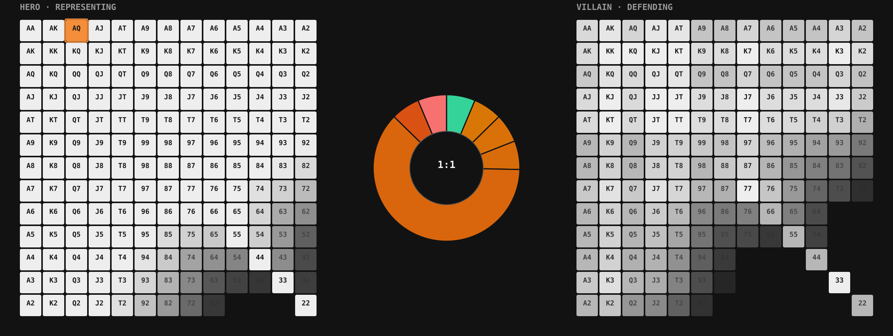
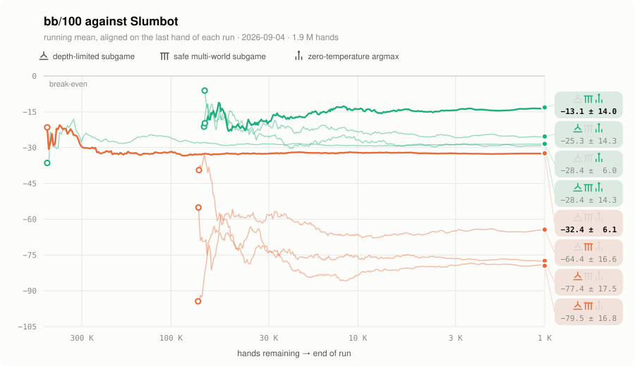
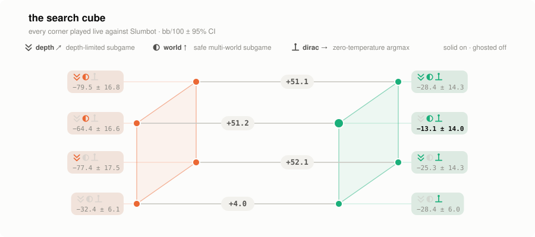
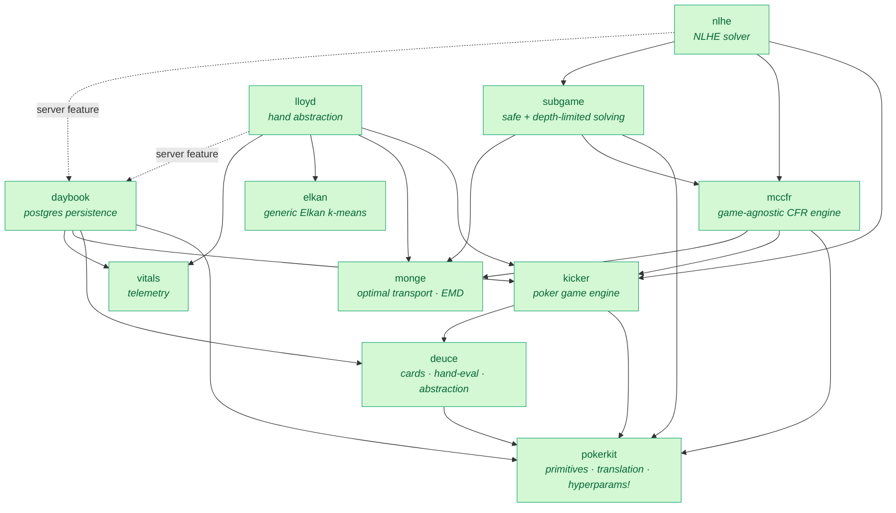
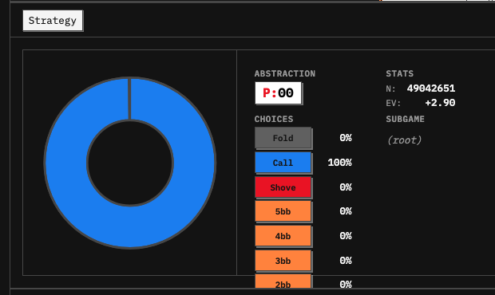
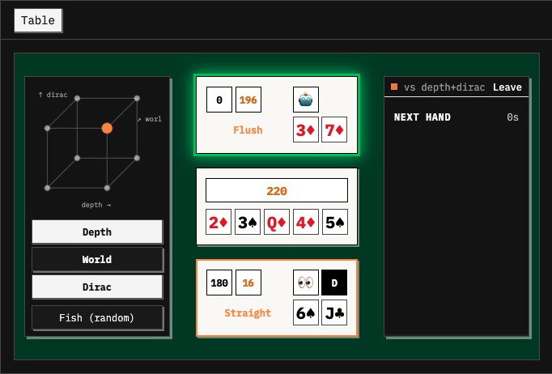
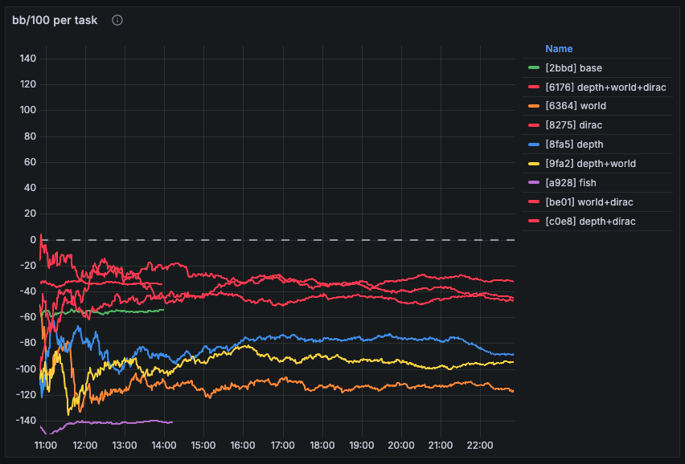

# robopoker

A Rust implementation of superhuman-scale poker AI, seeking functional parity with Pluribus¹ — hand evaluation, optimal transport, clustering, the CFR framework, the game engine, persistence, and telemetry, each written from scratch as a single-purpose crate.

  

  <b>Figure 1.</b> One hand, preflop → river, on nested clocks: the game tree flickers as MCCFR samples it,
  hero's range tightens street by street, the equity curves morph, the policy resolves, and the board deals out.
  Animated SVG emitted by the solver — no video, no scripts.

## Contributions

| Contribution | What it is |
| :--- | :--- |
| **Fastest open-source hand evaluator** | Nanosecond evaluation, outperforming Cactus Kev |
| **Optimal transport from scratch** | Sinkhorn/Greenkhorn⁵ over generic `Density`/`Support` measures, not a poker-specific hack |
| **Game-agnostic CFR framework** | Pluggable regret/policy/sampling schemes, held to closed-form equilibria on Kuhn, Leduc, and Rock-Paper-Scissors |
| **Action translation⁷,⁸** | Pseudo-harmonic mapping over finite lattices |
| **AIVAT variance reduction** | Low-variance evaluation over hand histories |
| **Evaluated in chips** | **−13.1 bb/100** against live [Slumbot](https://www.slumbot.com) over 86 K hands (§ [Evaluation](#evaluation)) |
| **Evaluated in shape** | A structural litmus suite holding the 169-cell range object to common-knowledge GTO invariants — rank monotonicity, suited/offsuit symmetry, no collapse onto a single action (§ [Evaluation](#evaluation)) |
| **Twelve published crates** | Every layer reusable on its own |

## Method

Three stages: a static abstraction computed once, a blueprint trained against it, and a real-time re-solve at play time.


```mermaid
flowchart LR
  subgraph S1["1 · abstraction"]
    direction LR
    A["deuce<br/>isomorphic hands"] --> B["lloyd<br/>hierarchical k-means"]
    B --> C["monge<br/>EMD · Sinkhorn"]
  end
  subgraph S2["2 · training"]
    D["mccfr + nlhe<br/>blueprint (Flagship)"]
  end
  subgraph S3["3 · search"]
    F["subgame<br/>depth-limited re-solve"]
  end
  C --> DB[("daybook<br/>PostgreSQL")]
  DB --> D
  D -->|checkpoint| DB
  DB -.->|blueprint prior| F
  F -.->|concrete action| G["portal · parlor"]
```

### 1 · Hierarchical abstraction

Computed once, per street, river → turn → flop → preflop.

- `deuce` — exhaustively iterates the isomorphic⁴ hand space; nanosecond evaluation over bijective `u8`/`u16`/`u32`/`u64` card encodings
- `lloyd` — groups strategically similar hands by hierarchical k-means, with k-means++² seeding and `elkan` triangle-inequality acceleration
- `monge` — measures distance as the Earth Mover's Distance between child-street distributions, by Sinkhorn/Greenkhorn iteration⁵
- `daybook` — persists abstractions over `COPY IN`, with `(Regime × Version)` table naming and a fingerprint check against silent constant drift

  
   
  <b>Figure 2.</b> The clustering feature. Each curve is one hand's distribution over next-street outcomes;
  hands whose curves lie close in EMD share an abstraction bucket. This is what makes 3.1 T situations tractable.

### 2 · MCCFR training³

- `kicker` — the game engine sampled through: full side-pot/all-in/tie settlement, `Size::SPR(n, d)` and `Size::BBs(n)` bet-sizing, `Witness` (one player's view) versus `Perfect` (god's view) recall
- `mccfr` — game-agnostic `CfrEncoder` → `Solver` → `Tree` machinery, with external sampling and dynamic tree construction
- `nlhe` — the concrete schemes via `Nlhe<R, W, S>` and the production `Flagship` config: discounted/linear regret weighting⁶, regret-based pruning⁹,¹¹
- `forge` — orchestrates `Fast` (single-machine, in-memory) or `Slow` (distributed workers) mode, checkpointing to the database

  
   
  <b>Figure 3.</b> External sampling walks one trajectory per iteration — chance nodes fan into revealed cards,
  decision nodes into the bet-sizing lattice, and the highlighted path is the branch being updated. Streets are the
  vertical bands; the acting seat labels each column.

### 3 · Real-time search

At play time the blueprint becomes a prior, and the current spot is re-solved.

- `DepthEdge<E, D>` — builds a depth-limited¹⁰ frontier with biased continuation strategies
- `WorldProfile` — partitions belief into discrete worlds for safe re-solving¹² that preserves the blueprint equilibrium
- `SubGameSolver` — composes both; `pokerkit`'s `Lattice` maps the abstract action back to a concrete chip amount by pseudo-harmonic translation⁷,⁸

  
   
  <b>Figure 4.</b> The 169-cell grid is the canonical lens on strategy quality: hero's representing range, the
  action distribution at the node, villain's defending range. Structural pathologies — non-monotonic hand-strength
  ordering, suited/offsuit asymmetry, collapsed action support — are visible at a glance, and are asserted
  mechanically by <a href="crates/litmus"><code>litmus</code></a>.

## Evaluation

Two independent axes. Chips answer whether it wins; shape answers whether the strategy is sound, and can be measured in seconds rather than weeks.

### In chips — live play against Slumbot

Each variant layers a different real-time-search technique onto the MCCFR blueprint: `depth` (depth-limited solving¹⁰), `world` (world-partitioned belief¹²), and `dirac` (a zero-temperature picker that argmaxes the post-search policy). `base` is the blueprint with no search; `fish` plays uniformly at random. All nine play Slumbot live and in parallel, one task each.

  <picture>
    <source media="(prefers-color-scheme: dark)" srcset="assets/images/competition-convergence-dark.svg"/>
    
  </picture>

  <b>Figure 5.</b> Every hand of the run, drawn from the hand log rather than from a dashboard. Runs are aligned
  on their <i>last</i> hand — the axis is hands remaining — so every estimate lands on the right edge at the value
  Table 1 reports, and a longer run simply reaches further left. <code>base</code> and <code>dirac</code> spend no
  time per decision and play 480 K hands in five hours; the six search variants take seconds per decision and reach
  ~86 K in twenty-four, so they enter at the hollow dot. Each panel names its variant by the three feature slots
  rather than in words — solid when the feature is on, ghosted when off, spelled out in the key.

| Variant             |  Hands |    bb/100 | 95% CI |
| :------------------ | -----: | --------: | -----: |
| `world+dirac`       | 86.0 K | **−13.1** | ± 14.0 |
| `depth+dirac`       | 86.2 K |     −25.3 | ± 14.3 |
| `dirac`             |  480 K |     −28.4 |  ± 6.0 |
| `depth+world+dirac` | 86.7 K |     −28.4 | ± 14.3 |
| `base`              |  480 K |     −32.4 |  ± 6.1 |
| `world`             | 90.9 K |     −64.4 | ± 16.6 |
| `depth`             | 91.4 K |     −77.4 | ± 17.5 |
| `depth+world`       | 91.7 K |     −79.5 | ± 16.8 |
| `fish`              |  480 K |    −136.5 |  ± 3.8 |

<b>Table 1.</b> Slumbot results by search configuration. Intervals are 1.96·σ/√n over the per-hand pnl.

**Every variant with `dirac` beats every variant without it**, with no overlap between the two groups. The leader, `world+dirac`, is nineteen bb/100 ahead of `base` and sixty-six ahead of `depth+world`, and its interval (−27.2 … +0.9) reaches break-even.

  <picture>
    <source media="(prefers-color-scheme: dark)" srcset="assets/images/competition-cube-dark.svg"/>
    
  </picture>

  <b>Figure 6.</b> The same run as a configuration cube — each corner one on/off setting of the three search
  features, each long edge the <code>dirac</code> transition, labelled with what switching it on is worth there.
  <code>fish</code>, the uniform-random control, is measured but never plotted: at −136.5 it only stretches the
  axis.

The cube is where the structure shows. `dirac` on its own buys almost nothing (**+4.0** over `base`), but layered onto either search feature it is worth **~+51**. The mirror statement is the same fact: `depth` and `world` *without* `dirac` are catastrophic (−45.1 and −32.0 against `base`), and *with* it they are free or better (+3.0 and +15.2 against `dirac`). Real-time search produces a policy the blueprint's sampler then squanders, and argmaxing it recovers the entire loss. Averaged over the four on/off pairs, `dirac` is worth **+40 bb/100** against **−18** for `depth` and **−5** for `world`. The interpretation: **sampling temperature, not tree depth or belief partitioning, is the dominant loss source** — and search does not paper over it, which is the clearest available direction for further work.

Confidence intervals on the six search variants run ± 14 to ± 18 bb/100 at ~86–92 K hands, so ordering *within* the `*+dirac` cluster is suggestive rather than settled — only the split between the `dirac` and non-`dirac` groups is fully separated. The three reference tasks — `base`, `dirac`, `fish` — have no per-decision think and blitz their budget, so they run an order of magnitude longer (480 K hands) and their estimates are tight (± 5.7).

Both figures are generated from the `players ⋈ users ⋈ hands` log by [`scripts/figures/slumbot.py`](scripts/figures/slumbot.py) — no dashboard screenshots, so the plotted endpoints and Table 1 are the same numbers by construction.

These figures postdate a showdown-evaluation fix — full houses now correctly outrank flushes, and flushes carry kickers — which shifts terminal utilities and therefore every number downstream of them. Earlier published results were measured against the buggy evaluator and are not comparable.

### In shape — the litmus suite

Winrate is a single scalar, and a slow one — separating two variants takes hundreds of thousands of hands. The [`litmus`](crates/litmus) suite instead asserts invariants the 169-cell range object must satisfy against any opponent: monotonicity along hand-strength sequences, suited/offsuit symmetry, no collapse onto a single action. It runs against a live blueprint over HTTP and answers in seconds.

| Category                  | Pass | Fail | Asserts                                                 |
| :------------------------ | ---: | ---: | :------------------------------------------------------ |
| `preflop_weak_rags`       |    5 |    1 | Trash folds instead of sticking in a stuck bucket        |
| `suited_offsuit_symmetry` |    3 |    3 | `AKs` and `AKo` play alike                               |
| `flop_air`                |    3 |    1 | Air checks on bad boards instead of over-betting         |
| `preflop_overjam`         |    3 |    1 | `JJ`/`QQ`/`AKo` do not collapse to all-in                |
| `flop_cbet`, `flop_value` |    6 |    0 | The c-bet and value lines exist at all                   |
| `preflop_bb_defense`      |    3 |    0 | BB defends rather than over-folding                      |
| `preflop_premium_control` |    2 |    0 | `AA`/`AKs` stay aggressive without collapsing            |
| `structural_grid`         |    2 |    0 | Every bet-sizing slot is used somewhere                  |
| `rank_monotonicity`       |    1 |    0 | Aggression rises monotonically with hand strength        |
| Turn and river lines      |    5 |    0 | Value and air lines hold on later streets                |
| **Total**                 |   34 |    6 |                                                          |

<b>Table 2.</b> Blueprint at epoch 151.7 M — 156 K infosets, sum regret 32.1.

The six failures are the interesting part, because chasing them produced a root cause that the winrate number alone could never have surfaced. The `suited_offsuit_symmetry` failures look like a suit bug and are not one: preflop is exact — all 169 combinations, no abstraction — and offsuit-only hands like `TT` and `77` show the same pathology. The mechanism is a *kicker* collapse one street later. Flop k-means merges `AQo`, `AJo`, `ATo`, `A5o`, and `AQs` into a single bucket while `AK` gets its own, compressing a 5.1 pp exact kicker gradient to 0.8 pp; since the jam is the only abstraction-free action available, CFR routes each hand's true strength through it. Jam frequency ends up tracking distance above the bucket average rather than hand strength — inverted from GTO, which jams weak aces and never `AQo`.

Higher `k` cannot fix this: cross-kicker EMD (`AQo`–`A5o`, 0.0299) is indistinguishable from within-class distance (0.0262), because the vs-random-equity clustering feature is domination-blind at every street. The fix is targeted bucket surgery rather than more clusters, and `litmus` carries the detectors that gate it.

## Implementation

A workspace of small, single-purpose crates. 🟢 = published to [crates.io](https://crates.io); ⚪ = internal (`publish = false`). Twelve crates form the public surface — eleven libraries plus the `robopoker` facade that re-exports them. Most funnel toward `pokerkit`; `elkan`, `monge`, and `vitals` stand alone. Edges point to dependencies.


```mermaid
graph TD
  classDef pub fill:#d4f8d4,stroke:#2a7,color:#063
  pokerkit["pokerkit<br/><i>primitives · translation · hyperparams!</i>"]
  deuce["deuce<br/><i>cards · hand-eval · abstraction</i>"]
  monge["monge<br/><i>optimal transport · EMD</i>"]
  kicker["kicker<br/><i>poker game engine</i>"]
  mccfr["mccfr<br/><i>game-agnostic CFR engine</i>"]
  subgame["subgame<br/><i>safe + depth-limited solving</i>"]
  elkan["elkan<br/><i>generic Elkan k-means</i>"]
  vitals["vitals<br/><i>telemetry</i>"]
  daybook["daybook<br/><i>postgres persistence</i>"]
  lloyd["lloyd<br/><i>hand abstraction</i>"]
  nlhe["nlhe<br/><i>NLHE solver</i>"]

  deuce --> pokerkit
  kicker --> pokerkit
  kicker --> deuce
  mccfr --> pokerkit
  mccfr --> kicker
  mccfr --> monge
  subgame --> pokerkit
  subgame --> mccfr
  subgame --> monge
  daybook --> pokerkit
  daybook --> deuce
  daybook --> kicker
  daybook --> vitals
  lloyd --> kicker
  lloyd --> monge
  lloyd --> elkan
  lloyd --> vitals
  nlhe --> kicker
  nlhe --> mccfr
  nlhe --> subgame
  nlhe -.->|"server feature"| daybook
  lloyd -.->|"server feature"| daybook

  class pokerkit,deuce,monge,kicker,mccfr,subgame,elkan,vitals,daybook,nlhe,lloyd pub
```

| Crate                           |     | Description                                                                                |
| ------------------------------- | --- | ------------------------------------------------------------------------------------------ |
| [`pokerkit`](crates/pokerkit)   | 🟢  | Type aliases, constants, regime/version metadata, action translation, `hyperparams!` macro |
| [`deuce`](crates/deuce)         | 🟢  | Card primitives, hand evaluation, equity, strategic abstraction                            |
| [`monge`](crates/monge)         | 🟢  | Optimal transport (Sinkhorn, EMD) over arbitrary measures                                  |
| [`elkan`](crates/elkan)         | 🟢  | Generic, triangle-inequality-accelerated (Elkan 2003) k-means                              |
| [`lloyd`](crates/lloyd)         | 🟢  | Hierarchical k-means hand abstraction with EMD                                             |
| [`kicker`](crates/kicker)       | 🟢  | Poker game engine: state, edges, settlement, witness/perfect recall                        |
| [`mccfr`](crates/mccfr)         | 🟢  | Game-agnostic MCCFR framework with pluggable regret/policy/sampling                        |
| [`subgame`](crates/subgame)     | 🟢  | Safe (world-partitioned) and depth-limited subgame solving                                 |
| [`nlhe`](crates/nlhe)           | 🟢  | No-Limit Hold'em solver and abstraction                                                    |
| [`daybook`](crates/daybook)     | 🟢  | PostgreSQL bulk I/O via `Schema`/`Row`/`Streamable`                                        |
| [`vitals`](crates/vitals)       | 🟢  | OpenTelemetry init and a centrally-registered metric table                                 |
| [`robopoker`](crates/robopoker) | 🟢  | Facade re-exporting the published crates                                                   |

<b>Internal crates</b> — the product built on top, and its scaffolding

| Crate                         |     | Description                                                            |
| ----------------------------- | --- | ---------------------------------------------------------------------- |
| [`parlor`](crates/parlor)     | ⚪  | Async game coordinator with pluggable players and hand-history records |
| [`portal`](crates/portal)     | ⚪  | Unified HTTP/WebSocket backend (analysis API and game hosting)         |
| [`forge`](crates/forge)       | ⚪  | Training pipeline orchestration with distributed workers               |
| [`arena`](crates/arena)       | ⚪  | Hand-history analysis with AIVAT variance reduction                    |
| [`spar`](crates/spar)         | ⚪  | Slumbot API benchmark client                                           |
| [`litmus`](crates/litmus)     | ⚪  | Strategic litmus tests for blueprint validation                        |
| [`phh`](crates/phh)           | ⚪  | Poker-hand-history parsing and chip-exact replay                       |
| [`bouncer`](crates/bouncer)   | ⚪  | JWT and Argon2 authentication, session management                      |
| [`kuhn`](crates/kuhn)         | ⚪  | Kuhn poker — MCCFR framework validation                                |
| [`leduc`](crates/leduc)       | ⚪  | Leduc Hold'em — MCCFR framework validation                             |
| [`roshambo`](crates/roshambo) | ⚪  | Rock-Paper-Scissors — MCCFR framework validation                       |

<b>Feature flags, resource requirements, telemetry</b>

| Feature     | Description                                          |
| ----------- | ---------------------------------------------------- |
| `database`  | PostgreSQL integration                               |
| `server`    | Server dependencies (Actix, Tokio, Rayon, telemetry) |
| `async`     | Async MCCFR sampling/regret variants                 |
| `shortdeck` | 36-card short-deck variant                           |
| `sixmax`    | Six-handed build (`N = 6`)                           |

| Street  | Abstraction size | Metric size |
| ------- | ---------------- | ----------- |
| Preflop | 4 KB             | 301 KB      |
| Flop    | 32 MB            | 175 KB      |
| Turn    | 347 MB           | 175 KB      |
| River   | 3.02 GB          | —           |

Recommended: training on 16 vCPU / 120 GB RAM; PostgreSQL 14+ on 8 vCPU / 64 GB RAM; analysis on 1 vCPU / 4 GB RAM.

`vitals` emits OpenTelemetry metrics to any OTLP-compatible backend — sum regret, throughput, and heatmaps of tree- and infoset-size distributions over time. A metric added in `crates/vitals/src/metrics.rs` is visible immediately.



## Frontend

A closed-source analysis frontend is built entirely on this repository's public APIs — `portal`'s WebSocket and HTTP endpoints, the `lloyd` abstraction tables, and the blueprint format from `nlhe`. The crates here are sufficient to build a comparable product.

|                      |       |
| :----------------------------------------------------------------------------------------------: | :-------------------------------------------------------------------------------------------: |
| Showdown view; the cube selects the opponent's `depth × world × dirac` configuration. | Strategy at flop bucket `F:95` — action distribution, visits, EV, subgame history. |

## References

1. (2019). Superhuman AI for multiplayer poker. [(Science)](https://science.sciencemag.org/content/early/2019/07/10/science.aay2400)
2. (2014). Potential-Aware Imperfect-Recall Abstraction with Earth Mover's Distance in Imperfect-Information Games. [(AAAI)](http://www.cs.cmu.edu/~sandholm/potential-aware_imperfect-recall.aaai14.pdf)
3. (2007). Regret Minimization in Games with Incomplete Information. [(NIPS)](https://papers.nips.cc/paper/3306-regret-minimization-in-games-with-incomplete-information)
4. (2013). A Fast and Optimal Hand Isomorphism Algorithm. [(AAAI)](https://www.cs.cmu.edu/~waugh/publications/isomorphism13.pdf)
5. (2018). Near-linear time approximation algorithms for optimal transport via Sinkhorn iteration. [(NIPS)](https://arxiv.org/abs/1705.09634)
6. (2019). Solving Imperfect-Information Games via Discounted Regret Minimization. [(AAAI)](https://arxiv.org/pdf/1809.04040.pdf)
7. (2013). Action Translation in Extensive-Form Games with Large Action Spaces. [(IJCAI)](http://www.cs.cmu.edu/~sandholm/reverse%20mapping.ijcai13.pdf)
8. (2015). Discretization of Continuous Action Spaces in Extensive-Form Games. [(AAMAS)](http://www.cs.cmu.edu/~sandholm/discretization.aamas15.fromACM.pdf)
9. (2015). Regret-Based Pruning in Extensive-Form Games. [(NIPS)](http://www.cs.cmu.edu/~sandholm/regret-basedPruning.nips15.withAppendix.pdf)
10. (2018). Depth-Limited Solving for Imperfect-Information Games. [(NeurIPS)](https://arxiv.org/pdf/1805.08195.pdf)
11. (2017). Reduced Space and Faster Convergence in Imperfect-Information Games via Pruning. [(ICML)](http://www.cs.cmu.edu/~sandholm/reducedSpace.icml17.pdf)
12. (2017). Safe and Nested Subgame Solving for Imperfect-Information Games. [(NIPS)](https://www.cs.cmu.edu/~noamb/papers/17-NIPS-Safe.pdf)

## License

MIT License — see [LICENSE](LICENSE).
