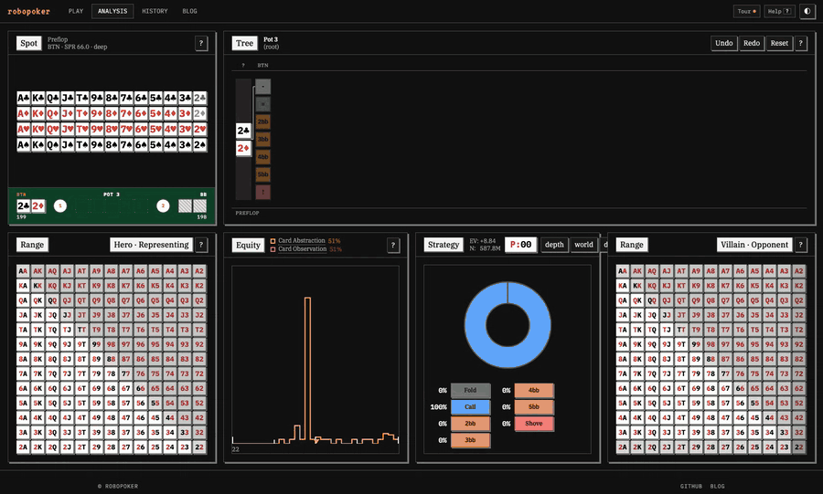
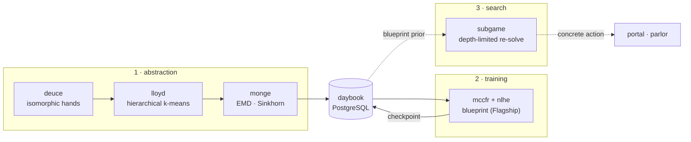
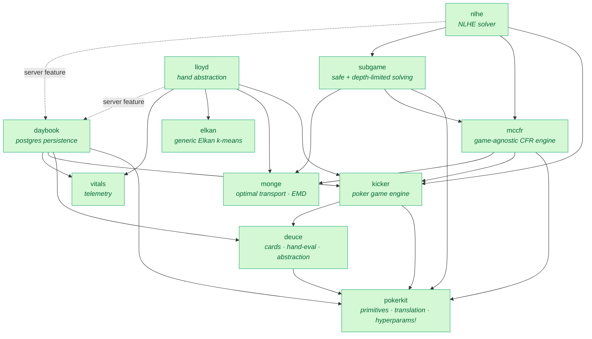

# robopoker

A Rust implementation of superhuman-scale poker AI, seeking functional parity with Pluribus¹ — hand evaluation, optimal transport, clustering, the CFR framework, the game engine, persistence, and telemetry, each written from scratch as a single-purpose crate.

  
   
  <b>Figure 1.</b> The analysis dashboard, driven through one hand.

## Contributions

| Contribution | What it is |
| :--- | :--- |
| **Fastest open-source hand evaluator** | Nanosecond evaluation, outperforming Cactus Kev |
| **Optimal transport from scratch** | Sinkhorn/Greenkhorn⁵ over generic `Density`/`Support` measures |
| **Game-agnostic CFR framework** | Pluggable regret/policy/sampling, held to closed-form equilibria on Kuhn, Leduc, RPS |
| **Action translation⁷,⁸** | Pseudo-harmonic mapping over finite lattices |
| **AIVAT variance reduction** | Low-variance evaluation over hand histories |
| **Evaluated in chips** | **−13.1 bb/100** against live [Slumbot](https://www.slumbot.com) over 86 K hands (§ [Evaluation](#evaluation)) |
| **Evaluated in shape** | A litmus suite holding the 169-cell range object to GTO invariants (§ [Evaluation](#evaluation)) |
| **Twelve published crates** | Every layer reusable on its own |

## Method

An abstraction computed once, a blueprint trained against it, a re-solve at play time.

```mermaid
flowchart LR
  subgraph S1["1 · abstraction"]
    direction LR
    A["deuce<br/>isomorphic hands"] --> B["lloyd<br/>hierarchical k-means"]
    B --> C["monge<br/>EMD · Sinkhorn"]
  end
  subgraph S2["2 · training"]
    D["mccfr + nlhe<br/>blueprint (Flagship)"]
  end
  subgraph S3["3 · search"]
    F["subgame<br/>depth-limited re-solve"]
  end
  C --> DB[("daybook<br/>PostgreSQL")]
  DB --> D
  D -->|checkpoint| DB
  DB -.->|blueprint prior| F
  F -.->|concrete action| G["portal · parlor"]
```

### 1 · Hierarchical abstraction — once, per street, river → preflop

- `deuce` — iterates the isomorphic⁴ hand space; nanosecond evaluation over bijective card encodings
- `lloyd` — hierarchical k-means over those hands, k-means++² seeded, `elkan`-accelerated
- `monge` — distance as Earth Mover's Distance between child-street distributions, by Sinkhorn/Greenkhorn⁵
- `daybook` — persists them over `COPY IN`, `(Regime × Version)` table naming, fingerprinted against silent constant drift

  
   
  <b>Figure 2.</b> Each curve is one hand's distribution over next-street outcomes; hands close in EMD share a bucket.

### 2 · MCCFR training³

- `kicker` — the engine sampled through: side-pot/all-in/tie settlement, `Size::SPR`/`Size::BBs` sizing, `Witness` versus `Perfect` recall
- `mccfr` — game-agnostic `CfrEncoder` → `Solver` → `Tree`, external sampling, dynamic tree construction
- `nlhe` — the concrete schemes: `Nlhe<R, W, S>`, the `Flagship` config, discounted/linear regret⁶, regret-based pruning⁹,¹¹
- `forge` — `Fast` (in-memory) or `Slow` (distributed) orchestration, checkpointing to the database

  
   
  <b>Figure 3.</b> External sampling walks one trajectory per iteration; the highlighted path is the branch being updated.

### 3 · Real-time search — the blueprint as prior, the spot re-solved

- `DepthEdge<E, D>` — a depth-limited¹⁰ frontier with biased continuations
- `WorldProfile` — belief partitioned into worlds for safe¹² re-solving
- `SubGameSolver` — composes both; `pokerkit`'s `Lattice` maps the abstract action back to chips⁷,⁸

  
   
  <b>Figure 4.</b> Hero's range, the action distribution, villain's range — the canonical lens, asserted by <a href="crates/litmus"><code>litmus</code></a>.

## Evaluation

### In chips — live play against Slumbot

`depth` = depth-limited subgame¹⁰ · `world` = safe multi-world subgame¹² · `dirac` = argmax the post-search policy · `base` = blueprint alone · `fish` = uniform random. All nine play Slumbot live, in parallel.

  <picture>
    <source media="(prefers-color-scheme: dark)" srcset="assets/images/competition-convergence-dark.svg"/>
    
  </picture>
   
  <b>Figure 5.</b> Every hand, from the hand log; runs align on their <i>last</i>. Search variants think for seconds and enter at the hollow dot.

| Variant             |  Hands |    bb/100 | 95% CI |
| :------------------ | -----: | --------: | -----: |
| `world+dirac`       | 86.0 K | **−13.1** | ± 14.0 |
| `depth+dirac`       | 86.2 K |     −25.3 | ± 14.3 |
| `dirac`             |  480 K |     −28.4 |  ± 6.0 |
| `depth+world+dirac` | 86.7 K |     −28.4 | ± 14.3 |
| `base`              |  480 K |     −32.4 |  ± 6.1 |
| `world`             | 90.9 K |     −64.4 | ± 16.6 |
| `depth`             | 91.4 K |     −77.4 | ± 17.5 |
| `depth+world`       | 91.7 K |     −79.5 | ± 16.8 |
| `fish`              |  480 K |    −136.5 |  ± 3.8 |

<b>Table 1.</b> 1.96·σ/√n over per-hand pnl. Every `dirac` variant beats every non-`dirac` one, no overlap. Post showdown-fix; earlier numbers aren't comparable.

  <picture>
    <source media="(prefers-color-scheme: dark)" srcset="assets/images/competition-cube-dark.svg"/>
    
  </picture>
   
  <b>Figure 6.</b> The run as a cube; long edges are the <code>dirac</code> transition. Alone it buys <b>+4</b>, on top of search <b>~+51</b> — sampling temperature, not search, is the dominant loss.

### In shape — the litmus suite

| Category                  | Pass | Fail | Asserts                                           |
| :------------------------ | ---: | ---: | :------------------------------------------------ |
| `preflop_weak_rags`       |    5 |    1 | Trash folds instead of sticking in a stuck bucket  |
| `suited_offsuit_symmetry` |    3 |    3 | `AKs` and `AKo` play alike                         |
| `flop_air`                |    3 |    1 | Air checks on bad boards instead of over-betting   |
| `preflop_overjam`         |    3 |    1 | `JJ`/`QQ`/`AKo` do not collapse to all-in          |
| `flop_cbet`, `flop_value` |    6 |    0 | The c-bet and value lines exist at all             |
| `preflop_bb_defense`      |    3 |    0 | BB defends rather than over-folding                |
| `preflop_premium_control` |    2 |    0 | `AA`/`AKs` stay aggressive without collapsing      |
| `structural_grid`         |    2 |    0 | Every bet-sizing slot is used somewhere            |
| `rank_monotonicity`       |    1 |    0 | Aggression rises monotonically with hand strength  |
| Turn and river lines      |    5 |    0 | Value and air lines hold on later streets          |
| **Total**                 |   34 |    6 |                                                    |

<b>Table 2.</b> [`litmus`](crates/litmus) answers in seconds where a winrate takes weeks. Epoch 151.7 M, 156 K infosets, sum regret 32.1. All six failures share a cause: flop k-means merges `AQo` through `A5o` into one bucket while `AK` gets its own, so CFR routes kicker strength through the jam.

## Implementation

🟢 published to [crates.io](https://crates.io) · ⚪ internal. Edges point to dependencies.

```mermaid
graph TD
  classDef pub fill:#d4f8d4,stroke:#2a7,color:#063
  pokerkit["pokerkit<br/><i>primitives · translation · hyperparams!</i>"]
  deuce["deuce<br/><i>cards · hand-eval · abstraction</i>"]
  monge["monge<br/><i>optimal transport · EMD</i>"]
  kicker["kicker<br/><i>poker game engine</i>"]
  mccfr["mccfr<br/><i>game-agnostic CFR engine</i>"]
  subgame["subgame<br/><i>safe + depth-limited solving</i>"]
  elkan["elkan<br/><i>generic Elkan k-means</i>"]
  vitals["vitals<br/><i>telemetry</i>"]
  daybook["daybook<br/><i>postgres persistence</i>"]
  lloyd["lloyd<br/><i>hand abstraction</i>"]
  nlhe["nlhe<br/><i>NLHE solver</i>"]

  deuce --> pokerkit
  kicker --> pokerkit
  kicker --> deuce
  mccfr --> pokerkit
  mccfr --> kicker
  mccfr --> monge
  subgame --> pokerkit
  subgame --> mccfr
  subgame --> monge
  daybook --> pokerkit
  daybook --> deuce
  daybook --> kicker
  daybook --> vitals
  lloyd --> kicker
  lloyd --> monge
  lloyd --> elkan
  lloyd --> vitals
  nlhe --> kicker
  nlhe --> mccfr
  nlhe --> subgame
  nlhe -.->|"server feature"| daybook
  lloyd -.->|"server feature"| daybook

  class pokerkit,deuce,monge,kicker,mccfr,subgame,elkan,vitals,daybook,nlhe,lloyd pub
```

| Crate                           |     | Description                                                                                |
| ------------------------------- | --- | ------------------------------------------------------------------------------------------ |
| [`pokerkit`](crates/pokerkit)   | 🟢  | Type aliases, constants, regime/version metadata, action translation, `hyperparams!` macro |
| [`deuce`](crates/deuce)         | 🟢  | Card primitives, hand evaluation, equity, strategic abstraction                            |
| [`monge`](crates/monge)         | 🟢  | Optimal transport (Sinkhorn, EMD) over arbitrary measures                                  |
| [`elkan`](crates/elkan)         | 🟢  | Generic, triangle-inequality-accelerated (Elkan 2003) k-means                              |
| [`lloyd`](crates/lloyd)         | 🟢  | Hierarchical k-means hand abstraction with EMD                                             |
| [`kicker`](crates/kicker)       | 🟢  | Poker game engine: state, edges, settlement, witness/perfect recall                        |
| [`mccfr`](crates/mccfr)         | 🟢  | Game-agnostic MCCFR framework with pluggable regret/policy/sampling                        |
| [`subgame`](crates/subgame)     | 🟢  | Safe (world-partitioned) and depth-limited subgame solving                                 |
| [`nlhe`](crates/nlhe)           | 🟢  | No-Limit Hold'em solver and abstraction                                                    |
| [`daybook`](crates/daybook)     | 🟢  | PostgreSQL bulk I/O via `Schema`/`Row`/`Streamable`                                        |
| [`vitals`](crates/vitals)       | 🟢  | OpenTelemetry init and a centrally-registered metric table                                 |
| [`robopoker`](crates/robopoker) | 🟢  | Facade re-exporting the published crates                                                   |

<b>Internal crates</b>

| Crate                         |     | Description                                                            |
| ----------------------------- | --- | ---------------------------------------------------------------------- |
| [`parlor`](crates/parlor)     | ⚪  | Async game coordinator with pluggable players and hand-history records |
| [`portal`](crates/portal)     | ⚪  | Unified HTTP/WebSocket backend (analysis API and game hosting)         |
| [`forge`](crates/forge)       | ⚪  | Training pipeline orchestration with distributed workers               |
| [`arena`](crates/arena)       | ⚪  | Hand-history analysis with AIVAT variance reduction                    |
| [`spar`](crates/spar)         | ⚪  | Slumbot API benchmark client                                           |
| [`litmus`](crates/litmus)     | ⚪  | Strategic litmus tests for blueprint validation                        |
| [`rosetta`](crates/rosetta)   | ⚪  | Names every abstraction bucket from a sample of its own hands          |
| [`phh`](crates/phh)           | ⚪  | Poker-hand-history parsing and chip-exact replay                       |
| [`bouncer`](crates/bouncer)   | ⚪  | JWT and Argon2 authentication, session management                      |
| [`kuhn`](crates/kuhn)         | ⚪  | Kuhn poker — MCCFR framework validation                                |
| [`leduc`](crates/leduc)       | ⚪  | Leduc Hold'em — MCCFR framework validation                             |
| [`roshambo`](crates/roshambo) | ⚪  | Rock-Paper-Scissors — MCCFR framework validation                       |

<b>Feature flags, resources, telemetry</b>

| Feature     | Description                                          |
| ----------- | ---------------------------------------------------- |
| `database`  | PostgreSQL integration                               |
| `server`    | Server dependencies (Actix, Tokio, Rayon, telemetry) |
| `async`     | Async MCCFR sampling/regret variants                 |
| `shortdeck` | 36-card short-deck variant                           |
| `sixmax`    | Six-handed build (`N = 6`)                           |

| Street  | Abstraction size | Metric size |
| ------- | ---------------- | ----------- |
| Preflop | 4 KB             | 301 KB      |
| Flop    | 32 MB            | 175 KB      |
| Turn    | 347 MB           | 175 KB      |
| River   | 3.02 GB          | —           |

Training: 16 vCPU / 120 GB. PostgreSQL 14+: 8 vCPU / 64 GB. Analysis: 1 vCPU / 4 GB.

<b>Figure 7.</b> `vitals` emits OpenTelemetry to any OTLP backend; a metric added in <code>crates/vitals/src/metrics.rs</code> is visible immediately.

## Frontend

Closed-source, built entirely on this repository's public APIs — `portal`'s endpoints, `lloyd`'s tables, `nlhe`'s blueprint format.

|                      |       |
| :----------------------------------------------------------------------------------------------: | :-------------------------------------------------------------------------------------------: |
| <b>Figure 8.</b> Showdown; the cube selects villain's `depth × world × dirac`.        | <b>Figure 9.</b> Flop bucket `F:95` — actions, visits, EV, subgame history.        |

## References

1. (2019). Superhuman AI for multiplayer poker. [(Science)](https://science.sciencemag.org/content/early/2019/07/10/science.aay2400)
2. (2014). Potential-Aware Imperfect-Recall Abstraction with Earth Mover's Distance in Imperfect-Information Games. [(AAAI)](http://www.cs.cmu.edu/~sandholm/potential-aware_imperfect-recall.aaai14.pdf)
3. (2007). Regret Minimization in Games with Incomplete Information. [(NIPS)](https://papers.nips.cc/paper/3306-regret-minimization-in-games-with-incomplete-information)
4. (2013). A Fast and Optimal Hand Isomorphism Algorithm. [(AAAI)](https://www.cs.cmu.edu/~waugh/publications/isomorphism13.pdf)
5. (2018). Near-linear time approximation algorithms for optimal transport via Sinkhorn iteration. [(NIPS)](https://arxiv.org/abs/1705.09634)
6. (2019). Solving Imperfect-Information Games via Discounted Regret Minimization. [(AAAI)](https://arxiv.org/pdf/1809.04040.pdf)
7. (2013). Action Translation in Extensive-Form Games with Large Action Spaces. [(IJCAI)](http://www.cs.cmu.edu/~sandholm/reverse%20mapping.ijcai13.pdf)
8. (2015). Discretization of Continuous Action Spaces in Extensive-Form Games. [(AAMAS)](http://www.cs.cmu.edu/~sandholm/discretization.aamas15.fromACM.pdf)
9. (2015). Regret-Based Pruning in Extensive-Form Games. [(NIPS)](http://www.cs.cmu.edu/~sandholm/regret-basedPruning.nips15.withAppendix.pdf)
10. (2018). Depth-Limited Solving for Imperfect-Information Games. [(NeurIPS)](https://arxiv.org/pdf/1805.08195.pdf)
11. (2017). Reduced Space and Faster Convergence in Imperfect-Information Games via Pruning. [(ICML)](http://www.cs.cmu.edu/~sandholm/reducedSpace.icml17.pdf)
12. (2017). Safe and Nested Subgame Solving for Imperfect-Information Games. [(NIPS)](https://www.cs.cmu.edu/~noamb/papers/17-NIPS-Safe.pdf)

## License

MIT License — see [LICENSE](LICENSE).
