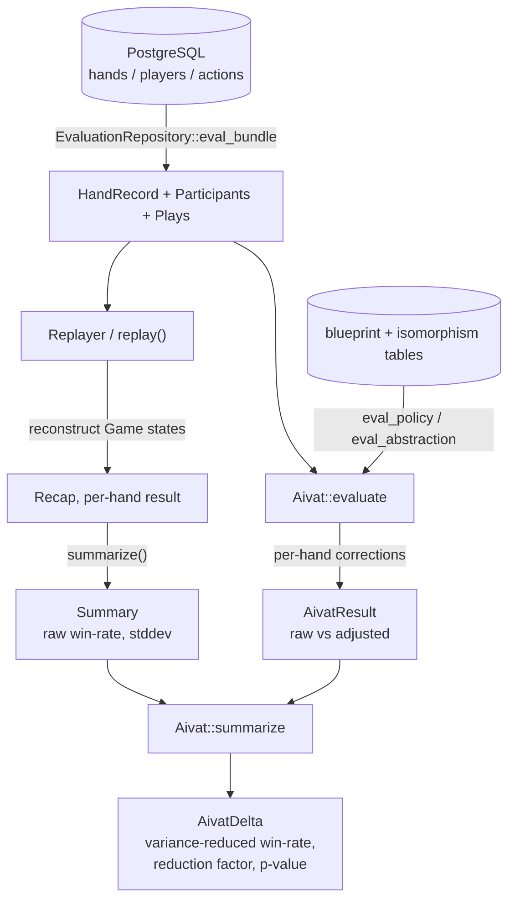
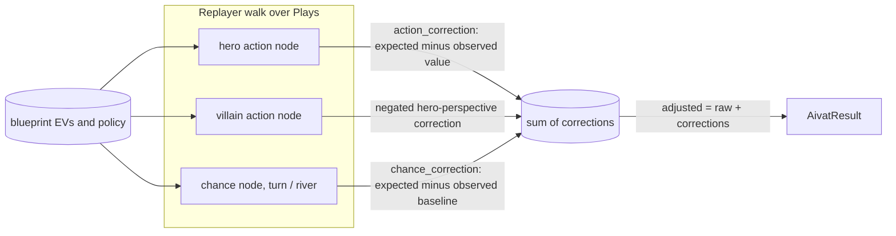

# arena

Hand history analysis with AIVAT variance reduction.

`arena` turns stored No-Limit Hold'em hand histories into statistically sound performance estimates. It replays each hand through the game engine, then applies **AIVAT** — using a trained MCCFR blueprint as a control variate to strip out the luck of card deals and action choices, sharpening win-rate estimates without introducing bias.

## Architecture

At every decision and post-flop chance node, the blueprint's expected value supplies a mean-zero correction term:

`EvaluationRepository` bulk-loads each hand as a `(HandRecord, Participants, Plays)` bundle; `Replayer` walks it through the engine to produce a `Recap`, and `summarize` folds recaps into a `Summary` (raw win-rate, VPIP/PFR, stddev). In parallel, `Aivat::evaluate` re-walks the same hand and, at every hero action, villain action, and post-flop chance node, looks up the blueprint's expected values to compute a correction (`action_correction` and `chance_correction` are the two control variates). `Aivat::summarize` combines the per-hand `AivatResult`s with the raw `Summary` into an `AivatDelta` reporting adjusted win-rate, variance-reduction factor, and significance.

The intuition: AIVAT is a control-variate estimator. It adds a mean-zero correction — the difference between the blueprint's *expected* outcome and the one that actually happened — so favorable and unfavorable chance events cancel out. The estimate stays unbiased while its variance drops sharply, letting you distinguish real skill from noise in far fewer hands.
