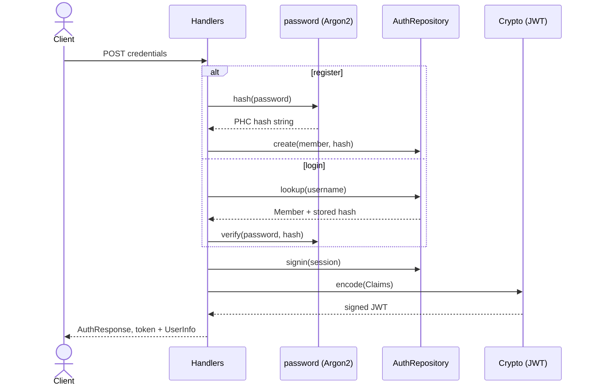
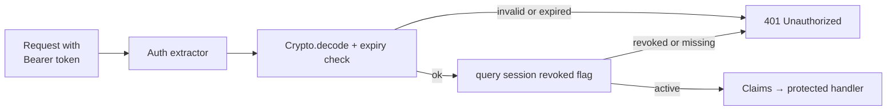

# bouncer

JWT and Argon2 authentication for robopoker.

## Architecture

`bouncer` issues short-lived JWTs backed by server-side session records. Passwords are hashed with Argon2; sessions are persisted so they can be revoked before the token expires. The crate splits into a portable core (identity types, claims, crypto, password hashing) and a `server` feature that adds actix-web handlers, request extractors, and the PostgreSQL repository.

Every request to a protected route is re-checked against both token validity and session state:

The core identity model is `User`, an enum of `Auth(Member)` for registered users and `Anon(Lurker)` for anonymous spectators; both carry a phantom-typed `ID<T>` (a UUID newtype from `pokerkit`). `Claims` is the JWT payload (subject, session id, username, issued/expiry timestamps), signed and verified by `Crypto` (HS256 via `jsonwebtoken`, 15-minute access tokens). Every login creates a `Session` row so the `Auth` extractor can reject revoked tokens on each request, while `MaybeAuth` does the same check without failing when no valid token is present.
