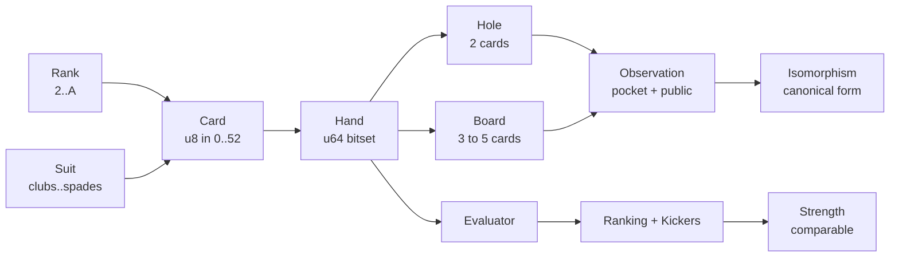
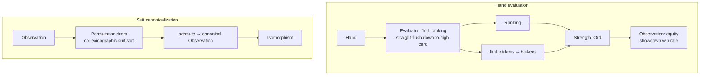

# deuce

Card representation, hand evaluation, and strategic abstraction primitives.

`deuce` is the foundational card layer. Every type is built around bijective integer encodings and branchless bit manipulation: a `Card` is one byte, a `Hand` is a 64-bit set, and hand evaluation is pure bit-twiddling. On top of these it builds the suit-isomorphism machinery that collapses the game's enormous observation space into strategically-distinct equivalence classes.

## Architecture

The core types form an encoding ladder from a single card up to a canonical, suit-reduced game state:

Two pipelines run over these types. Evaluation turns any 5-to-7 card `Hand` into a comparable `Strength`; abstraction canonicalizes an `Observation` under the 24 suit permutations of the symmetric group:

`Evaluator` searches rankings strongest-to-weakest over the `Hand`'s `u64`, returning a `Ranking` (category plus defining ranks) and a `Kickers` bitmask; together they compose into an `Ord`-comparable `Strength`. An `Observation` is a player's card view (`pocket` + `public`) and serializes to `i64`. `Permutation` derives the canonical suit relabeling by sorting suits co-lexicographically, and `Isomorphism` applies it — reducing billions of river observations to ~123M distinct classes. `HandIterator` (Gosper's-hack combinations) drives `ObservationIterator` and `IsomorphismIterator` to enumerate a whole `Street` in constant space. A `shortdeck` feature switches the stack to the 36-card variant.
