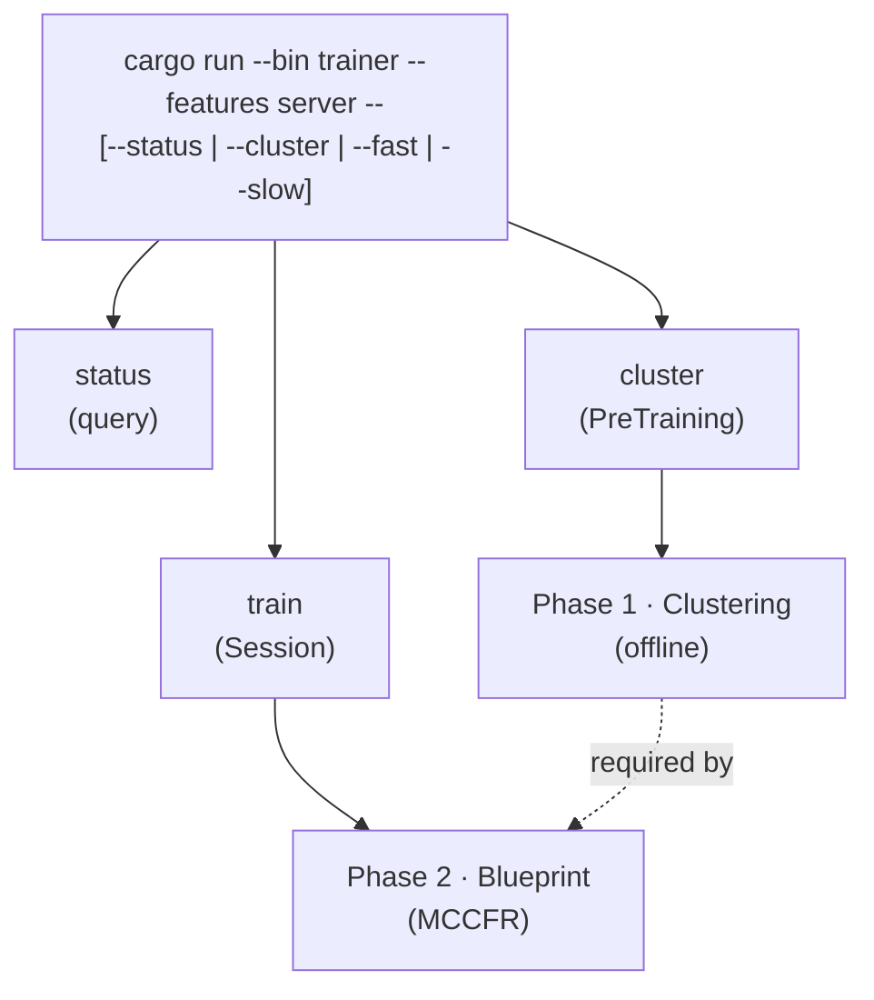
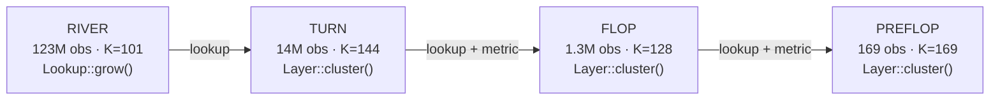
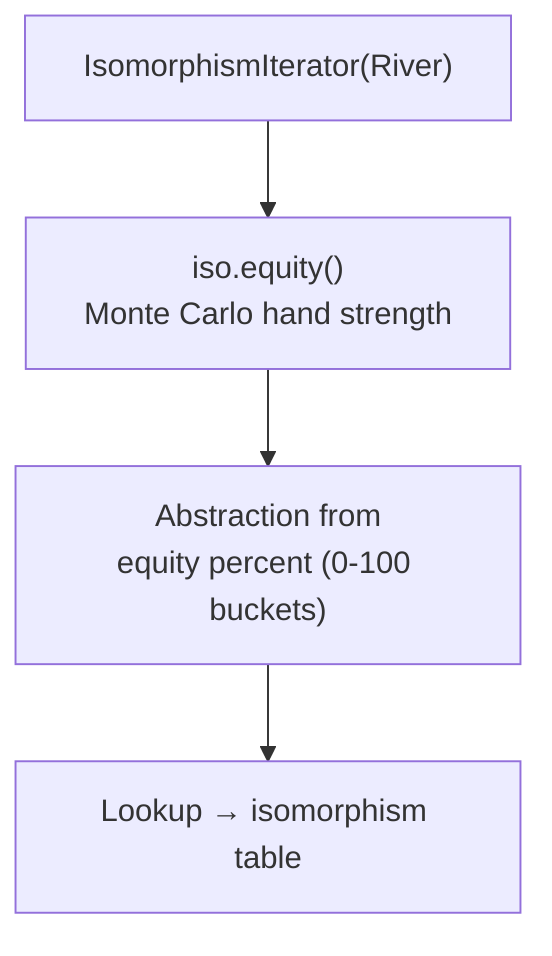
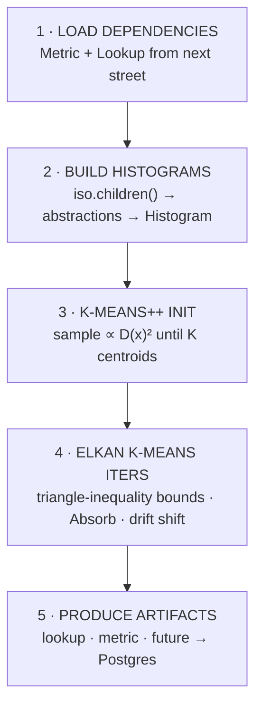
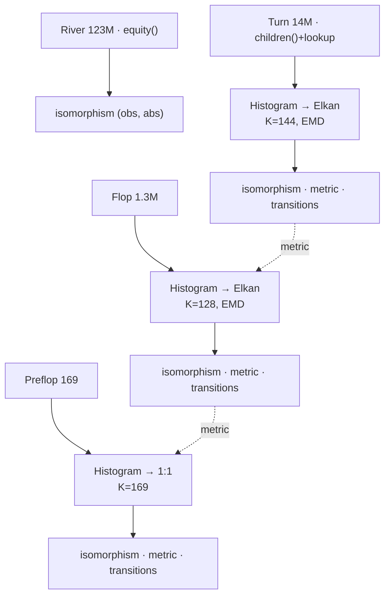
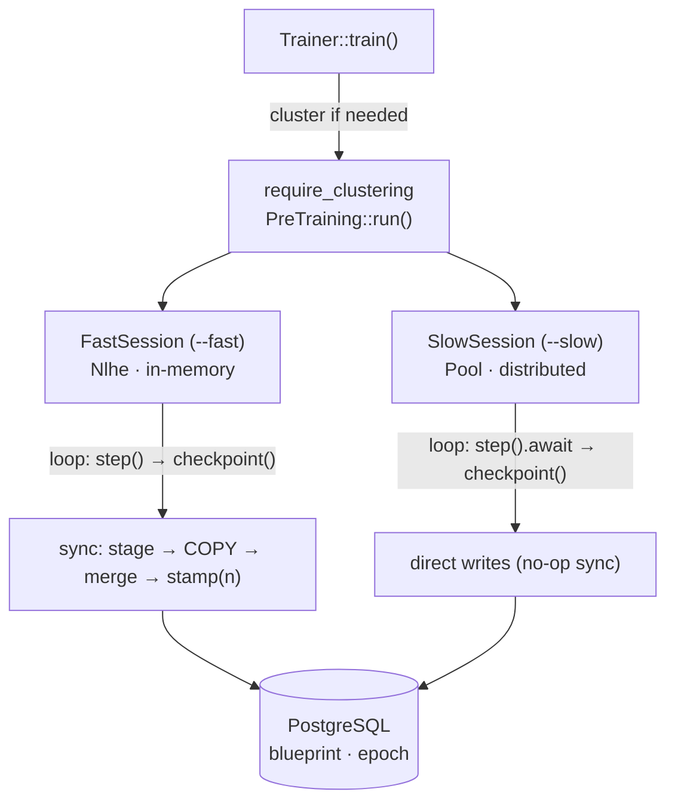
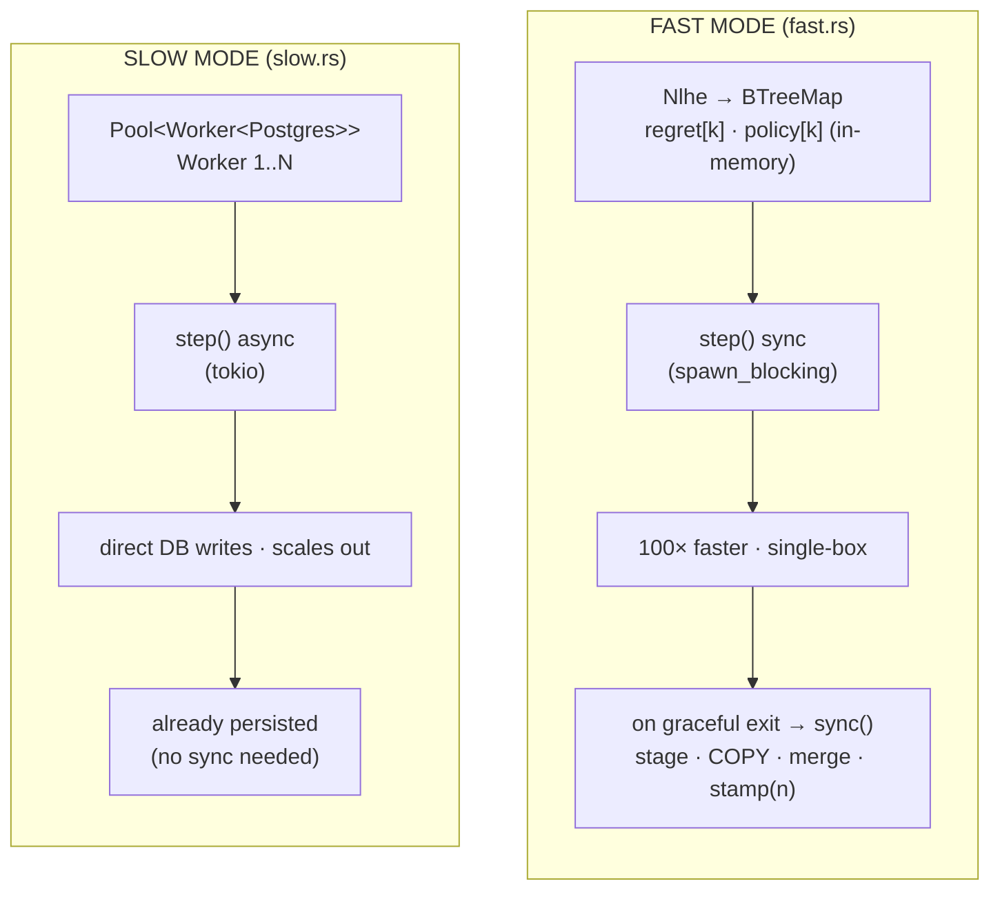
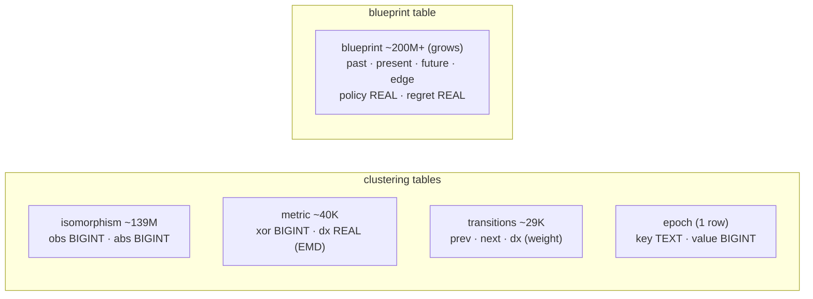
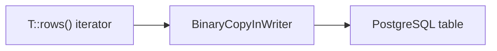

# forge

Automated MCCFR training-pipeline orchestration that streams data directly to PostgreSQL.

## High-Level Overview



1. **Clustering Phase**: Reduce 3.1 trillion poker situations into ~500 abstract buckets
2. **Blueprint Phase**: Train MCCFR strategies on the abstracted game tree

## Usage

```bash
# Check current state
cargo run --bin trainer --features server -- --status

# Run clustering only
cargo run --bin trainer --features server -- --cluster

# Run fast in-memory training (includes clustering if needed)
cargo run --bin trainer --features server -- --fast

# Run distributed training (includes clustering if needed)
cargo run --bin trainer --features server -- --slow
```

---

## Phase 1: Clustering (PreTraining)

**Entry Point:** `PreTraining::run()` in `src/pretraining.rs`

The clustering phase processes streets in **reverse order** (River → Turn → Flop → Preflop) because each street's abstraction depends on the _next_ street's lookup and metric.

### Reverse Dependency Chain



Each street produces a `lookup` (iso→abs), plus `metric` and `future` (except River); the next-coarser street loads those artifacts.

### Street Parameters

| Street  | N           | K   | Metric     | Space                  | Loads                    | Produces                   |
| ------- | ----------- | --- | ---------- | ---------------------- | ------------------------ | -------------------------- |
| River   | 123,156,254 | 101 | `f32::abs` | `Probability`          | N/A                      | lookup                     |
| Turn    | 13,960,050  | 144 | `W1`       | `Density<Probability>` | Lookup River             | lookup, metric, transition |
| Flop    | 1,286,792   | 128 | `EMD`      | `Density<Abstraction>` | Lookup Turn, Metric Turn | lookup, metric, transition |
| Preflop | 169         | 169 | `EMD`      | `Density<Abstraction>` | Lookup Flop, Metric Flop | lookup, metric, transition |

- **N**: Number of isomorphic observations on this street
- **K**: Number of abstraction clusters (river uses equity buckets 0-100%)
- **Metric**: Distance function for clustering (`W1` = Wasserstein-1, `EMD` = Earth Mover's Distance)
- **Space**: Element type being compared in the metric

### Per-Street Processing Detail

#### River Clustering (`pretraining.rs`)



No k-means (equity buckets *are* the abstractions) and no metric (equity distance is just `|e1 - e2|`).

#### Turn / Flop / Preflop Clustering (`Layer::cluster()`)



### Data Flow Through Tables



---

## Phase 2: Blueprint Training

**Entry Point:** `Trainer::train()` in `src/trainer.rs`



### Fast vs Slow Mode Comparison



- **Fast**: 100× more efficient, memory-bound, single machine.
- **Slow**: scales horizontally, I/O-bound, multi-machine ready.

Both modes implement the `Trainer` trait for polymorphic training:

```rust
#[async_trait]
pub trait Trainer: Send + Sync + Sized {
    fn client(&self) -> &Arc<Client>;
    async fn sync(self);
    async fn step(&mut self);
    async fn epoch(&self) -> usize;
    async fn summary(&self) -> String;
    async fn checkpoint(&self) -> Option<String>;
}
```

---

## Database Schema

### Core Tables



- `isomorphism` maps every isomorphic hand to its abstraction bucket.
- `metric` holds pairwise abstraction distances, used by the previous street's EMD.
- `transitions` holds the distribution over next-street abstractions per abstraction.
- `blueprint` stores the MCCFR strategy per information set — upserted via a staging table on graceful exit (FastSession) or written directly by workers (SlowSession).

### Derived Tables

| Table         | Columns                           | Rows | Description                   |
| ------------- | --------------------------------- | ---- | ----------------------------- |
| `abstraction` | `abs, street, population, equity` | 542  | Summary stats per abstraction |
| `street`      | `street, nobs, nabs`              | 4    | Summary stats per street      |

---

## Streaming Protocol

All data uses **PostgreSQL binary COPY** in 100k row chunks via the `Streamable` trait:



Implementors: `Lookup` (isomorphism), `Metric` (metric), `Future` (transitions), `Profile` (blueprint via staging).

---

## Resumability

| Feature           | Mechanism                                           |
| ----------------- | --------------------------------------------------- |
| Progress tracking | Queries `isomorphism` table to check completion     |
| Partial cleanup   | `truncate_street()` clears data before re-uploading |
| Epoch persistence | `epoch` table tracks MCCFR iteration count          |
| Graceful shutdown | Press `Q + Enter` to finish current batch and sync  |

---

## Key Insight

> Clustering flows **backwards** (river → preflop) because each street's abstraction depends on the _next_ street's distribution, while training flows **forwards** through the game tree, building blueprint strategies via MCCFR iterations.
