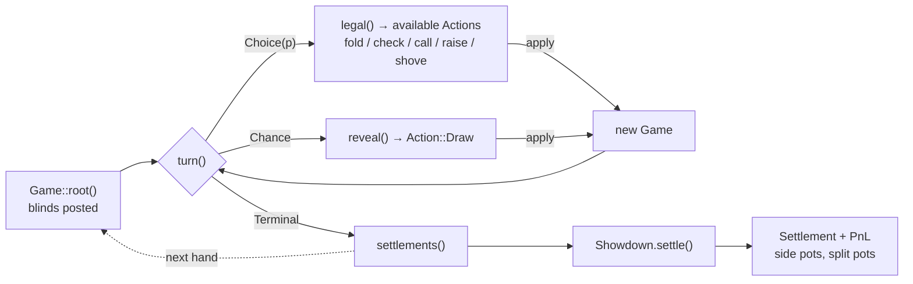
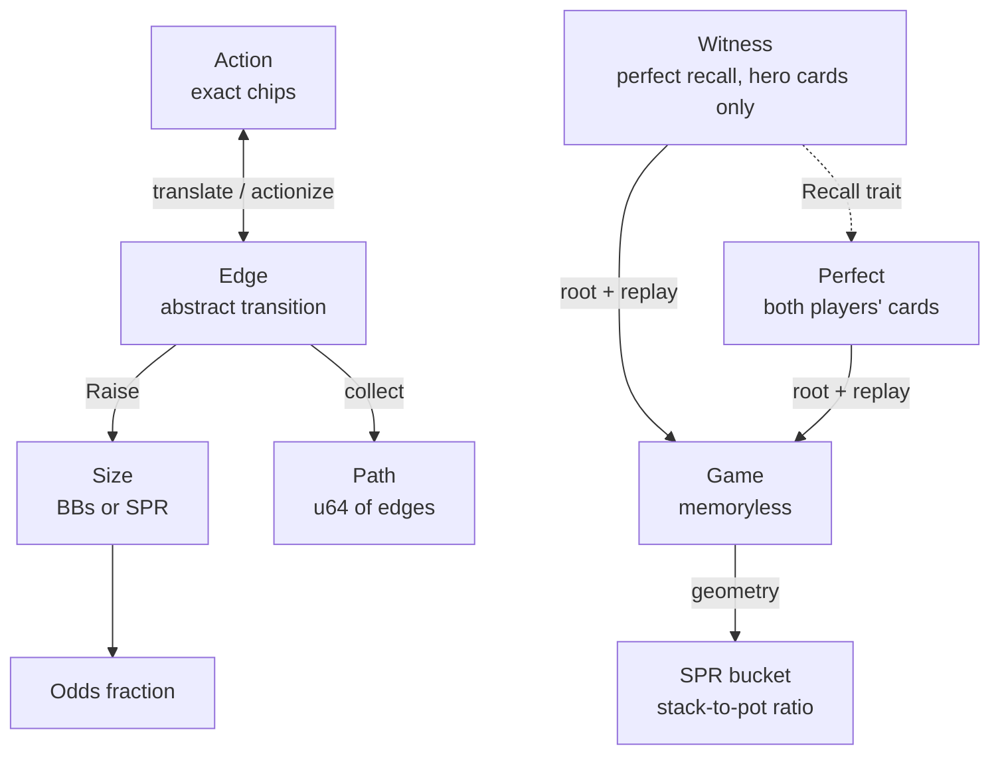

# kicker

Poker game engine with state management, action handling, and settlement.

## Architecture

`kicker` implements No-Limit Texas Hold'em as a functional state machine. A `Game` is the *memoryless present* (stacks, pot, board, seats); applying an `Action` returns a new `Game`. Every state resolves to a `Turn` — `Choice(p)` (a player decides), `Chance` (deal cards), or `Terminal` (settle) — which drives the state transition loop.

Concrete `Action`s (exact chip amounts) map to abstract `Edge`s for strategy lookup, decoupling the tree shape from stack depth. Raises discretize onto a bet-sizing grid via `Size` — `BBs(n)` for preflop opens and `SPR(n, d)` for pot-relative bets — selected per street and depth. `Game` conversions move between the two, and a `Path` packs a sequence of `Edge`s into a `u64` for use as an information-set key.

`GameN
` is generic over player count (`Game` / `HeadsUp` = 2, `FunTable` = 6, `NitTable` = 10). While `Game` forgets history, the `Recall` trait replays an action log from a post-blind root: `Witness` is the hero-only (inference) view, `Perfect` is the god's-eye (CFR training) view carrying both hands. `Showdown` distributes the pot from strongest hand down, handling side pots and split pots, emitting a `Settlement` / `PnL` per seat. Built on sibling crates `deuce` (cards, hand evaluation) and `pokerkit` (chip types, constants, regime configuration).
