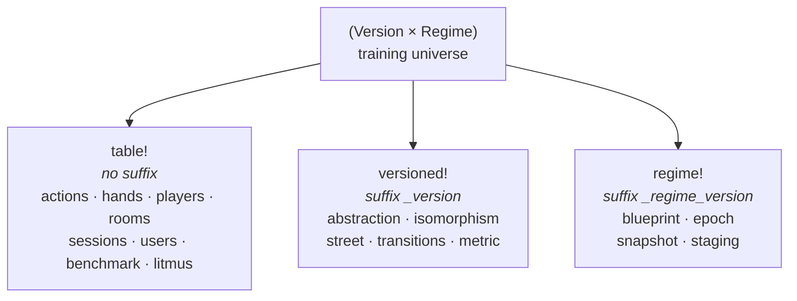
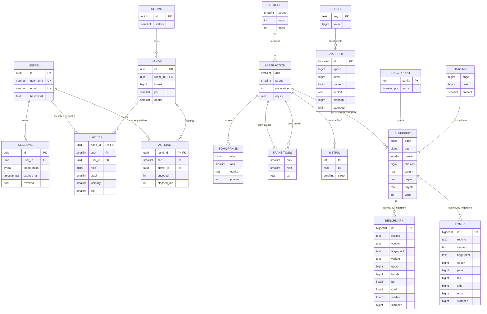

# ledger

PostgreSQL pipeline with `Schema`, `Row`, `Streamable` traits for bulk I/O.

Table naming keys off the `(Version × Regime)` training universe — three classes, three macros:



Full column reference + ER diagram of every table is in [**Schema reference**](#schema-reference) below.

## PostgreSQL Type Safety

**Always explicitly cast SQL expressions to `float4` when Rust expects `f32`.** PostgreSQL silently promotes `float4` to `float8` (double precision) in arithmetic with integers or other types. The `tokio-postgres` deserializer will panic at runtime if the SQL result type doesn't match the Rust type exactly.

```sql
-- ❌ BAD: SUM(float4) / COUNT(bigint) → float8, panics when Rust expects Option<f32>
SELECT SUM(baseline)::float4 / NULLIF(COUNT(*), 0)

-- ✅ GOOD: Cast the final expression
SELECT (SUM(baseline) / NULLIF(COUNT(*), 0))::float4
```

Common pitfalls:

- `AVG(float4)` → returns `float8`
- `float4 / integer` → returns `float8`
- `SUM(float4)::float4 / COUNT(*)` → the division re-promotes to `float8`
- Always cast the **outermost expression**, not intermediate subexpressions

## Database Table Versioning

The `(Version × Regime)` Cartesian product is the "training universe". Tables fall into three classes based on what they depend on. Pick the right macro in `crates/ledger/src/lib.rs`:

| Class                               | Macro        | Suffix                | Tables                                                          |
| ----------------------------------- | ------------ | --------------------- | --------------------------------------------------------------- |
| Shared (game obs / auth)            | `table!`     | none                  | `actions`, `hands`, `players`, `rooms`, `sessions`, `users`     |
| Versioned (abstraction-derived)     | `versioned!` | `_<version>`          | `abstraction`, `isomorphism`, `street`, `transitions`, `metric` |
| Training-derived (regime × version) | `regime!`    | `_<regime>_<version>` | `blueprint`, `epoch`, `snapshot`, `staging`                     |

**Note**: `regime!` always suffixes both regime and version. There's no regime-only-without-version macro because every regime-dependent table is a strategy keyed by InfoIds, and InfoIds embed abstraction IDs from the active version. Regime-only suffixing would let two versions corrupt each other's strategy data.

V0's `Version::suffix() == ""` keeps existing prod table names intact (`blueprint_pluribus`, `metric`). When V1 is introduced, all training-derived tables fork cleanly: `blueprint_pluribus_v1`, `metric_v1`, etc.

**Rule**: any new table that derives from clustering output → `versioned!`. Any new table that derives from a trained strategy → `regime_versioned!`. Raw game observations → `table!`.

### Scoreboard exception (`benchmark`, `litmus`)

The `benchmark` (Slumbot bb/100) and `litmus` (structural pass/fail) tables in `scoreboard.rs` derive from a trained strategy but deliberately use `table!`, **not** `regime!`. The `regime!` rationale — that InfoId-keyed rows share a byte representation across versions and would corrupt each other — does not apply: these rows are scalar *measurements about* a strategy, each carrying its own `regime` / `version` / `fingerprint` as explicit columns, and are never joined to a blueprint by InfoId. A single shared table is what makes "rank every fingerprint" one `ORDER BY bb DESC` (see `Scoreboard::leaderboard`) instead of a `UNION` over discovered regime-suffixed tables. The `fingerprint` column (a hash of `pokerkit::config_string`, via `pokerkit::fingerprint`) is finer than `(regime, version)` and pins each score to the exact game tree that produced it. Score columns are `DOUBLE PRECISION` to avoid the `float4` panic. Surfaced by `bin/scoreboard` and the `convert` `scoreboard`/`brd` command.

## Regime fingerprint

The `(Regime × Version)` pair is the table-naming key, but it's too coarse to detect drift in regime-affecting **constants** (bet-sizing arrays, `STACK`, `MAX_RAISE_REPEATS`, …) — those silently change `Edge::Raise(Size)` semantics while leaving the byte representation identical. Two trainers that share `(Pluribus, V1)` but disagree on `SIZE_FLOP_0` will accumulate regret on the same blueprint rows with different action meanings.

The `fingerprint_<regime>_<version>` table holds a single row with a textual fingerprint of every regime-affecting constant (computed via `pokerkit::config_string`). Trainer `Fast`/`Slow` startup compares the live fingerprint against the stored one:

- **No row** → first run; fingerprint is recorded.
- **Match** → continue.
- **Mismatch** → `panic!` with a `+ live / - stored` diff naming the changed constants.

**To resolve a mismatch:** revert the constant change, bump `Version` (forks tables cleanly), or run `trainer --mode reset` (truncates blueprint + epoch + snapshot + fingerprint, then re-fingerprints on next training run).

**When you add a new regime-affecting constant**, add it to `pokerkit::config_string` in `crates/pokerkit/src/regime.rs`. Anything you forget is silent drift that the runtime check won't catch.

**Adding `Version::V1`** (when bumping K-means params):

1. Add `V1` variant to enum in `crates/pokerkit/src/version.rs`; update `parse_version()`, `Display`, and `suffix()` matches
2. Bump `KMEANS_*_CLUSTER_COUNT` constants in `crates/pokerkit/src/lib.rs` (clustering is deterministic via hashed seeds — same params give identical clusters, so V1 is only meaningful with new params)
3. Recompile + deploy trainer
4. `trainer --version v1 --fast` auto-clusters fresh into `_v1`-suffixed tables, then trains
5. **Caveat**: `Layer<K, N>` is const-generic, so one binary has one set of K. To run V0 and V1 concurrently from the same binary, refactor `Street::k()` to runtime dispatch.

## Schema reference

Every table, its columns, and relationships. Only the live-game cluster
(`users`/`sessions`/`rooms`/`hands`/`players`/`actions`) declares real
`REFERENCES` foreign keys; the abstraction, training, and scoreboard links are
*logical* — keyed by encoded integers (`abs`/`obs`/`present`) or string tags
(`regime`/`version`/`fingerprint`), not DB-enforced. Names below are **base
names**; real names carry the suffix from the table above.



### Live game data (`table!` — shared)

Real foreign keys, `ON DELETE CASCADE` where noted. Written by `bouncer` (auth) and `parlor` (gameplay).

- **`users`** — accounts. `id` UUID PK; `username`/`email` unique; `hashword` (Argon2).
- **`sessions`** — JWT sessions. `user_id` → `users(id)` CASCADE; `token_hash`, `expires_at`, `revoked`.
- **`rooms`** — a table/room. `stakes` = big-blind size.
- **`hands`** — one completed hand. `room_id` → `rooms(id)`; `board`/`dealer`/`pot` encoded.
- **`players`** — per-hand seat occupancy. PK `(hand_id, seat)`; `user_id` → `users(id)` (NULL for bots); `hole`, `stack`, `visibility` (0=hidden/1=shown/2=mucked), `pnl`.
- **`actions`** — per-hand move log. PK `(hand_id, seq)`; `player_id` → `users(id)`; `encoded` action, `elapsed_ms` decision time.

### Abstraction pipeline (`versioned!` → `_v1`)

Deterministic products of hierarchical K-means + Sinkhorn; rebuilt per clustering version, keyed by encoded IDs (no declared FKs). Written by `lloyd` / `elkan`.

- **`street`** — 4-row metadata (obs/abs counts per street).
- **`abstraction`** — cluster buckets. `abs` id, `street`, `population`, `equity`.
- **`isomorphism`** — canonical-hand → bucket map. `obs` → `abs`; `equity`, `position`.
- **`transitions`** — next-street bucket flow. `prev`→`next` with mass `dx`.
- **`metric`** — pairwise EMD between buckets, `tri` = triangular-index-encoded pair.

### Training artifacts (`regime!` → `_pluribus_v3`)

Depend on both clustering and bet-sizing regime. Written by `forge` (trainer) and `nlhe` (profile serialization).

- **`blueprint`** — the MCCFR strategy. Unique key `(past, present, choices, edge)`; `weight`/`regret`/`payoff`/`visits`. (V3 dropped the V2 `geometry`/SPR column.)
- **`epoch`** — single-row training counter (`key='current'`).
- **`snapshot`** — append-only per-flush training log: `epoch`, `infos`, `nodes`, `exploit` (sum-regret proxy), `elapsed`, `stamped`.
- **`staging`** — ephemeral `UNLOGGED` COPY buffer, `(LIKE blueprint)`, merged then dropped each flush.
- **`fingerprint`** — single-row guard holding `pokerkit::config_string`; trainer panics on drift.

### Scoreboard (`table!` — shared)

Cross-fingerprint success metrics — see [Scoreboard exception](#scoreboard-exception-benchmark-litmus) above for the naming rationale, and `scoreboard.rs`. Surfaced by `bin/scoreboard` and the `convert` `scoreboard`/`brd` command.

- **`benchmark`** — one row per Slumbot benchmark run, per `variant`: `bb` (bb/100), `conf` (95% CI half-width), `stddev`, `hands`, blueprint `epoch`. `FLOAT8` to avoid the `float4` deserializer panic.
- **`litmus`** — one row per litmus catalog run: `pass`/`fail`/`skip`/`error` counts, blueprint `epoch`.

Both are append-only; `fingerprint` is a hash of `config_string` (finer than `(regime, version)`) pinning each score to the exact game tree that produced it.
