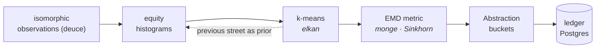
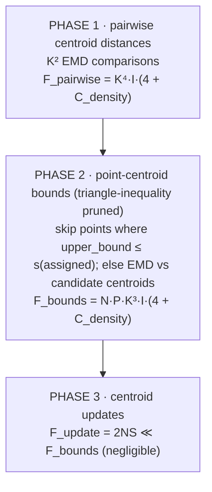
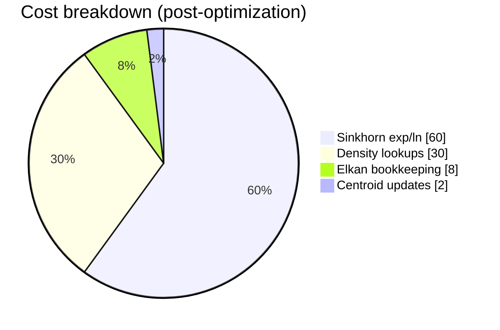

# lloyd

Hierarchical k-means clustering with Earth Mover's Distance for poker hand abstraction
(river → turn → flop → preflop).

## Architecture



Each coarser street clusters over distributions of the *next* street's buckets — hence
the prior edge above.

## Clustering complexity analysis

Computational cost model for the k-means clustering pipeline.

## High-Level Overview

```
                        CLUSTERING COST MODEL

    ┌─────────────────────────────────────────────────────────────────┐
    │                                                                 │
    │   F_total = E × K³ × I × (4 + C_density) × (K + NP)             │
    │                          ───────────────                        │
    │                           optimizable                           │
    │                                                                 │
    └─────────────────────────────────────────────────────────────────┘

    E = Elkan iterations        K = target centroids
    I = Sinkhorn iterations     N = points to cluster
    P = pruning factor          C_density = density lookup cost
```

The dominant cost comes from **Sinkhorn EMD calculations** in the inner loop of Elkan k-means. Each EMD requires O(K²) density lookups, making `C_density` a critical optimization target.

---

## Symbol Definitions

| Symbol        | Definition                                         | Typical Range |
| ------------- | -------------------------------------------------- | ------------- |
| **N**         | Points in layer (histograms to cluster)            | 169 – 1.7M    |
| **K**         | Target centroids                                   | 101 – 169     |
| **S**         | Support size per histogram (avg non-zero bins)     | 20 – 50       |
| **I**         | Sinkhorn iterations to convergence                 | 10 – 20       |
| **E**         | Elkan iterations to convergence                    | 15 – 30       |
| **P**         | Pruning factor (fraction of N×K computed per iter) | 0.3 – 0.5     |
| **C_density** | Cost of single density lookup                      | 1 – 7         |

---

## Per-Operation Costs

### Sinkhorn EMD (One Histogram Pair)

```
                         SINKHORN INNER LOOP
                         (sinkhorn.rs:minimize)

    for _ in 0..I {                          // I iterations
        for x in 0..K {                      // K abstractions
            for y in 0..K {                  // K abstractions
                ┌──────────────────────┐
                │  density(x)          │ <── C_density
                │  density(y)          │ <── C_density
                │  exp()               │ <── 1 FLOP
                │  ln()                │ <── 1 FLOP
                │  mul()               │ <── 1 FLOP
                │  add()               │ <── 1 FLOP
                └──────────────────────┘
            }
        }
    }

    C_sinkhorn = K² × I × (4 + 2 × C_density)
               ≈ K² × I × (4 + C_density)     // amortized
```

### Density Lookup Cost

```
                    DENSITY LOOKUP COMPARISON

    ┌─────────────────────────────────────────────────────────────┐
    │  BTreeMap<Abstraction, usize>                               │
    │  ─────────────────────────────                              │
    │                                                             │
    │     density(&x) → self.0.get(&x)                            │
    │                        │                                    │
    │                        └── O(log K) tree traversal          │
    │                            ≈ 7 comparisons for K=144        │
    │                                                             │
    │     C_density = log₂(K) ≈ 7                                 │
    │                                                             │
    ├─────────────────────────────────────────────────────────────┤
    │  Bins<N> (fixed array)                                      │
    │  ─────────────────────                                      │
    │                                                             │
    │     density(&x) → self.counts[x.index()]                    │
    │                              │                              │
    │                              └── O(1) array index           │
    │                                  1 offset calculation       │
    │                                                             │
    │     C_density = 1                                           │
    │                                                             │
    └─────────────────────────────────────────────────────────────┘
```

---

## Elkan K-Means Phases



---

## Total Cost Formula

### Per Elkan Iteration

```
F_iter = F_pairwise + F_bounds

       = K⁴I(4 + C_density) + NPK³I(4 + C_density)

       = K³I(4 + C_density)(K + NP)
         ─────────────────
              common factor
```

### Total Clustering FLOPs

```
┌─────────────────────────────────────────────────────────────────────┐
│                                                                     │
│   F_total = E × K³ × I × (4 + C_density) × (K + NP)                 │
│                                                                     │
│   where:                                                            │
│     E = Elkan iterations (15-30)                                    │
│     K = target centroids (101-169)                                  │
│     I = Sinkhorn iterations (10-20)                                 │
│     P = pruning factor (0.3-0.5)                                    │
│     N = points to cluster (169-1.7M)                                │
│     C_density = 7 (BTreeMap) or 1 (Bins<N>)                         │
│                                                                     │
└─────────────────────────────────────────────────────────────────────┘
```

---

## Street-Specific Estimates

### Parameters by Street

| Street  | N         | K   | EMD Method       | C_density (old) | C_density (new) |
| ------- | --------- | --- | ---------------- | --------------- | --------------- |
| River   | 123M      | 101 | Equity variation | N/A             | N/A             |
| Turn    | 1,755,000 | 144 | Sinkhorn OT      | 7               | 1               |
| Flop    | 1,286,792 | 128 | Sinkhorn OT      | 7               | 1               |
| Preflop | 169       | 169 | Sinkhorn OT      | 7               | 1               |

River uses `Equity::variation` (simple CDF difference) — no Sinkhorn, no optimization impact.

### Turn Layer (Dominant Cost)

```
                        TURN LAYER ESTIMATE
                        N=1.7M, K=144, I=15, E=20, P=0.4

    F_turn = 20 × 144³ × 15 × (4 + C_density) × (144 + 1.7M × 0.4)
           = 20 × 2,985,984 × 15 × (4 + C_density) × 680,144

    ┌─────────────────────────────────────────────────────────────┐
    │  BTreeMap (C_density = 7):                                  │
    │                                                             │
    │     F_turn_old = 20 × 2.99M × 15 × 11 × 680K                │
    │                ≈ 6.7 × 10¹⁵ FLOPs                           │
    │                ≈ 6.7 PFLOPs                                 │
    │                                                             │
    ├─────────────────────────────────────────────────────────────┤
    │  Bins<N> (C_density = 1):                                   │
    │                                                             │
    │     F_turn_new = 20 × 2.99M × 15 × 5 × 680K                 │
    │                ≈ 3.0 × 10¹⁵ FLOPs                           │
    │                ≈ 3.0 PFLOPs                                 │
    │                                                             │
    └─────────────────────────────────────────────────────────────┘

    Speedup: 6.7 / 3.0 ≈ 2.2×
```

### Flop Layer

```
                        FLOP LAYER ESTIMATE
                        N=1.3M, K=128, I=15, E=20, P=0.4

    F_flop = 20 × 128³ × 15 × (4 + C_density) × (128 + 1.3M × 0.4)

    ┌─────────────────────────────────────────────────────────────┐
    │  BTreeMap (C_density = 7):                                  │
    │                                                             │
    │     F_flop_old ≈ 3.2 × 10¹⁵ FLOPs                           │
    │                                                             │
    ├─────────────────────────────────────────────────────────────┤
    │  Bins<N> (C_density = 1):                                   │
    │                                                             │
    │     F_flop_new ≈ 1.5 × 10¹⁵ FLOPs                           │
    │                                                             │
    └─────────────────────────────────────────────────────────────┘

    Speedup: 3.2 / 1.5 ≈ 2.1×
```

### Preflop Layer (Negligible)

```
    N=169, K=169, I=15, E=20, P=0.4

    F_pref ≈ 10¹⁰ FLOPs (< 0.001% of total)
```

---

## Optimization Impact Summary

Histogram optimization drops the per-EMD factor `(4 + C_density)` from **11 → 5** (theoretical 2.2× speedup):

| Layer       | Old FLOPs    | New FLOPs    | Speedup |
| ----------- | ------------ | ------------ | ------- |
| Turn        | 6.7 PFLOP    | 3.0 PFLOP    | 2.2×    |
| Flop        | 3.2 PFLOP    | 1.5 PFLOP    | 2.1×    |
| Preflop     | negligible   | —            | N/A     |
| **Total**   | **9.9 PFLOP**| **4.5 PFLOP**| **2.2×**|

---

## Additional Benefits

### Memory Layout

|                | `BTreeMap<Abstraction, usize>`      | `Bins<N>` (stack-allocated array) |
| -------------- | ----------------------------------- | --------------------------------- |
| Size           | 48 B base + ~40 B/entry             | fixed `1 + 8 + 8N` B              |
| Heap           | scattered allocations               | zero                              |
| Locality       | poor                                | contiguous, cache-friendly        |
| Access         | pointer chasing                     | predictable                       |

`Layer` storage `Box<[Histogram; N]>` is fully contiguous — Turn ≈ 1.7M × 1.2 KB ≈ **2.0 GB**, Flop ≈ 1.3M × 1.0 KB ≈ **1.3 GB**.

### Cache Effects

Density iteration (support scan):

| Structure  | Behavior                                              |
| ---------- | ----------------------------------------------------- |
| `BTreeMap` | pointer chasing through tree nodes, ~3-5 misses/lookup |
| `Bins<N>`  | sequential array scan, prefetcher-friendly, ~0.1 misses/lookup |

Estimated cache speedup: **2-4×** on iteration-heavy code.

---

## Remaining Bottlenecks



Primary bottleneck: transcendental functions (`exp`, `ln`) in Sinkhorn; secondary: the sheer scale of N × K distance calculations.

---

## Future Optimization Opportunities

| Optimization               | Target                | Estimated Impact           |
| -------------------------- | --------------------- | -------------------------- |
| SIMD density lookups       | Inner product EMD     | 2-4× on vectorizable loops |
| Parallel Sinkhorn          | K² divergence calc    | ~Kx with K cores           |
| Early Sinkhorn termination | Convergence detection | 1.2-1.5× fewer iterations  |
| Approximate NN             | Initial bounds        | 10× on first iteration     |
| GPU offload                | Sinkhorn batches      | 10-100× on matrix ops      |

---

## Key Insight

> The histogram optimization reduces `C_density` from O(log K) to O(1), cutting the `(4 + C_density)` factor roughly in half. This yields a **theoretical 2.2× speedup** on the compute-bound Sinkhorn inner loop, with additional gains from improved cache behavior and eliminated heap allocations.
