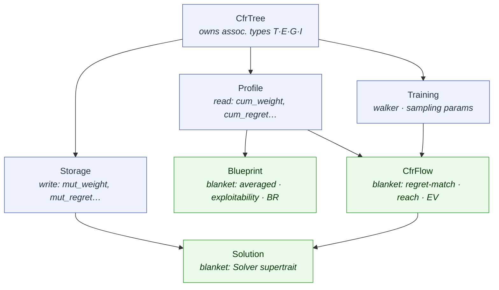
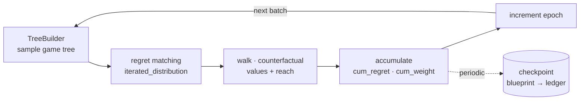

# mccfr

Game-agnostic Monte Carlo CFR framework. Nlhe-specific glue lives in `crates/nlhe/`; production solver type alias `Flagship` lives in the workspace root `lib.rs`.

## Flagship Solver Configuration

The production NLHE solver (`Flagship` type in `lib.rs`) uses Pluribus-inspired settings:

```rust
pub type Flagship = Nlhe<
    mccfr::LinearRegret,     // Linear CFR = DCFR(1,1,1), the variant used by Pluribus
    mccfr::LinearWeight,     // Linear weighting of the average strategy
    mccfr::PluribusSampling, // Probabilistic pruning with exploration
>;
```

Algorithm variants are pluggable via generics — swap `LinearRegret` for `DiscountedRegret` (DCFR α=1.5, β=0.5) or `FlooredRegret` (CFR+) to change the regret schedule.

## Trait Hierarchy



One MCCFR iteration (per sampled tree), driven by `Solver` over a `Solution`:



- **`CfrTree`** — Base trait bundling the four associated types (Turn, Edge, Game, Info)
- **`Storage`** — Mutable write access to accumulated regrets, weights, EVs, visits
- **`Profile`** — Read-only access to accumulated regrets, weights, EVs, visits, epochs
- **`Blueprint`** — Blanket from Profile: averaged strategy, exploitability, best-response
- **`Training`** — Walker identity (`walker`), epoch management (`increment`), sampling HyperParams
- **`CfrFlow`** — Blanket from Profile + Training: regret matching, reach probabilities, expected values, regret/policy vectors
- **`Solution`** — Blanket from CfrFlow + Storage: convenience supertrait used by Solver

The `Profile` trait uses these terms for accumulated values:

- **`cum_weight`** — Accumulated weighted strategy (used for average policy / Nash approximation)
- **`cum_regret`** — Accumulated counterfactual regret (used for regret matching)
- **`cum_evalue`** — Accumulated expected value (used for frontier evaluation)

Strategy distributions derived from these (on `CfrFlow` and `Blueprint`):

- **`iterated_distribution`** — Current iteration strategy via regret matching
- **`averaged_distribution`** — Historical average strategy (Nash approximation)
- **`sampling_distribution`** — Exploration-adjusted sampling probabilities

## Solver Configuration Constants (`lib.rs`)

- **MCCFR Batching**: `CFR_BATCH_SIZE_*`, `CFR_TREE_COUNT_*`
- **Sampling**: `SAMPLING_TEMPERATURE` (T), `SAMPLING_SMOOTHING` (β), `SAMPLING_CURIOSITY` (ε)
- **Regret Matching**: `POLICY_MIN`, `REGRET_MIN`
- **Probabilistic Pruning**: `PRUNING_THRESHOLD`, `PRUNING_EXPLORE`, `PRUNING_WARMUP`
- **Regret Bias**: `BIAS_FOLDS`, `BIAS_RAISE`, `BIAS_OTHER` (initial warmstart weights)

## Training Pipeline

```bash
# Generate abstractions and upload to PostgreSQL (resource intensive)
cargo run --bin trainer --features database -- --cluster

# Train blueprint strategies (in-memory MCCFR)
cargo run --bin trainer --features database -- --fast

# Train blueprint strategies (distributed workers)
cargo run --bin trainer --features database -- --slow
```

**Training modes:**

- `--status` — Check database training progress (epochs, infosets)
- `--cluster` — Generate hand abstractions via hierarchical k-means (run once, resource intensive)
- `--fast` — Single-machine in-memory MCCFR (uses `FastSession`)
- `--slow` — Distributed workers with PostgreSQL synchronization (uses `SlowSession`)
- `--reset` — Clear blueprint/epoch tables for fresh training run

**Environment variables:**

- `TRAIN_DURATION` — Optional timed training (e.g., `TRAIN_DURATION=2h` or `30m` or `1d`)
- Type `Q` + Enter during training for graceful shutdown after current batch

## Telemetry note

`mccfr_infoset_size` emits one record per filtered infoset per tree per batch (`batch_size=128 × ~K_infosets`, runtime-bounded). At ~200K infosets/batch this is ~20-100 ms per batch. Acceptable when batches take seconds; problematic if they're sub-second. Sample via a `MCCFR_INFOSET_SAMPLE_EVERY` constant if needed. See `crates/vitals/README.md` for the full cost-intuition writeup.

Records are emitted unlabeled. The metric is a **smoke detector** — it exists to tell you a pathological tail showed up, not to tell you which dimension drives it. NLHE infoset keys already fold over street (4), abstraction bucket (~128–144), subgame action sequence, choices mask, and SPR (4); none of those are labels. Adding labels per dimension would force the label cardinality story and pull game-specific concepts (e.g. `gameplay::SPR`) into the generic mccfr emission site for marginal diagnostic value. When the tail does spike, the right next step is a DB query or ablation, not reading the histogram more carefully.
