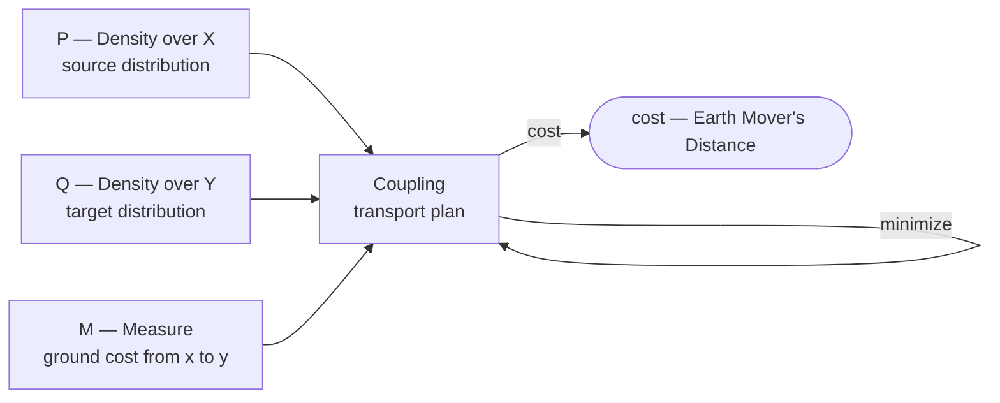
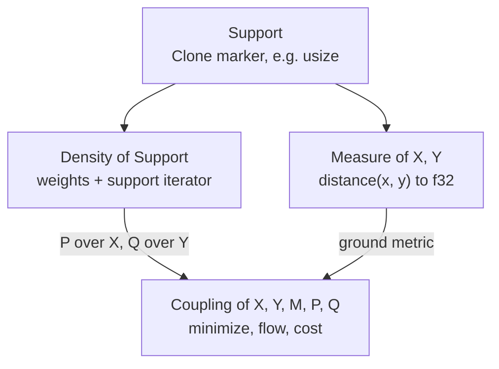

# monge

Optimal transport and Earth Mover's Distance via Sinkhorn algorithm.

`monge` defines the generic traits for computing optimal-transport cost — the Earth Mover's Distance (Wasserstein-1) — between two discrete distributions over a shared metric space. It is algorithm-agnostic: the crate specifies the *contract* (distributions, ground metric, transport plan) and ships two solver strategy markers, while concrete solvers are implemented against these traits.

## Architecture

Four traits compose the transport problem. A `Support` is the underlying point space; a `Density` is a distribution over that space; a `Measure` is the ground cost between a source and target space; and a `Coupling` is the transport plan whose `minimize` / `cost` pair yields the EMD.

Trait relationships: `Coupling` ties everything together, requiring associated `X` / `Y` support spaces, a `Measure` over them, and matching `Density` marginals `P` / `Q`.

`Density` is implemented out of the box for `BTreeMap`, `HashMap`, and `Vec` of pairs. Two solver strategies are provided as marker types — `GreedyOptimalTransport` (greedy cost-ordered matching) and `GreenkhornOptimalTransport` (Greenkhorn, a greedy row/column variant of Sinkhorn) — as documented entry points for implementing the `Coupling` contract.
