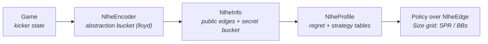

# nlhe

No-Limit Hold'em CFR implementation bridging `kicker` and `mccfr`. Game-tree shape and bet-sizing abstraction live here.

How a live game state becomes a policy lookup:



## Bet Sizing Abstraction (v3)

The `Size` enum is the **single source of truth** for which betting edges exist in the game tree:

```rust
pub enum Size {
    SPR(Chips, Chips),  // Pot-relative: SPR(1, 2) = half pot
    BBs(Chips),         // BB-relative: BBs(3) = 3BB open
}
```

`Size::raises(street, depth)` returns available raise sizes per `(street, depth)`. Defined as `PLURIBUS_INDICES` in `crates/pokerkit/src/lib.rs`. The grid is keyed only on `(street, depth)` — there is **no SPR axis on the menu**, and the InfoSet key does not carry an SPR bucket. Pot-relative sizing already self-scales with stack depth (1× pot at SPR=1 *is* all-in), and `Edge::Shove` is always available regardless of the menu, so the implicit absorbing state handles the SPR collapse without a dedicated key dimension.

The v3 design memo summarizes published menus from Pluribus, Libratus, DeepStack, Slumbot, and GTOWizard — none of those systems condition the menu on an SPR bucket.

### Menu per row

| Row | Menu | Source |
|---|---|---|
| Pref/0 (opens) | `OPENS = [2, 3, 4, 5]` BB | Wider than Pluribus's 2.0–2.5 empirical; preflop is well-trained and the extra width is harmless |
| Pref/1 (3-bet) | `[1:1, 2:1]` | GTOWizard 3-bet IP ≈ pot, OOP ≈ 2× |
| Pref/N (4-bet+) | `[1:1]` | Shrink — `Edge::Shove` handles polar |
| Flop/0 | `[1/4, 1/2, 3/4, 1:1, 2:1]` | GTOWizard SRP-IP menu, 5 sizes |
| Flop/1 | `[1/2, 1:1]` | Pluribus-faithful shrink on 2nd raise |
| Flop/N | `[1:1]` | Raise war |
| Turn/0 | `[1/3, 1/2, 1:1, 2:1]` | Geometric setup, 4 sizes |
| Turn/1 | `[1:1, 2:1]` | |
| Turn/N | `[1:1]` | |
| Rive/0 | `[1/3, 1/2, 1:1, 2:1]` | Polar + block bet |
| Rive/1 | `[1:1, 2:1]` | |
| Rive/N | `[1:1]` | |

### Two SPRs (the historical confusion)

- **`Size::SPR(n, d)`** — encoded *bet size* (pot-relative numerator/denominator). Lives on `Edge::Raise`. The thing the action enum carries. Unchanged from v2.
- **`gameplay::SPR`** — discrete 4-bucket *stack-to-pot ratio* (`Committed` / `Low` / `Mid` / `Deep`, boundaries `[1.5, 4.0, 10.0]`), defined at `crates/kicker/src/geometry.rs`. Computed from live `Game::geometry()`. **No longer on the InfoSet key** (v3 cutover). Still surfaced via `ApiStrategy.spr` for FE display and via the litmus `expected_spr` validator as a sanity check on history-definition chip dynamics.

## Game Tree Constants (`pokerkit`)

- `N` — Number of players
- `STACK` — Starting stack
- `B_BLIND`, `S_BLIND` — Blinds
- `MAX_RAISE_REPEATS` — Max consecutive raises before tree truncation
- `MAX_PATH_EDGES` — Max edges in any tree path
