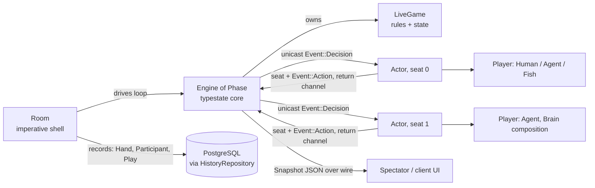
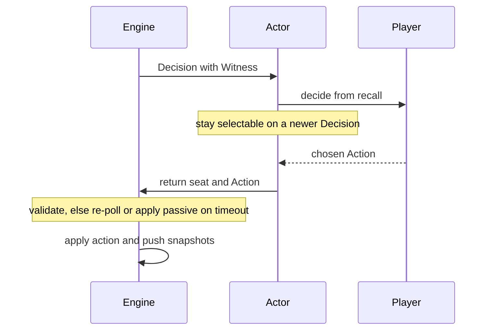

# parlor

Async game coordinator for live poker sessions.

`parlor` drives real-time multiplayer No-Limit Hold'em: it deals hands, collects decisions from heterogeneous players (humans over a wire, CFR bots, random CPUs), runs showdowns, and persists hand histories. Each player runs in its own Tokio task and talks to a central engine purely through message-passing channels, so a slow human never blocks the table and any player type is drop-in behind one trait.

## Architecture

A `Room` (imperative shell) owns an `Engine<Phase>` (functional core) and runs the hand loop. The `Engine` advances a `LiveGame` through a typestate machine — `Seating → Dealing → Showdown → Finished` — where each phase only exposes valid transitions. Every seated `Player` is wrapped in an `Actor` on its own task; engine and actors negotiate one decision at a time over `mpsc` channels carrying the `Event` enum, while UI/spectator wires receive JSON snapshots.

The turn loop for one choice node: the engine unicasts the acting seat's authoritative `Witness` (perfect-recall view), the actor calls `Player::decide`, and the chosen `Action` returns on a shared channel. If a newer `Decision` arrives mid-think the actor restarts with fresh recall; if the seat times out the engine substitutes a passive action.

## Key types

- **`Room`** — coordinator: registers users, runs the per-hand loop, handles idle/disconnect stop conditions, flushes `Hand`/`Participant`/`Play` records via `HistoryRepository`.
- **`Engine<Phase>`** — the game state machine; `Seating`, `Dealing`, `Showdown`, `Finished` are zero-sized phase markers enforcing legal transitions at compile time.
- **`Actor`** — a spawned task bridging one `Player` to the engine, with restartable/interruptible decision handling and pacing.
- **`Player`** — the async, transport-agnostic decision trait. `players::` supplies `Human` (CLI), `Fish` (random), and a compositional bot `Zoo` where `Agent<Brain>` layers `Blueprint`, `Depth`, `World`, and `Dirac` over an in-memory CFR blueprint (`nlhe::Flagship`).
- **`Event`** — the actor-engine protocol: `Decision(Witness)`, `Action`, `Disconnect`.

Built on sibling crates `kicker` (rules/state), `nlhe`/`mccfr`/`subgame` (strategy), `deuce`/`pokerkit` (cards & types), `bouncer` (identity), and `daybook` (persistence).
