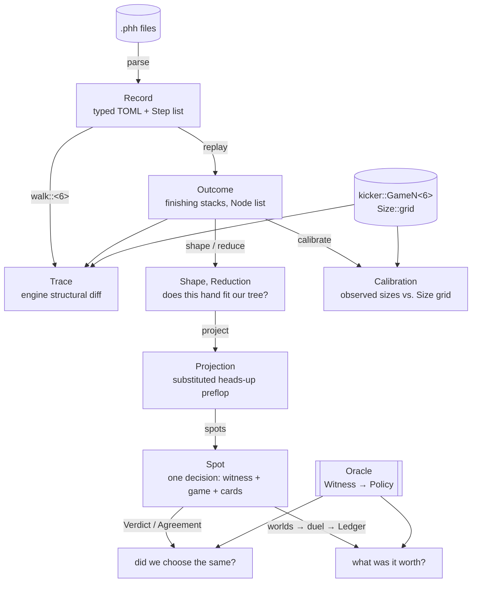
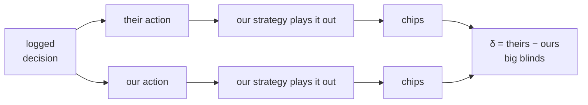

# phh

Poker Hand History parsing, chip-exact replay, and the 6-max → 2-max reduction
used to evaluate a heads-up blueprint against multiway logs.

Written for the 10,000 hands published with Brown & Sandholm (2019), vendored at
`~/Code/phh-dataset/data/pluribus`. Plan of record and the reasoning behind each
mode: [`docs/active/phh-evaluation.md`](../../docs/active/phh-evaluation.md).

## What the dataset actually gives you

Every hand is a TOML document with a flat `actions` list. The critical property,
and the one that makes value estimation possible at all:

| | |
|---|---|
| hands | 10,000 (92 directories, one per session) |
| hole cards | **all six players', in all 10,000 hands** — `d dh p3 KcJh` |
| board | however far the dealer got: 0 cards in 4,662 hands, 3 in 1,484, 4 in 1,106, **5 in 2,748** |
| stacks | `starting_stacks` and `finishing_stacks`, so every hand's ground-truth P&L |
| structure | `blinds_or_straddles`, `min_bet`, `antes`, `players` (six named seats) |
| actions | `f` fold, `cc` check/call, `cbr <to>` bet/raise-to, `d db <cards>` deal board, `sm` show/muck |

**There is no hidden information.** The corpus is a full-information log, not a
set of observations — hole cards are dealt face-up in the file whether or not the
hand reached showdown (only 1,673 hands carry an explicit `sm`). So the only
thing a rollout ever has to sample is the streets the dealer never ran out.

What the corpus does **not** contain: Pluribus's strategy, its ranges, any
counterfactual, and any indication of what the villains would have done facing an
action nobody took. That absence is the whole difficulty — see
[`duel`](#tier-3-what-a-decision-was-worth).

## Architecture



`replay` is the conformance oracle and is deliberately independent of `kicker`;
`walk` is the same hands run *through* `kicker` to diff the two.

Everything downstream of `Spot` talks to a strategy only through
[`Oracle`](src/oracle.rs) — one synchronous `Witness → Policy` method. Every cell
of the `parlor` bot zoo satisfies it (`Brain::policy` / `Brain::distrib`), and so
does an HTTP client, so the same evaluation scores any of them and this crate
never has to depend on the blueprint or the database.

## Tier 3: what a decision was worth

Agreement is similarity, not strength — the log has no continuation behind an
action nobody took. `duel` generates one. At each logged decision, play the hand
out twice with **our own** strategy on both seats, once behind their action and
once behind ours, in the same cards, and difference the results:



Both branches share the runout and the rollout's random stream, so a world where
the branches agree contributes exactly zero rather than two samples of noise —
and whatever our value function gets wrong largely cancels.

**What the sign measures.** Not two players — both continuations are ours. δ asks
one question about one strategy: *is there a better move here than the one we
make, against ourselves?* A converged blueprint best-responds to itself, so every
substitution can only lose and δ ≤ 0 everywhere. **δ > 0 is therefore a positive
measurement that we are not converged at that node**, which makes `Ledger` a
local best response with the log's real decisions as the probe set, and
`Ledger::delta` a **lower bound on our own exploitability** in bb/decision. Lower
is better; the bound is loose only in the safe direction.

For scale, the same corpus against a strategy that always checks or calls reads
**+0.6188 bb/decision**. That is what "very exploitable" looks like here.

Check `Ledger::t` first — inside ±2 standard errors the sign is noise.

## Two chip scales, on purpose

| | blinds | stack | type |
|---|---|---|---|
| PHH / Pluribus | 50 / 100 | 10,000 | `phh::Amount` = `i32` |
| engine | 1 / 2 | 200 | `pokerkit::Chips` = `i16` |

Same ratios — both are 100bb with a half-blind small — so the conversion is a
pure unit change at 50× coarser granularity. It has to stay a conversion rather
than a redefinition: a six-way all-in pot is 60,000 chips, which overflows
`i16`, and the engine's blinds are compile-time constants.

Two consequences shape the API:

- **`replay` settles in `Halves`** (`i64` half-chips), because a two-way split of
  an odd pot lands on a half chip and PHH logs it as `10112.5`. Eight Pluribus
  hands do exactly that.
- **`walk` reads all-in off the log, not off the divide.** 8,975 of 10,000 chips
  is a shove, but it divides to 179.5 engine chips; truncating leaves a phantom
  half chip behind and the hand never terminates. `Node::is_shove` settles the
  question before any rounding happens.

## Sizing convention

`Node::pot_fraction` and `Node::bb_units` measure raises the way `kicker`
measures them, which is not the way a poker player would:

- `Action::Raise(chips)` is an **increment from the actor's current stake**,
  denominated against `Game::pot()` **before** the action. A raise facing a bet
  therefore includes the call in its numerator and excludes it from its
  denominator.
- `Edge::Open(n)` puts in `n` big blinds, so the preflop opening row is measured
  in big blinds put in now — 2.1bb from UTG and 1.6bb from the small blind can
  be the same `cbr 210`.

Matching that exactly is the point: the numbers have to describe the anchors
`Size::translate` will actually pick between.

## What the reduction keeps and drops

Postflop action order is the discriminator. In 6-max, betting opens left of the
button, so the small blind acts first postflop; in heads-up the small blind *is*
the button and acts last. Blind-vs-blind pots are therefore inverted relative to
our tree and unusable. Everything else — earlier seat out of position, later seat
in — is our tree's shape exactly.

What the reduction drops is the pot: a folded blind leaves dead money our tree
cannot represent. `Reduction` carries the flop pot in big blinds so a caller can
project onto the nearest reachable heads-up preflop path and absorb the
difference there.

## Running it

```bash
cargo run --release -p phh-cli -- conform      # settlement + turn order + engine structure
cargo run --release -p phh-cli -- calibrate    # observed bet sizes vs. the Size grid
cargo run --release -p phh-cli -- calibrate --player Pluribus
cargo run --release -p phh-cli -- agree --player Pluribus   # did we choose the same? (needs --api)
cargo run --release -p phh-cli -- duel  --player Pluribus   # what was it worth? (needs $DB_URL)
```

`--data` (or `$PHH_DATA`) points at the corpus; it defaults to
`../phh-dataset/data/pluribus`.

`agree` queries a running backend over HTTP — one request per decision, so
`--api` is all it needs. `duel` hydrates the blueprint from `$DB_URL` instead: it
makes on the order of a million policy lookups and cannot afford a round trip in
front of each one. Pick the bot with `--variant` (`base`, `depth`, `world`,
`dirac`, or a `+`-joined combination); `--solve` swaps the blueprint lookup for a
full subgame re-solve at every rollout decision, which is only affordable
alongside a small `--limit`.

To exercise the rollout machinery without any credentials:

```bash
PHH_DATA=… cargo run --release -p phh --example rollout
```

which duels the corpus against a strategy that always checks or calls. Folds and
shoves should score large positive deltas and checks exactly zero; anything else
is a bug in the plumbing rather than a finding about anyone's poker.
