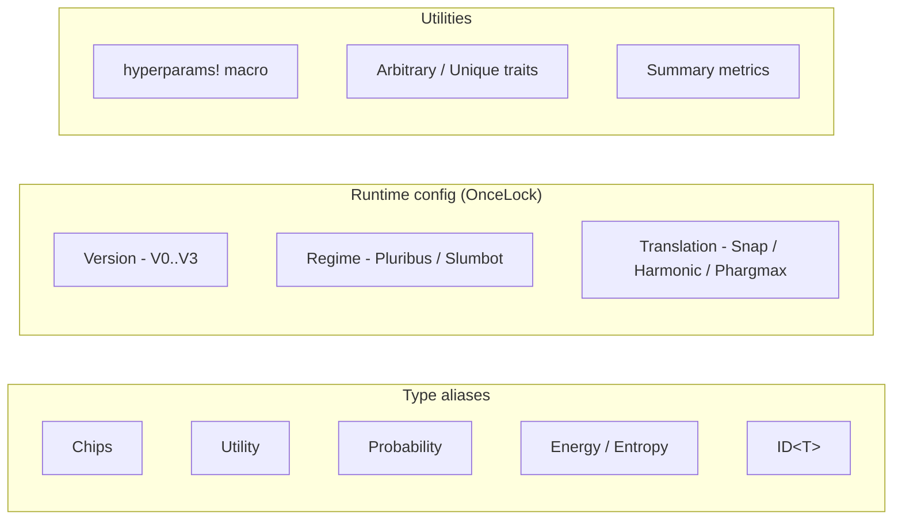
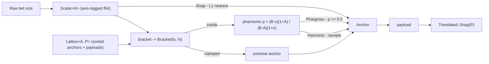

# pokerkit

Core type aliases, traits, and constants for robopoker.

`pokerkit` is the foundational crate of the robopoker workspace: the shared
vocabulary of domain types, the `(Version × Regime)` training configuration,
the `hyperparams!` singleton macro, and the generic action-translation engine
that maps arbitrary bet sizes onto a finite abstract action grid.

## Architecture

The crate defines the numeric vocabulary used across the workspace as thin
`f32`/`i16` aliases so intent is legible at call sites: `Chips` (stacks and
bets in big blinds), `Utility` (payoffs and regrets), `Probability` (strategy
weights), and `Energy`/`Entropy` (distances and temperatures). Training runs
are keyed by two orthogonal axes — `Version` (clustering abstraction) and
`Regime` (bet-sizing grid) — each a process-global `OnceLock` set once at
startup, together naming the database tables a run reads and writes.

### Action translation

Translation answers "which abstract action does an off-tree opponent bet
correspond to?" An observed size becomes a `Scalar<A>` (phantom-typed to an
axis like big blinds or pot fraction) and is located within a `Lattice<A, P>`,
a validated strictly-ascending list of anchor scalars each carrying a payload
`P`. `bracket` finds the surrounding `(lo, hi)` anchors (or clamps at an
extreme); the `Translation` policy then picks one: `Snap` takes the L1-nearest
anchor, while `Harmonic` and `Phargmax` apply the Ganzfried–Sandholm 2013
pseudo-harmonic weighting (randomized vs. deterministic argmax). The chosen
`Anchor` yields its payload as `Translated::Snap(P)`.
