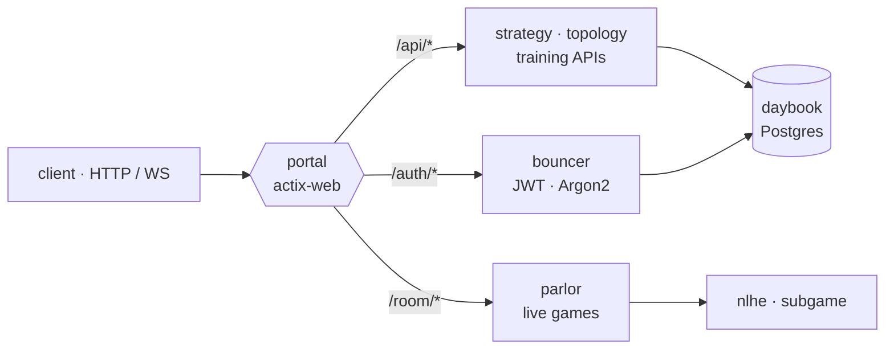

# portal

Unified actix-web server with `analysis` and `hosting` submodules.



## Run

```bash
# Start unified server (analysis API + live game hosting) on localhost:8888
BIND_ADDR=0.0.0.0:8888 cargo run --bin backend --features database

# Test API endpoints
curl http://localhost:8888/health
```

## Routes

- `/health` — Health check
- `/auth/*` — Authentication (register, login, logout, me)
- `/room/*` — Live game hosting (start, enter, leave)
- `/api/*` — Analysis API (training results, blueprints, neighbors)

## Local Development

```bash
# Terminal 1: Start unified server
BIND_ADDR=0.0.0.0:8888 cargo run --bin backend --features database

# Terminal 2: Start frontend (auto-proxies /api to backend)
trunk serve

# Query via HTTP API (POST JSON to /api/*)
curl -X POST -H "Content-Type: application/json" \
  -d '{"street": "P"}' http://localhost:8888/api/exp-wrt-str
```
