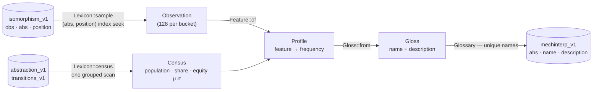

# rosetta

Mechanistic interpretability for the learned abstraction.

`lloyd` produces 512 anonymous k-means centroids — 256 flop buckets and 256 turn buckets — over next-street equity distributions. Nothing about `F::5a` says whether it holds top pair on a dry board or a naked flush draw, which makes every strategy question about that bucket unanswerable by inspection. This crate gives each bucket a **name** and a **description**, derived mechanically from a sample of its own members, and stores them in `mechinterp_v1`.

The other two streets are not learned — preflop buckets are the 169 starting hands and river buckets are equity bands — but they run through the same pipeline so that *every* abstraction has a name. 782 rows total.

## Pipeline

Run it with `cargo run --release -p mechinterp -- --streets all --samples 128`. `--dry` prints without writing, `--long` prints descriptions as well as names. A full pass over all 782 buckets samples ~100k isomorphisms and takes well under a minute.

## Where the two halves of a profile come from

| Half | Source | Why |
|---|---|---|
| `Census` — population, street share, equity μ and σ | `abstraction_v1` joined to a `transitions_v1` centroid | These are the numbers **k-means actually clustered on**: the bucket's mass over next-street buckets, weighted by their equity. μ is the bucket's equity, σ is how much of the hand's value is still undecided. |
| `Profile` — feature frequencies | a uniform sample of members from `isomorphism_v1` | Card-level structure the clustering never saw directly. Top pair, a flush draw, a monotone board — the vocabulary a player reasons in. |

A name is the second half; the equity band appended to it is the first. Together they say *what kind of hand this is* and *how good it is*, which is what "interpreting a bucket" means here.

## Cost

Sampling is an index seek, never a scan. `isomorphism_v1` carries a dense per-bucket `position` (written by `lloyd`, indexed as `idx_isomorphism_v1_abs_pos`), so a sample is `WHERE abs = $1 AND position = ANY($2)` against 128 index entries. The 123M-row river table is never scanned. The census is one grouped pass over the 54k-row `transitions_v1`. Sixteen buckets are sampled concurrently over the pipelined connection.

Feature extraction is pure bit manipulation plus one `Strength` evaluation per observation — the same evaluator the solver uses, at ~100ns.

## Naming rules

Names are **derived, never authored**, so a re-cluster followed by a re-run produces a glossary that still matches its buckets instead of orphaned prose. The phrase is built from thresholds on measured frequencies, all of them constants on `Gloss`:

Composition runs in domain types — `Class` for the head, `Feature` for the
qualifiers — and stringifies once at the end, so nothing downstream has to
parse a label back into a decision.

| Term | Rule |
|---|---|
| class | The modal made-hand class at ≥ 55%. Failing that, `some pair` when the one-pair classes together clear 55%, or `two pair or better` when the strong classes do, or `one pair or better` when the two families together clear 65% — a bucket can be unanimous that hero connected without agreeing on how. Failing all that, the modal class at ≥ 40%, and finally `mixed holdings`. |
| kicker | The modal kicker among paired members, at ≥ 50% *of paired members* — and only when the class is actually a pair. A kicker hung off "mixed holdings" qualifies nothing. |
| high card | `ace high` / `king high` / `queen high` / `jack high` / `overcards`, at ≥ 40%, ranked by lift — but only for buckets that missed. Below a jack the top card stops mattering; the hand is air and the equity band says so. |
| draw | The most common draw at ≥ 40%, ranked by lift. |
| texture | The board feature the bucket has and the street mostly doesn't: ≥ 50% inside the bucket and ≥ 15 points above the street's own rate. |

At most two qualifiers survive after the class, so a name stays a name. Then the equity band is appended (`· 52%±13`), which is usually what separates two buckets that hold the same kind of hand. Names that still collide inside a street get their bucket id appended.

`mixed holdings` is not a failure of the labeller — it is the labeller reporting that the bucket itself has no dominant structure, which is exactly the signal a kicker-collapse or stuck-bucket investigation wants. (At `v1` no bucket reaches it.)

### Lift, not frequency

Raw frequency names the base rate. Nearly every flop is two-tone and nearly every river board has three ranks inside a five-span, so "two-tone board" and "connected board" win frequency contests while saying nothing about the bucket. [`Baseline`] holds the street's own population-weighted feature rates — computed from the same profiles, at no extra query — and qualifiers are chosen by **lift**: how far the bucket sits above its street.

The difference is not cosmetic. Three examples from `v1`, before and after:

| Bucket | By frequency | By lift |
|---|---|---|
| `F::4e` | full house, **rainbow board** (95%, base 40%) | full house, **trips board** (95%, base 0.2%) |
| `T::b8` | trips, **two-tone board** (84%, base 70%) | trips, **paired board** (70%, base 33%) |
| `F::4d` | two pair, **connected board** (91%) | two pair, **monotone board** (98%, base 8%) |

Each description also carries a `Distinctive:` clause — the features the bucket runs most above its street, in points — which is the one-line answer to "what is this bucket *for*".

[`Baseline`]: src/baseline.rs

### Reproducibility

Sampling is seeded on the bucket id, the way `lloyd` seeds k-means. Two runs over the same clustering draw the same members and derive the same names; an unseeded sampler drifts a few frequency points per run, which is enough to flip a threshold and rewrite a label for no reason.

## Vocabulary

`Feature` is a closed vocabulary of card-level predicates in five groups: made hands (exactly one holds), kicker quality, draws, hero shape, board texture. Everything is a pure function of the cards — no equity, no strategy, no clustering — which is what lets the same observation always produce the same features.

Four subtleties worth knowing:

- **A pair on the board is not hero's pair.** `Strength` reports the best five cards; the classifier checks whether hero actually holds the paired rank before calling it a pair, and on the river checks whether hero improves on the board at all (`plays the board`).
- **Draws are street-sensitive.** Four to a flush is a draw on the flop and the turn and nothing at all on the river, where every card is out. Straight draws count only the completing ranks hero adds *beyond* what the board already offers, so a board-only open-ender is not credited to hero.
- **An overpair is not overcards.** `overcards` means two live unpaired cards above the board; a pocket pair over the board is a made hand and is named as one. Same for the high-card family: a hand that paired anything is named by its pair.
- **A trips board is its own texture.** It is also a paired board, and both fire — lift decides which one gets said, and on a `222` flop it is never "rainbow".

## Reading it back

Three surfaces, one row:

| Surface | How |
|---|---|
| Analysis UI | The caption under the equity histogram, and the tooltip on the bucket chip in the Strategy panel. Fed by `POST /topology/gloss`. |
| CLI | `convert> mch F::09` — or `mch AsKh~Kd7c2s` to go through the observation. |
| Library | `Lexicon::lookup(abs)` / `Lexicon::glossary(street)` from any crate holding a `Client`. |

The HTTP route answers `{abs, name, description}` with `abs` in display form
(`"F::09"`), and **404 when a bucket has no gloss** — an ordinary state meaning
the pass hasn't been run against the live clustering, which the frontend renders
as nothing rather than as an error.
