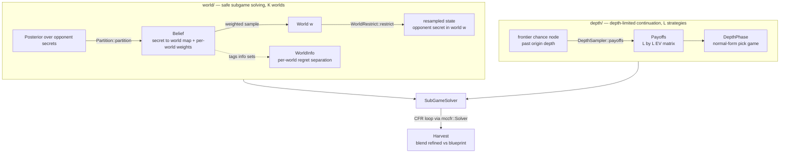
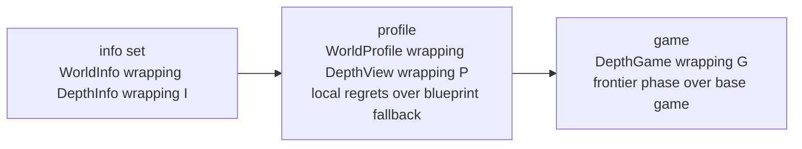

# subgame

Safe + depth-limited subgame solving (world-partitioned belief + depth-limited continuation).

`subgame` composes two orthogonal real-time-solving techniques from the Pluribus line of work: **safe subgame solving** (opponent-range safety via world partitioning) and **depth-limited solving** (leaf evaluation via biased continuation strategies). It builds on the game-agnostic CFR framework in [`mccfr`](../mccfr), optimal transport in [`monge`](../monge), and poker primitives in [`pokerkit`](../pokerkit).

## Architecture

The two techniques act at different levels and never reference each other's types. They meet only in the final wrapper stack: a world tag on the outside, a depth phase on the inside.

The **world** module discretizes the opponent's reach `Posterior` into `W` quantile buckets (`Partition` produces a `Belief`); each iteration samples a `World`, resamples the opponent's hidden cards into it (`WorldRestrict`), and tags every info set with `WorldInfo` so worlds accrue regret independently. The **depth** module intercepts frontier chance nodes past the subgame's `origin` depth, replacing the rest of the tree with an `L by L` normal-form game where both players pick among `L` biased continuation strategies (`DepthPhase`, `Payoffs`, `Continuation`). `SubGameEncoder` merges both concerns; `SubGameSolver` drives them through the `mccfr` CFR loop, routing lookups between fresh local regrets and the frozen blueprint via `WorldProfile` and `DepthView`.

The composition is a nested wrapper stack — the outer type carries the world tag, the inner carries the depth phase:

Setting `origin = None` disables frontier detection, degenerating to pure safe subgame solving (`WorldSolver`); using `DepthSolver` alone gives depth-limiting without world safety. `SubgameHyperParams` sets the per-decision time budget and the visit threshold at which the refined subgame policy is blended against the blueprint.

## References

Brown, N., & Sandholm, T. (2019). *Superhuman AI for multiplayer poker.* Science, 365(6456), 885–890.
