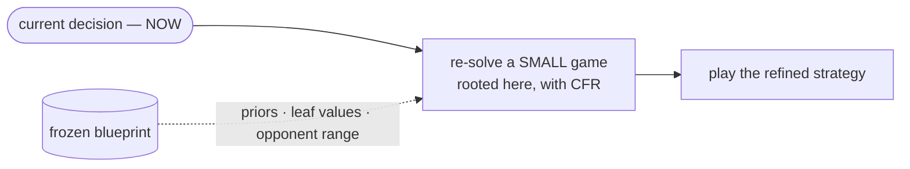
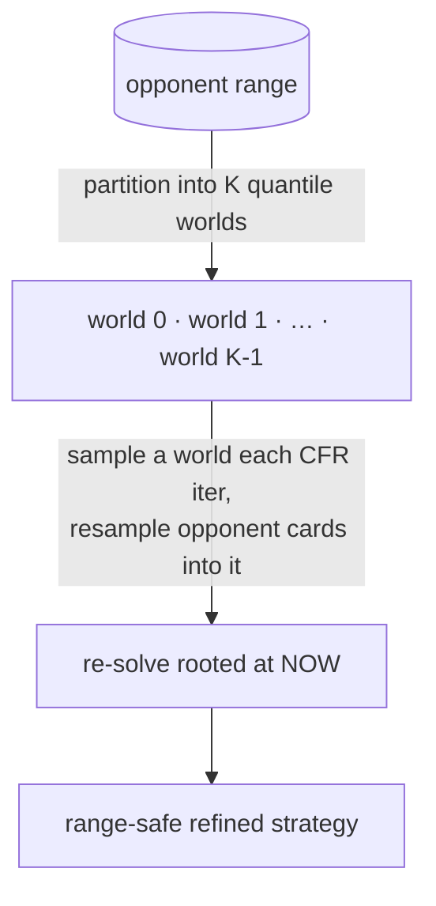
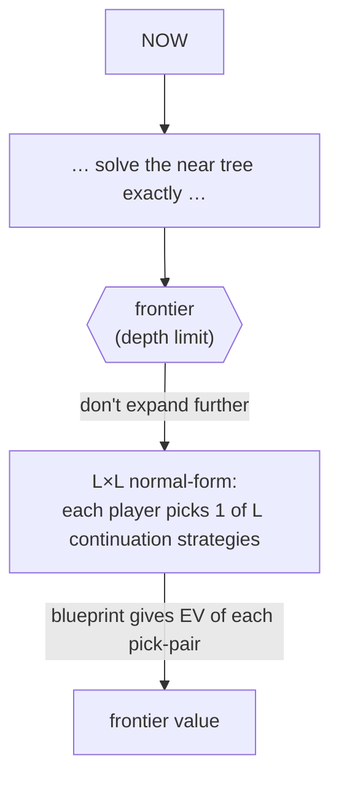
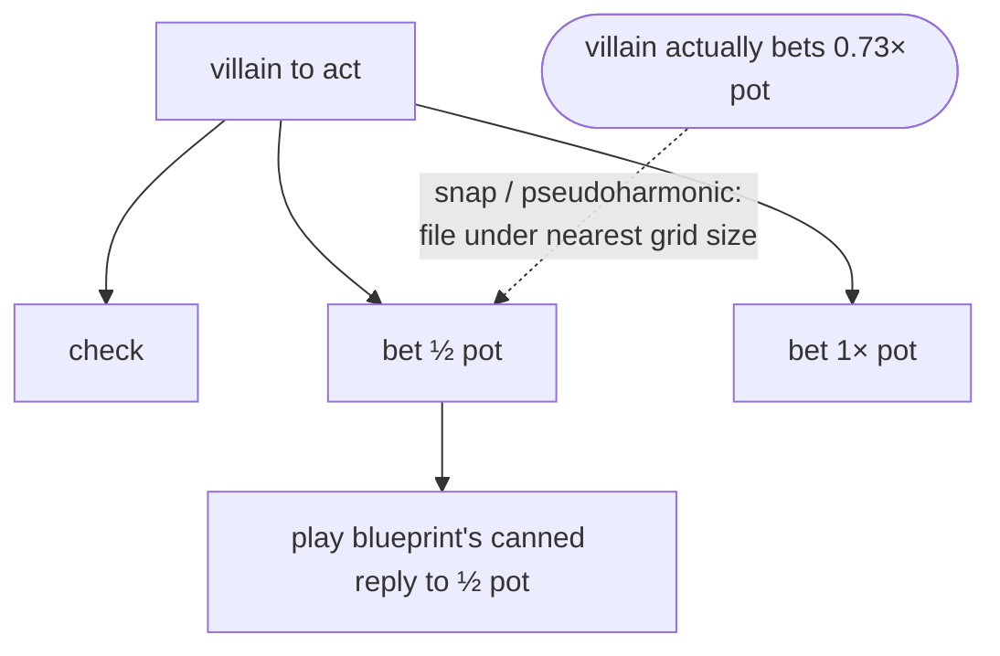
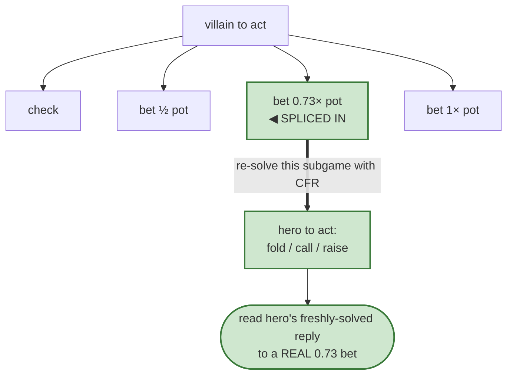
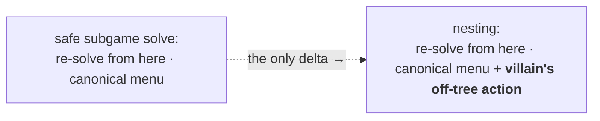
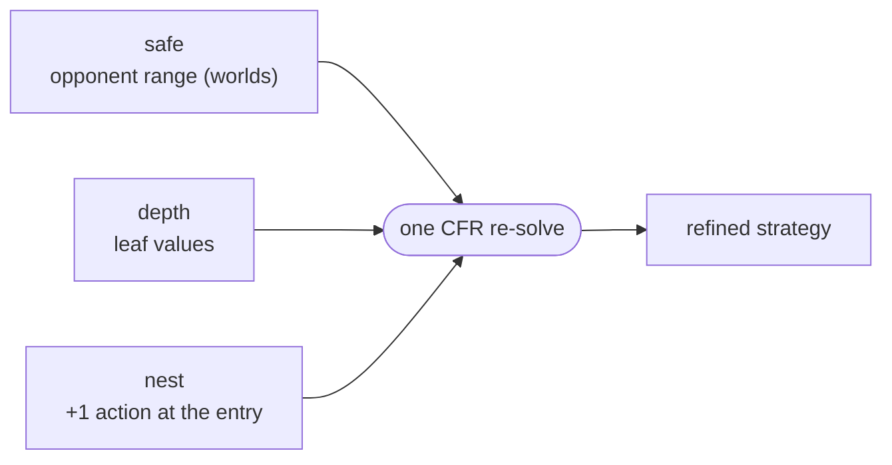
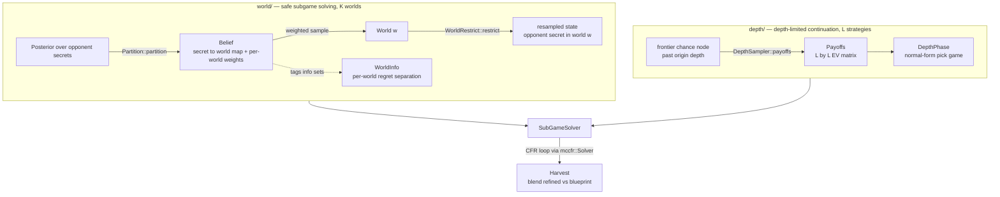
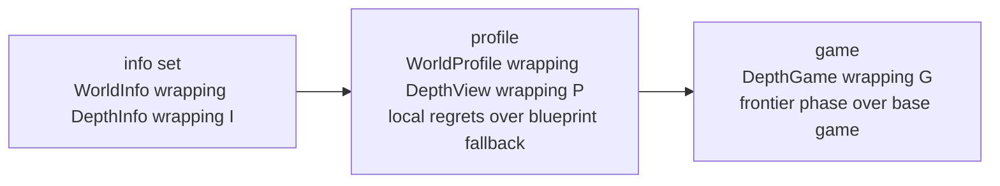

# subgame

Safe + depth-limited subgame solving (world-partitioned belief + depth-limited continuation).

`subgame` composes two orthogonal real-time-solving techniques from the Pluribus line of work: **safe subgame solving** (opponent-range safety via world partitioning) and **depth-limited solving** (leaf evaluation via biased continuation strategies). It builds on the game-agnostic CFR framework in [`mccfr`](../mccfr), optimal transport in [`monge`](../monge), and poker primitives in [`pokerkit`](../pokerkit).

## The ideas (read this first)

Every real-time-solving technique here is the **same move**:

> Re-solve a *small* game rooted at **now**, and borrow the frozen blueprint for everything you don't re-solve.


```mermaid
flowchart LR
    Now(["current decision — NOW"]) --> Re["re-solve a SMALL game<br/>rooted here, with CFR"]
    BP[("frozen blueprint")] -. "priors · leaf values · opponent range" .-> Re
    Re --> Play["play the refined strategy"]
```

The techniques differ only in **what the re-solve fixes** and **what it borrows**:

| Technique | The re-solve fixes… | Borrows from blueprint… | Lives in |
|---|---|---|---|
| **Safe subgame** | opponent-range leakage | the opponent's *range* (→ worlds) | `world/` |
| **Depth-limited** | tree too big to solve to the end | *leaf values* (continuation strategies) | `depth/` |
| **Nesting** (Modicum) | villain acted outside the abstraction | strategy for the *canonical* branches | `nest/` |

### Safe subgame solving — fix the opponent's range

Re-solve from now, but condition on the opponent's whole **range**, discretized into `K` worlds. Each CFR iteration samples a world, resamples the opponent's hidden cards into it, and accrues regret per-world — safe against the opponent's *actual* distribution, not a point estimate.


```mermaid
flowchart TD
    R[("opponent range")] -->|"partition into K quantile worlds"| W["world 0 · world 1 · … · world K-1"]
    W -->|"sample a world each CFR iter,<br/>resample opponent cards into it"| Solve["re-solve rooted at NOW"]
    Solve --> Pol["range-safe refined strategy"]
```

### Depth-limited solving — fix the tree size

Re-solve from now, but stop at a **frontier** (e.g. a street boundary): both players pick among `L` **biased continuation strategies**, and the blueprint supplies each pick-pair's payoff. End-game-quality decisions without solving the end game.


```mermaid
flowchart TD
    N["NOW"] --> A["… solve the near tree exactly …"]
    A --> F{{"frontier<br/>(depth limit)"}}
    F -->|"don't expand further"| NF["L×L normal-form:<br/>each player picks 1 of L continuation strategies"]
    NF -->|"blueprint gives EV of each pick-pair"| Leaf["frontier value"]
```

### Nesting — fix the off-tree action

Your blueprint trained on a **fixed menu of bet sizes**. A real opponent bets an arbitrary amount — `0.73×pot` — that **isn't a branch in your tree** ("off-tree"). Two ways to cope, and the contrast is the whole point:

> **Translation bends the *bet* to fit the *tree*. Nesting bends the *tree* to fit the *bet*.**

**Translation** (cheap, lookup-time): pretend `0.73` was one of your grid sizes and play the blueprint's pre-computed reply. You respond to a *fiction*.


```mermaid
flowchart TD
    V["villain to act"] --> C["check"]
    V --> H["bet ½ pot"]
    V --> O["bet 1× pot"]
    OBS(["villain actually bets 0.73× pot"]) -. "snap / pseudoharmonic:<br/>file under nearest grid size" .-> H
    H --> Reply["play blueprint's canned reply to ½ pot"]
```

**Nesting** (expensive, re-solve): **splice `0.73` in as a genuine action** and **re-solve the augmented subgame**. The solver computes the real equilibrium of the game *where `0.73` is legal*.


```mermaid
flowchart TD
    V["villain to act"] --> C["check"]
    V --> H["bet ½ pot"]
    V --> N["bet 0.73× pot<br/>◀ SPLICED IN"]
    V --> O["bet 1× pot"]
    N ==>|"re-solve this subgame with CFR"| Hero["hero to act:<br/>fold / call / raise"]
    Hero --> Read(["read hero's freshly-solved reply<br/>to a REAL 0.73 bet"])
    classDef new fill:#cfe7cf,stroke:#3a7a3a,stroke-width:2px;
    class N,Hero,Read new;
```

Two things that trip people up:

- **Why re-solve, not insert-and-look-up?** Adding an action *changes the equilibrium* — villain's mixing over *all* sizes shifts, and hero's responses with it. Hence *augment-**and**-resolve*.
- **Why not train `0.73` into the blueprint?** Off-tree sizes are opponent-specific and infinite. You mint them **on demand, at play time**, only for the sizes villain actually uses.

### The punchline: nesting = safe subgame solving + one twig

Nesting is **not a new algorithm** — it's the safe subgame solve above with **one extra action bolted onto the root** before you solve. Same worlds, same CFR loop, same blueprint priors for the canonical branches.


```mermaid
flowchart LR
    S["safe subgame solve:<br/>re-solve from here · canonical menu"]
    Nn["nesting:<br/>re-solve from here · canonical menu <b>+ villain's off-tree action</b>"]
    S -. "the only delta →" .-> Nn
```

### How the three compose — they're orthogonal

A natural confusion: isn't nesting just a fancier safe subgame solve — a *superset* of it? No. Each technique answers an **independent** question, and a single re-solve answers all three at once:

| Dimension | Question | Handled by |
|---|---|---|
| **Range** | *which hands* could the opponent hold here? | safe (`world/`) |
| **Leaves** | *how to value the horizon* without solving to the end? | depth (`depth/`) |
| **Action menu** | *which actions* exist at this node? | nesting (`nest/`) |

Nesting is a re-solve *trigger + a menu edit*, **not a solving method**: splicing in the off-tree action still leaves a tree that must be solved, and that solve needs an opponent-range model — which is exactly what safe supplies. So there is **one** solve with three orthogonal contributors, not three stacked solves:


```mermaid
flowchart LR
    Safe["safe<br/>opponent range (worlds)"] --> Solve(["one CFR re-solve"])
    Depth["depth<br/>leaf values"] --> Solve
    Nest["nest<br/>+1 action at the entry"] --> Solve
    Solve --> Pol["refined strategy"]
```

Two consequences:

- **Not a superset.** Nesting says nothing about range; safe says nothing about the menu — neither contains the other. (At the *player* layer, `Nest<World<…>>` *is* a behavioral superset of `World<…>` — it falls back to it when the line is on-tree — but that's the outer wrapper subsuming the inner player, not the nesting *technique* subsuming the safe *technique*.)
- **Swappable range layer.** Because nesting is indifferent to *how* the range is handled, swapping safe (worlds) for unsafe search leaves `nest/` untouched — it augments whatever solve it composes with. (If nesting really were a superset of safe, you couldn't cleanly pull safe out from under it.)

For the *player-side* view — how these fold together with `Dirac` (the output/argmax axis) into the bot-config cube, plus a validity table of every combination (and which are wired vs merely coherent) — see the module docs in `crates/parlor/src/players/mod.rs`.

### How `nest/` is built — one generic seam

The `nest/` wrapper family (`NestEdge` / `NestGame` / `NestInfo` / `NestPublic` / `NestView` / `NestProfile` / `NestEncoder`) is **fully generic** over any [`Augmentable`] game. That trait is the *entire* domain-specific surface:

```rust
trait Augmentable: CfrGame { type Off: OffPayload; fn augment(&self, off: Self::Off) -> Self; }
```

`augment` is the one thing a generic `CfrGame` can't express — applying a *real* transition built from raw off-abstraction data (the `Off` payload — for NLHE, an `Action`). Everything else is bookkeeping to carry that one extra twig without corrupting the abstraction: `is_entry` marks the single node that gets the twig, and the three-way `NestInfo` (`Entry`/`Augmented`/`Game`) stops the freshly-solved off-tree branch from commingling regrets with canonical branches at look-alike spots later in the hand. Because it's generic, the whole machinery is unit-tested on a toy `Augmentable` game with no blueprint. NLHE supplies just `impl Augmentable for NlheGame` (`augment` = `Game::apply`). See [`docs/active/off-tree-nesting.md`](../../docs/active/off-tree-nesting.md).

> **On the name "Modicum":** the *nesting* technique proper (add the off-tree action, re-solve) is Brown & Sandholm, *Safe and Nested Subgame Solving* (NeurIPS 2017 — the Libratus real-time method). **Modicum** is their 2018 follow-up agent (*Depth-Limited Solving…*), named for near-top-tier play on a *modicum* of compute; it made test-time action re-solving cheap. "Modicum-style" here is that loose, agent-flavored shorthand.

## Architecture

The two techniques act at different levels and never reference each other's types. They meet only in the final wrapper stack: a world tag on the outside, a depth phase on the inside.


```mermaid
flowchart TB
    subgraph world["world/ — safe subgame solving, K worlds"]
        Post["Posterior over opponent secrets"] -->|"Partition::partition"| Bel["Belief<br/>secret to world map + per-world weights"]
        Bel -->|"weighted sample"| Wsel["World w"]
        Wsel -->|"WorldRestrict::restrict"| Rst["resampled state<br/>opponent secret in world w"]
        Bel -.->|"tags info sets"| WI["WorldInfo<br/>per-world regret separation"]
    end
    subgraph depth["depth/ — depth-limited continuation, L strategies"]
        Front["frontier chance node<br/>past origin depth"] -->|"DepthSampler::payoffs"| Pay["Payoffs<br/>L by L EV matrix"]
        Pay --> NF["DepthPhase<br/>normal-form pick game"]
    end
    world --> Solver["SubGameSolver"]
    depth --> Solver
    Solver -->|"CFR loop via mccfr::Solver"| Harv["Harvest<br/>blend refined vs blueprint"]
```

The **world** module discretizes the opponent's reach `Posterior` into `W` quantile buckets (`Partition` produces a `Belief`); each iteration samples a `World`, resamples the opponent's hidden cards into it (`WorldRestrict`), and tags every info set with `WorldInfo` so worlds accrue regret independently. The **depth** module intercepts frontier chance nodes past the subgame's `origin` depth, replacing the rest of the tree with an `L by L` normal-form game where both players pick among `L` biased continuation strategies (`DepthPhase`, `Payoffs`, `Continuation`). `SubGameEncoder` merges both concerns; `SubGameSolver` drives them through the `mccfr` CFR loop, routing lookups between fresh local regrets and the frozen blueprint via `WorldProfile` and `DepthView`.

The composition is a nested wrapper stack — the outer type carries the world tag, the inner carries the depth phase:


```mermaid
flowchart LR
    WI2["info set<br/>WorldInfo wrapping DepthInfo wrapping I"]
    WP["profile<br/>WorldProfile wrapping DepthView wrapping P<br/>local regrets over blueprint fallback"]
    DG["game<br/>DepthGame wrapping G<br/>frontier phase over base game"]
    WI2 --> WP --> DG
```

Setting `origin = None` disables frontier detection, degenerating to pure safe subgame solving (`WorldSolver`); using `DepthSolver` alone gives depth-limiting without world safety. `SubgameHyperParams` sets the per-decision time budget and the visit threshold at which the refined subgame policy is blended against the blueprint.

## References

Brown, N., & Sandholm, T. (2019). *Superhuman AI for multiplayer poker.* Science, 365(6456), 885–890.
