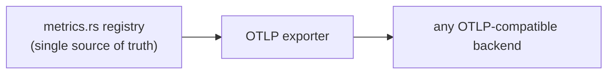

# vitals

OpenTelemetry + tracing init and metric registry for robopoker binaries.

## Architecture

Metric handles are registered centrally in `metrics.rs` — the single source of truth,
never minted at call sites — then exported over OTLP to any compatible backend. Tracing
is structured (key-value fields), not format strings, so events are queryable downstream.

Histogram bucket boundaries are configured via `histogram_view()` for values outside the
OTLP default `[0..10000]` range.

> Metric-authoring rules, the tracing-field/metric-label aliasing pattern, and per-metric
> cost intuition are in `CLAUDE.md`.
